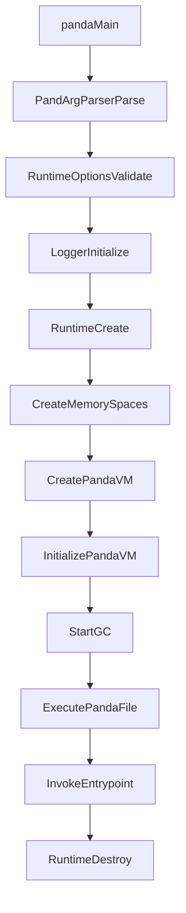
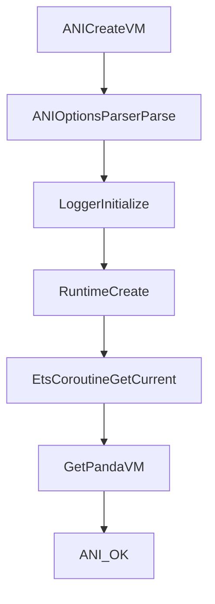

# Runtime 架构内幕与开发者指南（阶段 1：Architecture & Index）

> 本目录面向 **arkcompiler/runtime_core/static_core** 这套 C++ Runtime（类 ART 风格 VM）工程，目标是：**用虚拟机生命周期**把代码结构“翻译”为架构地图与可持续扩展的开发者指南索引。

---

### 0. 读者与范围

- **读者**：需要理解/改造 VM 启动、内存管理、类加载、解释器/JIT/AOT、Native 接口（ANI/Interop）的开发者。
- **范围**：以 `static_core/` 为根；重点覆盖 `runtime/` 与 `plugins/ets/runtime/` 的运行期关键路径，并关联 `compiler/`、`irtoc/`、`verification/` 等支撑模块。

---

### 1. 结论先行：组件映射（Component Mapping）

| 组件 | 主要目录 | 关键文件（入口/锚点） | 说明 |
|---|---|---|---|
| 启动入口（CLI） | `panda/` | `panda/panda.cpp` | `main()` 解析参数后调用 `Runtime::Create()`，执行 `ExecutePandaFile()`，最终 `Runtime::Destroy()` |
| 启动入口（zygote/ANI） | `plugins/ets/runtime/ani/` | `plugins/ets/runtime/ani/ani_vm_api.cpp` | `ANI_CreateVM()` 解析 ANI options，初始化 logger，调用 `ark::Runtime::Create()`，拿到 `EtsCoroutine->GetPandaVM()` |
| Runtime 生命周期 | `runtime/` | `runtime/runtime.cpp`、`runtime/include/runtime.h` | `Runtime::Create/Initialize/Destroy` 串起内存空间、PandaVM、ClassLinker、GC、工具链等 |
| 内存管理（Heap/GC/Allocator） | `runtime/mem/` | `runtime/mem/heap_manager.*`、`runtime/mem/gc/*` | HeapManager + 多种 GC（STW、G1/Gen、Epsilon…），并提供 barrier/safepoint 支撑 |
| 对象模型（Object Model） | `runtime/`、`runtime/coretypes/` | `runtime/object_header.cpp`、`runtime/include/object_header.h`、`runtime/mark_word.*` | `ObjectHeader` 由 MarkWord + ClassWord 组成；`coretypes/*` 提供 Array/String 等核心对象 |
| 类加载与链接（ClassLinker） | `runtime/` | `runtime/include/class_linker.h`、`runtime/class_linker.cpp`、`runtime/class_linker_context.h` | 统一的 language-agnostic `ClassLinker`，通过 `ClassLinkerExtension` 做语言扩展 |
| 执行引擎（解释器） | `runtime/interpreter/` | `runtime/interpreter/frame.h`、`runtime/interpreter/vregister.h` | 基于 **vregister（虚拟寄存器）** 的解释器；静态语言用“mirror vregs”存 tag，动态语言用 TaggedValue |
| JIT/AOT/桥接 | `runtime/bridge/`、`runtime/jit/`、`compiler/`、`irtoc/` | `runtime/bridge/bridge.h`、`runtime/runtime.cpp`（JIT/AOT 选项处理） | 解释器 <-> 编译代码桥接（c2i/i2c），JIT 编译与 profile 保存；AOT 由 `compiler/aot/` 与 AotManager 参与 |
| Native/桥（ANI/ETS Native/Interop） | `plugins/ets/runtime/` | `plugins/ets/runtime/ani/*`、`plugins/ets/runtime/ets_native_library*.{h,cpp}`、`plugins/ets/runtime/interop_js/*` | ANI 线程 attach/detach；ETS Native 库加载；可选 JS 互操作 |
| 工具链与可观测性 | `runtime/tooling/` | `runtime/tooling/inspector/*`、`runtime/tooling/debugger.*`、`runtime/tooling/tools.*` | 调试器/Inspector（PtHooks）、采样 profiler、perf counter 等 |
| 字节码/快化/优化工具 | `bytecode_optimizer/`、`quickener/` | `bytecode_optimizer/optimize_bytecode.cpp`、`quickener/quick.cpp` | 字节码优化与 quickening（运行前/构建期优化） |
| 验证器（Verifier） | `verification/` | `verification/verifier/verifier.cpp`、`verification/public.h` | 多线程验证方法；通过 language plugin 创建 ManagedThread 并调用 Verify |
| 构建与配置 | 顶层 + 各模块 | `BUILD.gn`、`CMakeLists.txt`、`runtime/options.yaml` | GN/CMake 双构建体系；runtime/compiler/options 等通过 yaml 合并生成 options |

---

### 2. 逻辑架构推断（从目录/代码证据出发）

#### 2.1 这是基于栈还是寄存器的 VM？

**结论：以寄存器（register-based / vreg-based）为中心的解释器设计。**

关键证据：
- `runtime/interpreter/vregister.h`：定义 `VRegister`（64-bit payload）与 `StaticVRegisterRef/DynamicVRegisterRef`，并显式提到“tagless vregister / mirror vregister”。  
- `runtime/interpreter/frame.h`：Frame layout 直接包含 `vregs_[0]` 的 VLA，并说明静态语言需要 mirror 区存 tag；还定义 `AccVRegister`（累加器）与 `GetAccAsVReg()`。

这与 ART 的 dex bytecode “vreg + accumulator/临时寄存器”风格非常接近：**执行状态以一组虚拟寄存器为主，而非 operand stack 为主**。

#### 2.2 对象模型（Object Model）长什么样？

**结论：以 `ObjectHeader` 为统一对象头，MarkWord 管同步/GC/哈希，ClassWord 指向元数据（Class/HClass），并通过 `coretypes/*` 提供核心对象。**

关键证据：
- `runtime/object_header.cpp`：`ObjectHeader::CreateObject()` 通过 `HeapManager` 分配对象；`ObjectSize()` 依据 `ClassAddr<BaseClass>()` 判断静态/动态 class，并对 `Array/String/Class` 做特殊分派。
- `runtime/include/object_header.h` / `runtime/mark_word.*`：对象头拆分为 mark/class 两部分（不同平台配置在 `runtime/object_header_config.h`）。
- `runtime/coretypes/`：`String`、`Array` 等核心类型实现。

这里不像 ART 文档里常说的 “mirror::Object” 命名体系；但功能上等价：**对象头 + 元数据类（Class/HClass）+ coretypes 基类** 共同构成 “mirror 系统”。

---

### 3. VM 生命周期总览（Master Index）

> 下面的章节顺序按“启动 -> 运行 -> 退出”的真实路径组织；每章先给阶段 1 的架构地图与索引，阶段 2 再填深入细节。

#### 3.1 Chapter Index

- **Chapter 1**：启动与入口点（CLI/ANI/zygote、options、logger、Runtime Create/Destroy）  
  - 见：`01_Startup_and_Entrypoints.md`
- **Chapter 2**：内存管理与对象布局（Heap/Allocator、GC、barrier/safepoint、ObjectHeader/coretypes）  
  - 见：`02_Memory_Management_and_Object_Model.md`
- **Chapter 3**：类加载与链接（PandaFile/Abc 装载、ClassLinker、Context、ClassLinkerExtension、AOT class context）  
  - 见：`03_Class_Loading_and_Linking.md`
- **Chapter 4**：执行引擎（Interpreter vreg/frame、桥接、JIT/AOT/IRTOC、deopt/OSR）  
  - 见：`04_Execution_Engine_Interpreter_JIT_AOT.md`
- **Chapter 5**：Native 桥（ANI、ETS Native library、Interop JS、线程 attach/detach）  
  - 见：`05_Native_Bridge_ANI_and_Interop.md`
- **Chapter 6**：工具链与可观测性（Inspector/Debugger、Profiling、Verification）  
  - 见：`06_Tooling_Profiling_Verification.md`
- **Chapter 7**：构建与配置（GN/CMake、options.yaml 合并、生成物关系）  
  - 见：`07_Build_and_Configuration.md`

---

### 4. 两条关键启动链路（用于读代码的“主干路径”）

#### 4.1 CLI 启动链路（`panda/panda.cpp`）

关键锚点：
- `panda/panda.cpp`：`ark::Main()` 调用 `Runtime::Create(runtimeOptions)`，然后 `ExecutePandaFile()`，最后 `Runtime::Destroy()`
- `runtime/runtime.cpp`：`Runtime::Create()` -> `Runtime::Initialize()` -> `CreatePandaVM/InitializePandaVM` 等

#### 4.2 ANI/zygote 启动链路（`ANI_CreateVM`）

关键锚点：
- `plugins/ets/runtime/ani/ani_vm_api.cpp`：`ANI_CreateVM()`、`ANI_GetCreatedVMs()`、`AttachCurrentThread()`、`DetachCurrentThread()`

---

### 5. 如何用本指南读代码（推荐路径）

- **从入口开始**：先读 `01_Startup_and_Entrypoints.md`，把 `Runtime::Create/Initialize/Destroy` 这条主干跑通。
- **再看两大底座**：内存（Chapter 2）与类加载（Chapter 3）决定了运行时所有对象/方法如何出现与存活。
- **最后进入执行与桥**：解释器 vreg/frame、桥接、JIT/AOT（Chapter 4）是性能与正确性的交汇处。
- **做语言/平台集成时**：优先读 Chapter 5（ANI/Interop）与 Chapter 7（构建/配置）。

补充：如果你在写/审视文档（而不仅是读代码），建议直接按“04 章沉淀的方法论清单”做验收与补齐闭环：
- `00_Methodology_Wiki_Review_Checklist.md`

