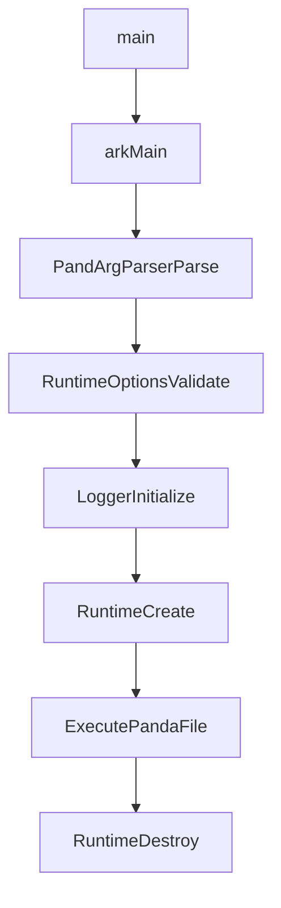
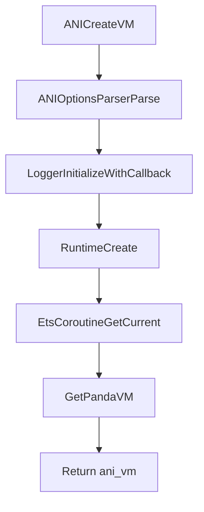

# Chapter 1：启动与入口点（Startup & Entrypoints）

> 本章把“怎么把 VM 跑起来”拆成两条主路径：**命令行（CLI）**与 **ANI/zygote（通过 ETS 插件）**。你读代码时建议从本章开始，先把 `Runtime::Create/Initialize/Destroy` 走通。

---

### 1. 启动入口总表

| 场景 | 入口文件/函数 | 关键动作 | 产物 |
|---|---|---|---|
| CLI 可执行文件 | `panda/panda.cpp`：`main()` / `ark::Main()` | 解析 runtime/compiler/logger options → `Runtime::Create()` → `ExecutePandaFile()` → `Runtime::Destroy()` | 运行指定 `pandafile(.abc)` 的 entrypoint |
| zygote/ANI 创建 VM | `plugins/ets/runtime/ani/ani_vm_api.cpp`：`ANI_CreateVM()` | 解析 ANI options → 初始化 logger → `Runtime::Create()` → 获取 `EtsCoroutine` 与 `PandaVM` | 返回 `ani_vm*`（底层指向 PandaVM） |

---

### 2. CLI 路径：从 `main()` 到 `ExecutePandaFile()`

#### 2.1 关键控制流（高层）

#### 2.2 关键锚点（推荐阅读顺序）

- **参数与 options 体系**
  - `panda/panda.cpp`：把 `RuntimeOptions`、`logger::Options`、`compiler::g_options` 全部注册到同一个 `PandArgParser`
  - `runtime/options.yaml`：runtime options 的源（会经生成器生成 `runtime/include/runtime_options.h` 等）
- **创建/销毁 Runtime**
  - `runtime/runtime.cpp`：`Runtime::Create()` / `Runtime::Initialize()` / `Runtime::Destroy()`
- **执行入口**
  - `runtime/runtime.cpp`：`Runtime::ExecutePandaFile()` → `Runtime::Execute()` → `pandaVm_->InvokeEntrypoint()`

---

### 3. ANI 路径：从 `ANI_CreateVM()` 到 `PandaVM`

#### 3.1 关键控制流（高层）

#### 3.2 线程 attach/detach（ANI 运行期必备）

ANI 不仅提供“创建 VM”，还负责把 native 线程附着到 VM：

- **Attach**
  - `plugins/ets/runtime/ani/ani_vm_api.cpp`：`AttachCurrentThread()`
  - 关键行为：检查当前线程未 attach → 通过 `CoroutineManager` 为线程创建“exclusive worker coroutine” → 返回 `ani_env*`
- **Detach**
  - `plugins/ets/runtime/ani/ani_vm_api.cpp`：`DetachCurrentThread()`
  - 关键行为：销毁该 worker coroutine；若启用 interop（JS），还会清理 JS env

> 读代码提示：这条链路把 “线程-协程-VM” 绑定在一起，后续你看 GC root / safepoint / handle scope 时，会频繁碰到 `ManagedThread` 与 ETS 的 `EtsCoroutine`。

---

### 4. Runtime::Create/Initialize/Destroy：启动主干骨架

#### 4.1 Create：最小可运行 Runtime 的建立

在 `runtime/runtime.cpp` 中，`Runtime::Create()` 的关键阶段可以抽象为：

1. **初始化运行时空间与内存池**
   - `CreateMemorySpaces()`：根据 `RuntimeOptions` 初始化 `MemConfig`，并 `PoolManager::Initialize()`
2. **创建内部分配器**
   - `RuntimeInternalAllocator::Create()`：为 runtime 内部对象（包括 GC 内部结构等）提供 allocator
3. **创建 Runtime 单例实例**
   - `Runtime::CreateInstance()`：初始化 `Locks` / `Events` 等，并构造 `Runtime(options, allocator)`
4. **Initialize()：进入“有 PandaVM 的运行态”**
   - 见 4.2
5. **StartGC()**
   - `instance_->GetPandaVM()->StartGC()`（创建完成后启动 GC 线程/机制）

#### 4.2 Initialize：组装 PandaVM、ClassLinker、AOT/JIT 等

`Runtime::Initialize()` 的核心步骤（按代码顺序）：

- **Verifier 配置**
  - `LoadVerificationConfig()` + `InitializeVerifierRuntime()`（若开启 verification）
- **CreatePandaVM(runtimeType)**
  - `PandaVM::Create(this, options_, runtimeType)`
  - `LoadBootPandaFiles()`（按语言上下文决定 openMode）
  - 设置 AOT class context：`AotManager::SetBootClassContext/SetAppClassContext`
- **HandleAotOptions()**
  - 通过 `FileManager::LoadAnFile()` 加载 AOT 文件（如有）
- **InitializePandaVM()**
  - `classLinker_->Initialize(...)`
  - `pandaVm_->Initialize()`
- **SetThreadClassPointers()**
  - 在当前 `ManagedThread` 上缓存常用 Class 指针（String/Array roots 等）
- **HandleJitOptions()**
  - 设置信号处理（采样、NPE、栈溢出等），并根据 AOT/选项调整
- **pandaVm_->InitializeFinish()**

#### 4.3 Destroy：退出顺序（“为什么要先停编译器，再停 GC？”）

`Runtime::Destroy()` 的退出顺序高度工程化，核心点是避免线程/编译器/GC 的交叉资源访问：

- 先触发 `VmDeathEvent`，再 **先停 compiler/JIT**（避免 compile memleak 与并发访问）
- 再卸载 debugger（从 listener 链路中摘除）
- `UninitializeThreads()` 后再 `StopGC()`（注释说明：uninit 可能执行 managed code，需要 barrier）
- 最后释放 Runtime 单例、Finalize MemConfig/PoolManager 等

---

### 5. 与 zygote/fork 相关的生命周期钩子

在 `runtime/runtime.cpp` 中可看到：

- `Runtime::PreZygoteFork()` / `Runtime::PostZygoteFork()`：转发给 `pandaVm_`
- `Runtime::InitNonZygoteOrPostFork(...)`：用于 fork 后的非 zygote 初始化；内部会 `pandaVm_->PreStartup()` 并执行 `initHook()`

> 这说明工程预留了 Android/类 Android 的“zygote 预热 + fork 子进程”运行模式，但部分注释显示仍有待集成的系统服务（NativeBridge/ThreadPool/profile 等）。

---

### 6. 阶段 2（后续扩展建议）

- **把 `RuntimeOptions` 的关键开关做成“按场景配置矩阵”**：debug / AOT / JIT / verifier / profiling / interop
- **补齐启动时序的线程视角**：谁创建了 GC 线程？谁创建了 JIT worker？哪个时刻允许执行 managed code？
- **把 `FileManager`、`panda_file`（abc/zip）与 AOT `*.an` 的装载路径画成一张图**

