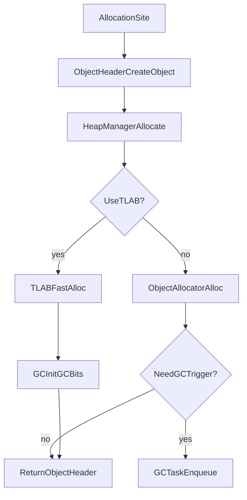
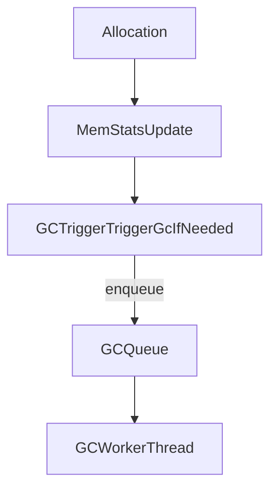

# Chapter 2：内存管理与对象模型（Memory Management & Object Model）

> 本章回答三件事：**对象如何分配**、**GC 如何追踪/触发/回收**、以及 **对象头/核心对象（coretypes）长什么样**。阶段 1 以“架构地图 + 索引”为主，便于你快速定位到可读的关键文件。

---

### 1. 组件地图（目录 → 职责）

| 子系统 | 目录 | 关键文件（建议入口） | 你能在这里找到什么 |
|---|---|---|---|
| HeapManager / 分配入口 | `runtime/mem/` | `runtime/mem/heap_manager.h`、`runtime/mem/heap_manager.cpp` | `AllocateObject/AllocateNonMovableObject`、TLAB、对象空间判定（young/non-movable） |
| 分配器家族 | `runtime/mem/` | `allocator.*`、`runslots*`、`region_allocator*`、`bump-allocator*` | 不同 size class/region/runslots 分配策略 |
| GC 总接口 | `runtime/mem/gc/` | `runtime/mem/gc/gc.h`、`runtime/mem/gc/gc.cpp` | `GC::StartGC/StopGC/WaitForGC`、root/phase/stats/worker 框架 |
| GC 具体实现 | `runtime/mem/gc/*/` | `stw-gc/`、`gen-gc/`、`g1/`、`epsilon/`… | STW/分代/G1/空 GC 等实现细节 |
| 触发器（Trigger） | `runtime/mem/gc/` | `runtime/mem/gc/gc_trigger.h` | heap 阈值、adaptive、debug、按 Nth alloc 等触发策略 |
| BarrierSet（写屏障/读屏障） | `runtime/mem/gc/` + `libarkbase/mem/` | `runtime/mem/gc/gc_barrier_set.h` | Interpreter 调用的 `PreBarrier/PostBarrier` + 给 Compiler 的 operand 接口 |
| 对象头 | `runtime/` | `runtime/include/object_header.h`、`runtime/object_header.cpp`、`runtime/mark_word.h`、`runtime/object_header_config.h` | MarkWord/ClassWord、同步/哈希/转发地址、对象大小与类型判定 |
| 核心对象（Array/String） | `runtime/include/coretypes/` + `runtime/coretypes/` | `runtime/include/coretypes/array.h`、`runtime/include/coretypes/string.h` | `Array`/`String` 继承 `ObjectHeader`，定义布局、读写与 barrier 交互 |
| 设计文档（对齐实现） | `docs/` | `docs/memory-management.md` | 设计/术语/对象头布局、barrier/safepoint 理念 |

---

### 2. 分配主路径：从 `new object` 到 Heap

#### 2.1 分配入口在哪里？

**统一入口是 `mem::HeapManager`**：
- `runtime/mem/heap_manager.h`：`AllocateObject()` / `AllocateNonMovableObject()`  
- `runtime/object_header.cpp`：`ObjectHeader::CreateObject()` 内部通过 `thread->GetVM()->GetHeapManager()` 分配对象
- `runtime/coretypes/string.cpp` / `runtime/coretypes/line_string.cpp`：字符串也通过 `vm->GetHeapManager()->AllocateObject(...)` 分配（可 movable 或 non-movable）

#### 2.2 Allocation 流程图（概念级）

> 注：具体“是否触发 GC”由 `GCTrigger` 与 `GC::WaitForGC/Trigger` 组合决定；TLAB 事件/统计在 `runtime/entrypoints/entrypoints.cpp` 有记录点（例如 slowpath alloc 事件、MemStats 记录）。

---

### 3. GC 框架：GC 的职责边界与主线程模型

#### 3.1 GC 抽象接口的“最小集合”

在 `runtime/mem/gc/gc.h` 中，GC 基类提供了：
- **生命周期**：`Initialize(PandaVM*)`、`StartGC()`、`StopGC()`
- **任务执行**：`WaitForGC(GCTask)`、`WaitForGCInManaged(...)`（在 managed scope 下等待）
- **对象元数据**：`InitGCBits(...)`、`InitGCBitsForAllocationInTLAB(...)`
- **可观测性**：`GCListener`、`GCPhase`、`GCStats`、`GCWorkersTaskPool`

读代码建议：先看 `GC::StartGC/StopGC/WaitForGC` 的约束，再进入具体实现（G1/Gen/STW）。

#### 3.2 GC 触发器（Trigger）

`runtime/mem/gc/gc_trigger.h` 给出可插拔的触发策略（示例）：
- `HEAP_TRIGGER`：heap size 相对上次 GC 增长一定百分比触发
- `ADAPTIVE_HEAP_TRIGGER`：自适应阈值（保存近期阈值避免过频）
- `DEBUG` / `DEBUG_NEVER` / `ON_NTH_ALLOC`：调试/测试策略

在工程层面，“何时跑 GC”通常是：

---

### 4. BarrierSet：解释器与编译器如何与 GC 协作

#### 4.1 为什么需要 Barrier？

GC 需要在并发标记/分代收集中保持堆一致性与 remembered set/card table 的正确性。工程中把 barrier 抽象为 `GCBarrierSet`：

- **Interpreter 使用**（直接调用）
  - `PreBarrier(void *preValAddr)`
  - `PostBarrier(const void *objAddr, size_t offset, void *valAddr)`
  - `PostBarrier(const void *objAddr, size_t offset, size_t count)`
- **Compiler 使用**（生成 barrier 的 operand）
  - `GetBarrierOperand(BarrierPosition, name)`

对应文件：`runtime/mem/gc/gc_barrier_set.h`

#### 4.2 典型实现：分代写屏障 / G1 屏障

`gc_barrier_set.h` 里可以直接看到：
- `GCGenBarrierSet`：使用 `CardTable` + dirty card 更新（典型 inter-generational barrier）
- `GCG1BarrierSet`：更复杂，涉及 thread-local card queue / ring buffer（用于 G1 remembered set 更新）

---

### 5. 对象模型：ObjectHeader + MarkWord/ClassWord

#### 5.1 ObjectHeader 的两大职责

`runtime/include/object_header.h` 明确把职责拆为：
- **Class word**：类型/元数据（`ClassAddr<T>()`）、字段访问/类型判断
- **Mark word**：锁（轻量/重量）、hash、GC mark、转发地址（forwarding）

`runtime/mark_word.h` 则给出不同平台配置下 MarkWord 的 bit layout（高端/低端、32/64 位指针）。

#### 5.2 “转发地址”意味着什么？

当对象被移动 GC 移动后，MarkWord 进入 `STATE_GC`（forwarding），这解释了：
- 为什么对象头需要保存 forwarding address
- 为什么 `ObjectHeader::IsForwarded()` 是一个高频判断点（对读 barrier/更新指针非常关键）

#### 5.3 object header 配置点

`runtime/object_header_config.h`：当前通过 `#define HIGHENDSYSTEM` 选择 high-end 配置（hash in header 等），并按 `OBJECT_POINTER_SIZE` 分化 32/64 位。

---

### 6. 核心对象（coretypes）：Array 与 String

#### 6.1 Array

`runtime/include/coretypes/array.h`：
- `class Array : public ObjectHeader`
- 布局要点：对象头 + `length_` + `data_[]`
- 关键点：`GetObject/SetObject` 等 API 会结合 **读写 barrier**（通过模板参数控制 `NEED_READ_BARRIER/NEED_WRITE_BARRIER`）

#### 6.2 String

`runtime/include/coretypes/string.h`：
- `class String : public ObjectHeader`
- 支持压缩字符串（`LineString::SetCompressedStringsEnabled`），多种来源构建（Utf8/Utf16/MUtf8）
- 字符串实现与 `LanguageContext`/`PandaVM` 强绑定（创建时需要 ctx 与 vm）

---

### 7. 阶段 2（后续扩展建议）

- **把 heap space/region/young/tenured 的“真实实现类”补齐**：在 `runtime/mem/heap_space.*`、`runtime/mem/gc/g1/*`、`runtime/mem/gc/gen-gc/*` 之间建立一张类图
- **补齐 root 枚举与扫描路径**：从 `runtime/mem/gc/gc_root.*`、`runtime/include/thread.h`、`runtime/stack_walker.*` 出发
- **补齐 safepoint 与信号协作**：对照 `docs/memory-management.md` 的 safepoint 设计段落，关联 runtime 实际实现点

