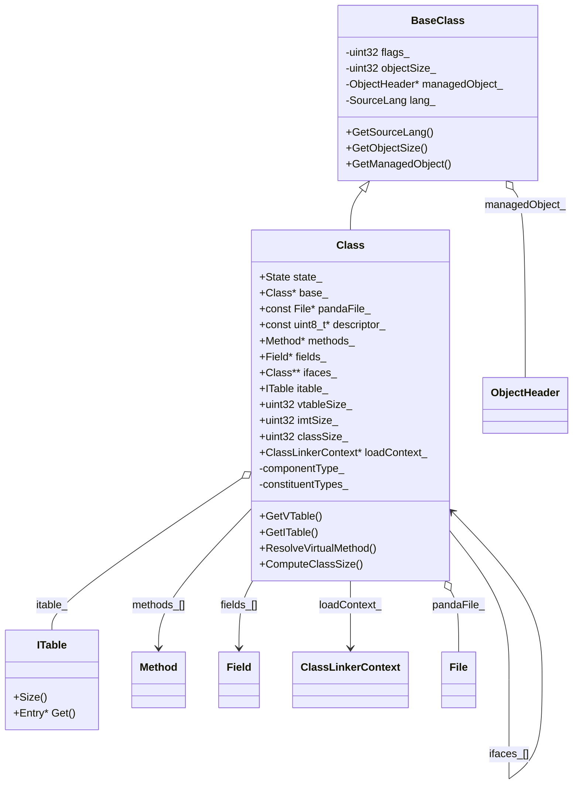
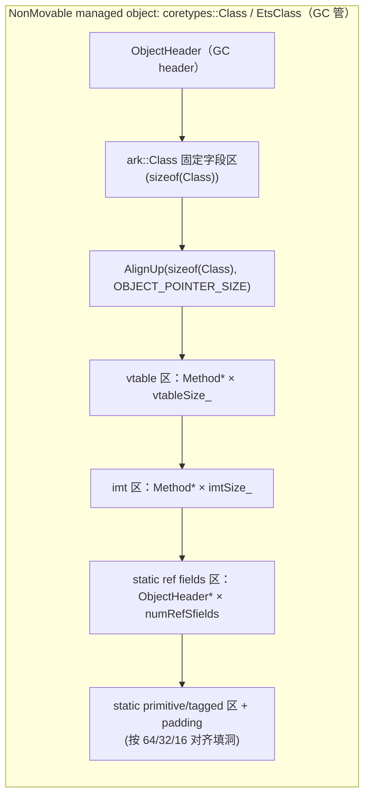

# Class（运行时类元数据对象）

## 0) 在端到端主线图中的位置

- 总入口：[../Flows/ClassLoading_EndToEnd](../Flows/ClassLoading_EndToEnd.md)（“主管线：LoadClass”框；以及后续初始化交界）

## 它是什么

`Class` 是运行时对“一个类型”的元数据对象：它包含继承关系、接口信息、字段/方法数组，以及 vtable/itable/IMT 等派发表。它本身也是一个 managed object（有 class object 形态），不同语言通过 `ClassLinkerExtension::FromClassObject` 做映射。

## 1) UML：Class 结构（Mermaid classDiagram）

> 说明：这是“读代码/排障需要的主干字段”，不是把 `class.h` 全部字段穷举；重点突出**派发表、容器分区、加载域、状态机**。

## 2) 关键坑点：`Class` 是“变长对象尾随布局”（placement new + 尾随 vtable/imt/静态区）

这是你提到的核心坑点：**`ark::Class` 不是一个“单独 malloc/new 的 C++ 对象”**。在 core（PANDA_ASSEMBLY）路径里，它被内嵌在 `coretypes::Class`（一个 GC 管理的 NonMovable object）里：

- 分配：`CoreClassLinkerExtension::CreateClass` 用 HeapManager 分配 `coretypes::Class::GetSize(size)` 字节（其中 `size` 是 `Class::ComputeClassSize(...)` 计算出的“runtime class 总大小”）。
- 构造：`coretypes::Class::InitClass(...)` 用 **placement new**：`new (&klass_) ark::Class(...)` 在“已分配的对象内存”里原地构造 `ark::Class`。
- 关键原因（源码注释直说）：不要在 InitClass 里重新 init object header，否则 GC 并发访问对象的 class 时可能 data race。

### 2.1 Mermaid：内存布局（简化示意）

下图对应 `runtime/include/class-inl.h::Class::ComputeClassSize` 的分段计算逻辑（先对齐，再加 vtable/imt/ref static fields/各类 padding）：

> 直接影响排障：当你在 gdb 里看 `Class*` 指针时，**`GetVTable()/GetIMTOffset()/GetClassSpan()` 都是在同一块“classSize_ 指定的尾随内存”上做 subspan**；如果把它当成普通 C++ 成员数组，会产生非常隐蔽的越界/误判。

## 关键字段/不变量（只列 03 章关心的）

- **布局相关**：
  - `classSize_`：`Class` 对象自身大小（含 vtable/imt/static fields 的内嵌区间）
  - `objectSize_`：实例对象大小（由 `LayoutFields` 计算并写回；变长对象例外）
  - `refFieldsNum/refFieldsOffset/volatileRefFieldsNum`：GC 需要的 ref 字段信息（static/instance 各一套）
- **派发表相关**：
  - `vtableSize_/imtSize_`：表大小
  - `ITable itable_`：接口表（Entry: interface Class* + Method* span）
  - `IMT`：接口方法快速表（冲突即清空槽，可能整体禁用）
- **容器相关**：
  - `methods_`：按 `numVmethods/numSmethods` 分区；末尾可能有 copied methods（default interface）
  - `fields_`：按 `numSfields` 分区（静态字段在前）
  - `interfaces_`：接口列表（class linker 解析得到）
- **状态机**：
  - `State::{INITIAL, LOADED, VERIFIED, INITIALIZING, ERRONEOUS, INITIALIZED}`

## 谁写它、谁读它（对齐点）

- **写入（主要在 ClassLinker）**：
  - `runtime/class_linker.cpp`：
    - `SetupClassInfo`：决定 `Class::ComputeClassSize(...)` 的输入（vtable/imt/static field types）
    - `LoadMethods/LoadFields`：填 `methods_/fields_`
    - `LinkMethods`：vtable/itable/imtable 的 UpdateClass 写回
    - `LinkFields/LayoutFields`：写 `Field::offset_`，并写回 `objectSize_` 与 ref 字段统计
- **读取（派发/反射/执行）**：
  - `Class::ResolveVirtualMethod` 走 IMT/ITable/VTable（见 [FileNotes/runtime_include_class-inl.h](FileNotes/runtime_include_class-inl.h.md)）
  - field/method 查找（Find* / Get*ByName）在 `class-inl.h`（同上）

## 证据链

- [FileNotes/runtime_include_class.h](FileNotes/runtime_include_class.h.md)
- [FileNotes/runtime_include_class-inl.h](FileNotes/runtime_include_class-inl.h.md)
- [FileNotes/runtime_class_linker.cpp](FileNotes/runtime_class_linker.cpp.md)
 - 关键源码锚点（placement new + 变长布局）：
   - `runtime/include/coretypes/class.h`（`InitClass` 的 placement new；`GetSize(klassSize)`；“klass field must be last” static_assert）
   - `runtime/include/class-inl.h`（`ComputeClassSize/GetVTableOffset/GetVTable/GetIMTOffset/GetClassSpan`）
   - `runtime/core/core_class_linker_extension.cpp::CreateClass`（按 `coretypes::Class::GetSize(size)` 分配 NonMovable object 并调用 `InitClass`）
   - `plugins/ets/runtime/ets_class_linker_extension.cpp::CreateClass`（ETS 侧同样通过 managed Class 对象承载 runtime Class）

## 下一步（新人推荐）

- 想看“GetClass/LoadClass 主调用链” → [../Flows/GetClass_and_LoadClass](../Flows/GetClass_and_LoadClass.md)
- 想看“vtable/itable/IMT 构建与冲突” → [ITable_and_IMT](ITable_and_IMT.md) 与 [../Flows/Builders_and_LinkMethods](../Flows/Builders_and_LinkMethods.md)
- 想看“加载↔初始化交界（<clinit> 真正执行）” → [04_ExecutionEngine/README](../../04_ExecutionEngine/README.md)

