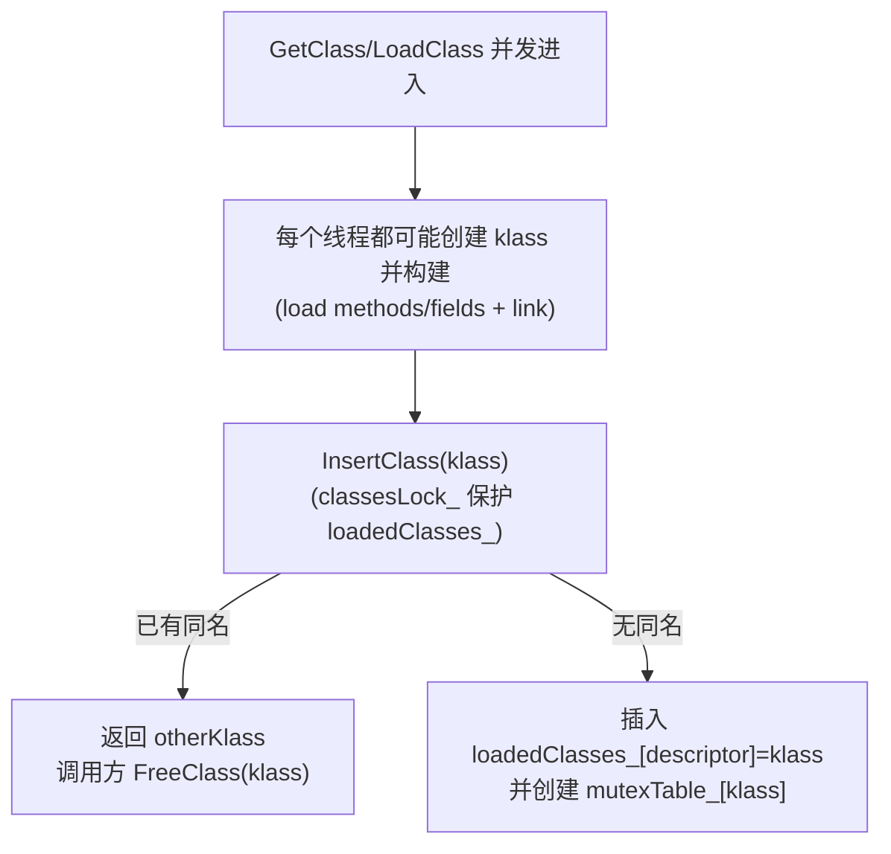

# ClassLinkerContext（加载域/类加载器上下文）

## 0) 在端到端主线图中的位置

- 总入口：[../Flows/ClassLoading_EndToEnd](../Flows/ClassLoading_EndToEnd.md)（“入口：按 descriptor 找 Class（FindLoadedClass/ctx->LoadClass）”框）

## 它是什么

`ClassLinkerContext` 是“类加载隔离域”的抽象：它持有本域内已加载类缓存，并提供并发协调与 GC roots 管理接口。语言插件可继承它，定义自己的 `LoadClass` 与 panda files 枚举策略。

## 关键能力

- **缓存**：`descriptor -> Class*`（`FindClass/InsertClass/RemoveClass`）
- **并发协调**：
  - `classesLock_`：保护 loadedClasses_（递归锁，支持 InsertClass 内重入 FindClass）
  - `mutexTable_`：每个 Class* 一个 `ClassMutexHandler(RecursiveMutex+CondVar)`，用于类加载/初始化等待唤醒
- **GC roots**：`roots_` + `VisitGCRoots/UpdateGCRoots/AddGCRoot`
- **文件枚举**：
  - `EnumeratePandaFiles`（本 context）
  - `EnumeratePandaFilesInChain`（链式 context）

## ETS 特化：EtsClassLinkerContext

`EtsClassLinkerContext` 的核心扩展：
- context 与一个 managed `RuntimeLinker` 绑定（weak ref）
- `LoadClass` 实现为两段式：
  - native 先行沿 parent+shared libs 链尝试（仅对白名单 linker 生效）
  - 必要时才调用 managed `RuntimeLinker.loadClass(final)`，并且 **禁止在非 managed 线程调用**
- `EnumeratePandaFilesImpl` 从 RuntimeLinker 的 AbcFiles 列表枚举 panda files

## 证据链

- [FileNotes/runtime_class_linker_context.h](../FileNotes/runtime_class_linker_context.h.md)
- [FileNotes/plugins_ets_runtime_ets_class_linker_context.h](../FileNotes/plugins_ets_runtime_ets_class_linker_context.h.md)
- [FileNotes/plugins_ets_runtime_ets_class_linker_context.cpp](../FileNotes/plugins_ets_runtime_ets_class_linker_context.cpp.md)

## 3) 并发模型（必须按真实代码理解）

当前 `ClassLinker` 的 `LoadClass` 主线并没有“按 descriptor 上锁排队”，而是允许重复构建，最后用 `InsertClass` 去重：

> 详细时序图与递归加载防护（CLASS_CIRCULARITY）见：[../Flows/Concurrency_and_ClassLock](../Flows/Concurrency_and_ClassLock.md)。

## 4) ClassLock（per-class condvar）的定位与现实

`ClassLinkerContext` 确实维护 `mutexTable_`，并提供 `runtime/class_lock.{h,cpp}` 的 `ClassLock`（基于 `ClassMutexHandler`）。  
但需要注意：**当前 class loading 去重主线并未使用 ClassLock**（它更像一个通用工具/未来接入点）。不要在排障时先假设“类加载会被 per-class 锁串行化”。

## 下一步（新人推荐）

- 想看“Context 决定可见域（boot vs app vs ETS 链）” → [../Flows/ClassLoading_EndToEnd](../Flows/ClassLoading_EndToEnd.md)
- 想看“ETS 两段式加载的 gate 细节” → [../Flows/ETS_Context_Native_vs_Managed_Load](../Flows/ETS_Context_Native_vs_Managed_Load.md)
- 想看“并发去重/递归加载防护/（ClassLock 的现实定位）” → [../Flows/Concurrency_and_ClassLock](../Flows/Concurrency_and_ClassLock.md)

