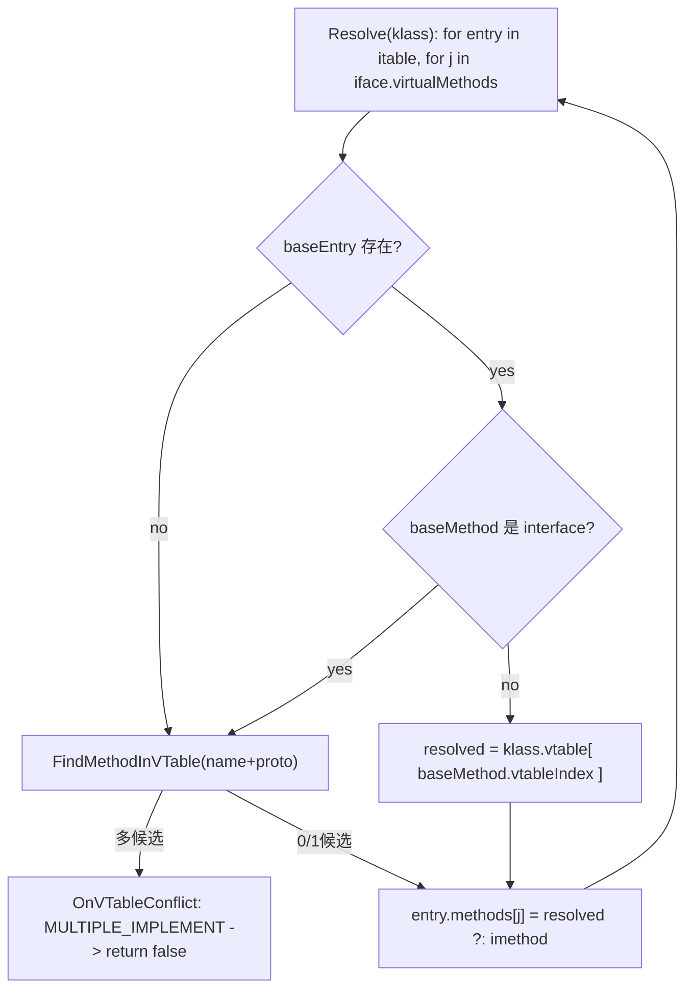

# ITable 与 IMT（接口派发结构）

## 0) 在端到端主线图中的位置

- 总入口：[../Flows/ClassLoading_EndToEnd](../Flows/ClassLoading_EndToEnd.md)（“LinkMethods：vtable/itable/imtable UpdateClass”框）

## 1) ITable：接口表（Interface Table）

### 它是什么
`ITable` 是 `Class` 内部保存的接口派发结构：一组 `ITable::Entry`，每个 entry 关联：
- `interface_`：接口 `Class*`
- `methods_`：`Span<Method*>`，长度与该接口的 virtual methods 数量一致、同序对齐

### 谁建它
- **构建接口（契约）**：`runtime/include/itable_builder.h`
- **ETS 实现**：`plugins/ets/runtime/ets_itable_builder.cpp`
  - Build：clone base itable + 线性化接口/父接口
  - Resolve：vtable 驱动解析，每个接口方法槽写入最终实现（或回退到接口方法本身）

### 算法细节（ETS：Build/Resolve 两阶段）

> 为什么要分两阶段：Build 阶段决定 itable 的“形状”（有哪些接口 entry、每个 entry 的 methods 数组大小），Resolve 阶段才把每个槽映射到最终实现（依赖 vtable 已就绪）。

#### Build：线性化（Linearize）+ 为 entry 分配 methods 数组

关键步骤（`plugins/ets/runtime/ets_itable_builder.cpp`）：

- 收集需要的接口集合：
  - 先把 base 的 itable 里已有接口加入集合（避免重复 entry）
  - 再把 `classInterfaces` 及其 itable 内的“父接口”加入集合
- 生成 itable：
  - 先 clone base itable 的 entries（保持 base 端 entry 顺序与含义不变）
  - 再按“直接接口顺序”追加其父接口 entries 与接口自身 entry（去重，保证稳定顺序）
- 对每个新增 entry：
  - `methods = entry.interface->GetVirtualMethods()`
  - 分配 `Method** methodsAlloc`（长度 = methods.size）
  - `entry.SetMethods({methodsAlloc, methods.size})`

#### Resolve：每个接口方法槽 j 映射到最终实现

Resolve 的核心循环（按源码的真实优先级）：

1. **优先复用 base**（如果 baseEntry 存在且 baseMethod 是 class method）：
   - 通过 `baseMethod->GetVTableIndex()` 在当前类 `klass->GetVTable()` 里取实现（这一步很快，也避免重复 name+proto 匹配）
2. **否则在当前 vtable 反向匹配**：`FindMethodInVTable(klass, imethod)`
   - 只比对“同名”候选，再用 `ETSProtoIsOverriddenBy` 做签名兼容判断
   - 找到多个候选直接 `MULTIPLE_IMPLEMENT` fail-fast
3. **写回槽位**：
   - 找到实现：写 class method
   - 找不到实现：写接口方法本身（后续派发会体现为“无实现/默认路径”）

Mermaid（ETS itable Resolve 关键决策树）：

### 关键不变量
- `Entry.methods_.Size == Entry.interface_->GetVirtualMethods().Size`
- Resolve 后：
  - `Entry.methods_[j]` 要么是实现方法（class），要么是接口方法（interface，表示无实现/默认路径）
  - 冲突（Multiple implement）必须 fail-fast

## 2) IMT：接口方法快速表（Interface Method Table）

### 它是什么
IMT 是 Class 内部的一段 `Method*` 数组，用于把“接口方法 id/hash”映射到实现方法，减少 itable 遍历。

### 谁建它
- `runtime/imtable_builder.cpp`
  - **规模策略**：接口方法数过多时直接 `imtSize=0`（禁用）
  - **冲突策略**：同槽冲突即清空槽，并标记该槽为 conflict（后续不再尝试填）

### 关键不变量
- IMT 是“可选加速结构”：
  - `imtSize==0` → 派发必须回退到 itable
  - 槽为空（FREE SLOT） → 回退到 itable
  - 槽冲突 → 也回退到 itable（通过清空槽保证不会误派发）

## 3) 派发路径（概念）

- **优先 IMT**：快路径命中则直接调用槽内 Method*

## 下一步（新人推荐）

- 想看“Build/Resolve/UpdateClass 的真实顺序” → [../Flows/Builders_and_LinkMethods](../Flows/Builders_and_LinkMethods.md)
- 想排查 MULTIPLE_IMPLEMENT / IMT 冲突 / IMT 禁用 → [../Newbie_MinDebug_Playbook](../Newbie_MinDebug_Playbook.md)（实验 3）
- **回退 ITable**：按接口 entry + vtableIndex/resolve 结果取实现
- **最终 vtable**：对类虚方法派发则直接走 vtable

## 证据链

- [FileNotes/runtime_include_itable.h](../FileNotes/runtime_include_itable.h.md)
- [FileNotes/runtime_include_itable_builder.h](../FileNotes/runtime_include_itable_builder.h.md)
- [FileNotes/plugins_ets_runtime_ets_itable_builder.cpp](../FileNotes/plugins_ets_runtime_ets_itable_builder.cpp.md)
- [FileNotes/runtime_imtable_builder.cpp](../FileNotes/runtime_imtable_builder.cpp.md)
- [FileNotes/runtime_include_class-inl.h](../FileNotes/runtime_include_class-inl.h.md)（ResolveVirtualMethod 的 IMT/ITable/VTable 分支）
 - 关键源码锚点：
   - `plugins/ets/runtime/ets_itable_builder.cpp`（LinearizeITable/CloneBaseITable/Build/Resolve/FindMethodInVTable）

