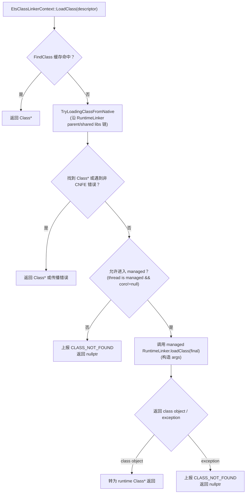

# `plugins/ets/runtime/ets_class_linker_context.cpp`（逐行精读）

> 章节归属：Stage2 / 03_ClassLoading  
> 文件类型：ETS AppContext 的核心实现：把 “descriptor→Class” 的查找/加载，拆成 **native 快路径（走 linker chain）** 与 **managed 慢路径（调用 RuntimeLinker.loadClass）**。  
> 文件规模：约 332 行（主要逻辑集中在 LoadClass 与链式查找/枚举）。

> 术语速查：见 [FileNotes/_Glossary](FileNotes/_Glossary.md)（同目录）

## 一图读懂：ETS LoadClass（native 优先链式解析 → managed 回退）

## 1. 重要内部工具：DecoratorErrorHandler（L31–L67）

`DecoratorErrorHandler` 包装一个真实 `ClassLinkerErrorHandler*`，用于：
- **捕获**最后一次错误（`lastError_`）
- **判断/读取**错误（HasError/GetErrorCode）
- **传播**错误到外部 handler（PropagateError）
- **清空**错误（ClearError）

关键用途：在 native 链式尝试过程中：
- 遇到 `CLASS_NOT_FOUND`：认为“可以继续向下委托/回退”，因此清空错误（L84–L87）
- 遇到其它错误：立即传播并停止回退（L87–L90）

## 2. ReportClassNotFound（L69–L76）

如果 errorHandler 非空，上报 `CLASS_NOT_FOUND` + “Cannot find class <descriptor>”。

## 3. BootContext 加载封装：LoadFromBootContext（L78–L93）

语义：当 ctx 是 boot context 时，直接调用 core `ClassLinker::GetClass(descriptor, true, ctx, &decoratorHandler)`：
- 如果出现错误：
  - `CLASS_NOT_FOUND`：清空（允许后续“委托/回退”）
  - 其它错误：传播（说明加载过程出错，例如 link/verify/oom 等）

> 这使得 ETS app context 也能“借用” boot context 的查找/加载能力，并统一 error 处理策略。

## 4. TryLoadingClassInChain：沿 RuntimeLinker 链做 native 解析（L95–L165）

这是本文件最关键的“闭环点”：把 managed 链式 class loader 逻辑部分复刻到 native 层，减少调用 managed 的次数。

### 4.1 基本结构
输入：
- descriptor
- DecoratorErrorHandler
- ctx（当前 ClassLinkerContext，可能是 boot 或 ETS app context）
- 输出 `Class** klass`（初始必须为 nullptr）

辅助：
- `isClassFound(cls)`：只要 cls 非空 **或** errorHandler 已记录错误，就算“已得到结论”（L102–L103）。

### 4.2 boot context 分支（L104–L108）
直接 `LoadFromBootContext`，并返回 true（链遍历成功）。

### 4.3 非 boot context 的前置约束（L110–L118）
强假设：所有非 boot context 都是 `EtsClassLinkerContext`：
- `EtsClassLinkerContext::FromCoreType(ctx)`（L111）
- 取 `runtimeLinker`（L112）
- 如果 runtimeLinker 的 class 不是 `coreAbcRuntimeLinker` 或 `coreMemoryRuntimeLinker`：
  - 认为无法在 native 侧遍历链 → 返回 false，必须调用 managed 实现（L114–L118）

> 这体现了一个“安全白名单”：只有核心 runtime linker 类型允许 native 复刻逻辑，其余用户自定义 linker 必须走 managed。

### 4.4 parent chain（L120–L133）
- `abcRuntimeLinker->GetParentLinker()` → parentContext
- 递归 `TryLoadingClassInChain`：
  - 如果递归返回 false：必须走 managed（链遍历失败）
  - 如果 parent 已找到 class 或有错误：直接返回 true（不再继续）

### 4.5 shared libraries linkers（L133–L158）
重复 managed 侧 `findAndLoadClass` 的逻辑：
- 枚举 `sharedLibraryRuntimeLinkers`（注释说明理论上存在 undefined，但构造时已保证非空）
- 对每个 shared linker：
  - 同样白名单检查
  - 递归 TryLoadingClassInChain
  - 若找到/有错误：返回 true

### 4.6 当前 context 自己的 files（L160–L164）
如果链都没找到且未有错误：调用 `etsLinkerContext->FindAndLoadClass(descriptor, &decoratorHandler)`。
最后返回 true（表示链遍历“逻辑上成功完成”）。

## 5. TryEnumeratePandaFilesInChain（L167–L197）

目的：沿 RuntimeLinker parent chain 枚举所有 panda files，用于：
- AOT class context、dump、调试工具等

逻辑：
- boot context：直接 `ctx->EnumeratePandaFiles(cb)`（L173–L175）
- 非 boot：
  - 要求 runtimeLinker 是 `coreAbcRuntimeLinker`（否则返回 false，表示无法遍历）
  - 递归遍历 parentContext
  - 然后再枚举当前 ctx 自己的 panda files（L195）

## 6. EtsClassLinkerContext::LoadClass（L201–L244）

这是 ETS app context 对 core `GetClass` 的替代入口（被 `ClassLinker::GetClass` 的非 boot 分支调用）。

步骤：
1) 先查 `FindClass(descriptor)`（context 内 cache）（L204–L207）
2) 断言 GC/MutatorLock 状态（L209）：  
   - 若 GC 在跑，必须持有 mutator lock（避免在 GC 并发期随意触发加载）
3) `TryLoadingClassFromNative(descriptor, errorHandler, &klass)`（L211–L214）：
   - 如果 succeeded（无论 klass 是否找到/是否错误）→ 直接返回 klass
4) 若 native 失败：决定是否允许调用 managed：
   - `EtsCoroutine::GetCurrent()` 为空或当前线程不是 managed code → **禁止调用 managed**（L218–L222）
     - 例如 JIT/AOT 线程：只能报 CLASS_NOT_FOUND
5) 构造 managed 调用参数：
   - `clsName = ClassHelper::GetName(descriptor)` 转成 ETS string（L224–L227）
   - `args = { runtimeLinker, etsClsName, nullptr }`（L233）
6) 调用 managed `RuntimeLinker.loadClass`（L236–L238）：
   - 方法来自 `PlatformTypes(coro)->coreRuntimeLinkerLoadClass`（说明这个方法在平台类型表中固定）
   - 无异常：把返回的 class object 转成 `Class*`（L239）
   - 有异常：ReportClassNotFound + return nullptr（L242–L243）

> 结论：**ETS 的类加载允许“managed 递归”只发生在 managed 线程**，否则必须走 native 或失败。  
> 这是防止 VM 内部线程（JIT/AOT/GC）意外 re-enter managed runtime 的关键防线。

## 7. EnumeratePandaFilesImpl/EnumeratePandaFiles（L246–L269）

`EnumeratePandaFilesImpl`：
- ASSERT 持有 ETS mutator lock（L248）
- 仅当 runtimeLinker 是 AbcRuntimeLinker 实例时才枚举（L251–L253）
- 从 runtimeLinker 获取 `AbcFiles` 列表，逐个取出 `EtsAbcFile->GetPandaFile()` 并回调（L254–L263）

`EnumeratePandaFiles` 简单转发到 Impl。

## 8. EnumeratePandaFilesInChain（L271–L277）

调用 `TryEnumeratePandaFilesInChain(this, cb)` 并 ASSERT 成功：
- 注释说明：AbcRuntimeLinker 是所有用户自定义 linker 的基类，因此链遍历应当总能成立（在 ETS 的运行时模型下）。

## 9. FindAndLoadClass（L279–L291）

在当前 context 的 panda files 中查找并加载：
- `pf.GetClassId(descriptor)` 命中且非 external → `Runtime::GetCurrent()->GetClassLinker()->LoadClass(pf, classId, this, errorHandler)`
- 一旦加载成功/失败（即尝试过），返回 false 停止枚举（L288–L289）

> 这是 native 链路“落到真正 class_linker.cpp 加载管线”的入口点。

## 10. TryLoadingClassFromNative（L293–L309）

把 `TryLoadingClassInChain` 包一层：
- 如果 DecoratorErrorHandler 捕获到错误：传播（L301–L305）
- 如果链遍历成功但没找到 class：ReportClassNotFound（L305–L307）
- 返回 succeeded（链是否可遍历；不可遍历意味着必须走 managed）

## 11. 析构：释放 weak ref（L311–L320）

析构时：
- 断言 `ClassLinker` 销毁早于 `PandaVM`（因此可安全访问 `PandaEtsVM::GetCurrent()`）
- 从 global object storage 移除 `refToLinker_`（避免泄漏）

## 12. FromCoreType（L322–L329）

强断言：
- ctx 非空、语言 ETS、且非 boot context
- 然后 reinterpret_cast 为 `EtsClassLinkerContext*`

