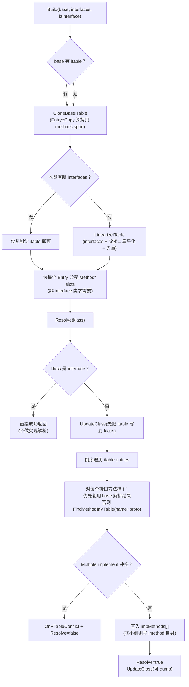

# `plugins/ets/runtime/ets_itable_builder.cpp`（逐行精读）

> 章节归属：Stage2 / 03_ClassLoading  
> 文件类型：ETS 的 itable 构建与解析实现（Build / Resolve / UpdateClass）。  
> 文件规模：约 205 行（实现相对集中）。

> 术语速查：见 [FileNotes/_Glossary](_Glossary.md)（同目录）

## 一图读懂：ETS ITableBuilder（Build → Resolve → UpdateClass）

## 0. include 与依赖（L16–L25）

该实现直接依赖：
- core `ClassLinker`（用于 allocator 与类型加载）
- ETS `EtsVTableBuilder` 的 override/冲突检测工具（`ETSProtoIsOverriddenBy`、`OnVTableConflict`）
- `runtime/include/exceptions.h`：用于冲突错误构造

> 这也解释了：ETS 的 itable resolve 不是“纯接口表”，而是与 vtable override 规则强耦合。

## 1. FindMethodInVTable：在 vtable 中找接口实现（L28–L53）

输入：
- `klass`：当前类
- `imethod`：接口方法（virtual method）
- `errHandler`：错误处理器

算法：
- 取 `vtable = klass->GetVTable()`、`imethodName = imethod->GetName()`、`ctx = klass->GetLoadContext()`。
- **从 vtable 末尾向前扫描**（L36–L51）：
  - 先比 name（快速过滤）
  - 再用 `ETSProtoIsOverriddenBy(ctx, imethod->GetProtoId(), kmethod->GetProtoId())` 判定签名/协变覆盖兼容
  - 记录候选 `candidate`
  - 若发现第二个候选：调用 `OnVTableConflict(errHandler, MULTIPLE_IMPLEMENT, ...)` 并返回 `nullopt`
- 返回：
  - `std::optional<Method*>`：空 optional 表示“冲突（致命）”；有值但为 nullptr 表示“没找到实现”（允许回退到接口默认实现，即填 imethod 自己）。

> 关键点：它显式防止“一接口方法多实现候选”的歧义，这与 ClassLinker 的 Error::MULTIPLE_IMPLEMENT 对齐。

## 2. CloneBaseITable：把 base 的 itable 深拷贝出来（L55–L72）

输入：`classLinker`、`base`、`size`（目标 itable entry 数）

- 用 `classLinker->GetAllocator()` 分配 `ITable::Entry` 数组（L57–L58）。
- 先把每个 entry 的 methods span 设置成 `{nullptr,nullptr}`（L60–L62），避免悬空。
- 若 base 非空：
  - `superItable = base->GetITable().Get()`
  - 对每个 entry 执行 `superItable[i].Copy(allocator)`（L67–L69）
    - 注意：`ITable::Entry::Copy` 会深拷贝 methods span（见我们之前对 `itable.h` 的逐行笔记）。

> 结论：子类 itable 构建以“复制父类 itable”为基底，再追加当前类接口。

## 3. LinearizeITable：把 interfaces + 子接口扁平化并追加到 itable（L74–L117）

目标：把“类直接实现的接口”与“接口的父接口”都加入 itable，同时保持去重与一定的线性化顺序。

步骤：
1) 建 `PandaUnorderedMap<Class*, bool> interfaces`：
   - key：interface class
   - value：是否已写入 itable（true=已放入）
2) 若 base 非空：
   - 把 base 的 itable entry interface 全部标记为 true（L80–L85）
3) 遍历 `classInterfaces`：
   - 先 `interfaces.insert({interface,false})`
   - 若这是首次插入（second==true），再把该 interface 的 itable（即其父接口列表）都 insert 为 false（L89–L94）
4) `itable = CloneBaseITable(..., interfaces.size())`（L97）
   - `shift = base!=nullptr ? base->GetITable().Size() : 0`（L98）
5) 再遍历 `classInterfaces`，对每个 interface：
   - 若在 map 中且 value==false（未放入），则先遍历其 `interface->GetITable().Get()`：
     - 对每个 item（父接口）如果 map 里 value==false：`itable[shift++] = item.Copy(allocator)` 并置 true（L105–L110）
   - 然后 `itable[shift++].SetInterface(interface)`（L112）
   - 把该 interface 标记为 true（L113–L114）

> 这个线性化策略非常关键：  
> - 先追加父接口，再追加直接接口  
> - 通过 bool 去重，避免重复 entry  
> - 保证 itable 的 entries 是“可枚举、可解析”的扁平序列

## 4. Build：构造 itable entries + 为每个接口虚方法分配实现槽（L119–L141）

### 4.1 itable entries 来源（L121–L124）
- 若 `classInterfaces` 为空：
  - 仅 clone base itable（size=base->GetITable().Size()）
- 否则：
  - `LinearizeITable(classLinker, base, classInterfaces)`

### 4.2 非接口类：为新追加的接口 entry 分配 methods 数组（L125–L137）
当 `!isInterface`：
- `superItableSize = base ? base->GetITable().Size() : 0`
- 对 `[superItableSize, itable.Size())` 的新增 entries：
  - `methods = entry.GetInterface()->GetVirtualMethods()`
  - 分配 `Method** methodsAlloc`（长度=methods.size()）
  - `entry.SetMethods(Span<Method*>{methodsAlloc, methods.size()})`

> 这里的关键契约：每个 itable entry 的 methods span 与 “接口的 virtual methods 列表”同长度同序对齐，  
> 后续 Resolve 会按 index j 填入对应实现。

### 4.3 写入成员 itable_（L139–L140）
`itable_ = ITable(itable)`，Build 完成。

## 5. Resolve：把每个接口方法映射到最终实现（L144–L181）

总体策略：对每个 itable entry 的每个接口虚方法 j，求出一个 `resolved`：
- 能继承复用的 → 直接复用 base 的实现（通过 vtableIndex 回到派发目标）
- 否则 → 在当前 klass 的 vtable 里找 name+proto 的候选实现
- 若没找到实现 → 退化为接口方法本身（填 `imethod` 指针）

逐步：
- interface class 直接 true（L146–L148）
- `UpdateClass(klass)` 先把 itable 写回 class（L149）
  - 这样后续 `klass->GetITable()` 可用（也便于调试）
- `baseEntry` 的复用路径（L163–L167）：
  - `baseMethod = baseEntry->GetMethods()[j]`
  - 如果 `baseMethod->GetClass()->IsInterface()`：说明 base 里这个槽还没解析到具体实现（仍是接口方法）→ 不复用
  - 否则：`resolved = klass->GetVTable()[ baseMethod->GetVTableIndex() ]`
    - 这里非常关键：**通过 vtableIndex 让“实现方法指针”在子类 vtable 中找到正确 override 的最终目标**。
- 若 resolved 仍为空：
  - `FindMethodInVTable(klass, imethod, errorHandler_)`
  - 返回 nullopt → 冲突（MULTIPLE_IMPLEMENT）→ Resolve 失败
  - 有值（可能 nullptr）→ 赋给 resolved
- 最终填槽（L176）：
  - `entry->GetMethods()[j] = resolved != nullptr ? resolved : imethod`

> 结论：ETS 的 itable resolve 是 **vtable 驱动** 的：  
> - 先用 base 的 vtableIndex 复用“派发位置”  
> - 再在当前类 vtable 里做 override 匹配  
> - 冲突严格报错并失败

## 6. UpdateClass / DumpITable（L183–L202）

- `UpdateClass`：`klass->SetITable(itable_)` 并 `DumpITable`
- `DumpITable`（debug only）：打印 itable 的 interface 列表（注释提到 `#22950 itable has nullptr entries`，暗示存在 “interface==nullptr” 的占位 entry，dump 时需要更完善输出）

