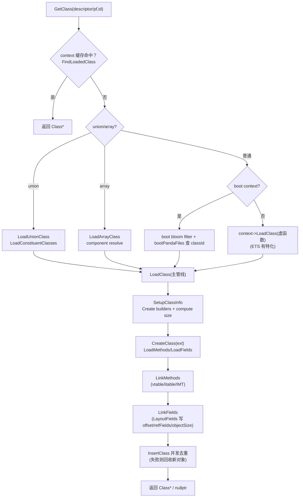

# `runtime/class_linker.cpp`（逐行精读｜按函数簇分段）

> 章节归属：Stage2 / 03_ClassLoading  
> 文件规模：1895 行（实现文件，按“函数簇 + 行段”做逐行记录）  
> 目标：把 **ClassLinker 的真实执行管线**、**布局算法**、**缓存/并发策略**、以及 **AOT/boot filter** 的接入点讲清楚。

> 术语速查：见 [FileNotes/_Glossary](FileNotes/_Glossary.md)（同目录）

## 一图读懂：GetClass → LoadClass → Link（本文件主线）

## 0. 顶部 include 与命名空间（L16–L49）

- **L16**：实现对应头：`runtime/include/class_linker.h`。
- **L17**：bridge：`GetCompiledCodeToInterpreterBridge`（LoadMethod 设置 entrypoint 用）。
- **L18–L19**：`cha.h`、`class_initializer.h`（类初始化与 CHA 相关）。
- **L33–L39**：panda_file 的各类 accessor（Class/Method/Field/Proto/Code）与 `panda_cache.h`（缓存）。
- **L45–L49**：`namespace ark`；`using Type/SourceLang`。

## 1. PandaFile 注册：`ClassLinker::AddPandaFile`（L50–L79）

核心逻辑：
- **L58–L61**：在 `pandaFilesLock_` 下把 `{context, pf}` push 到 `pandaFiles_`（全量文件集）。
- **L63**：调用 `AotManager::UpdatePandaFilesSnapshot(file, context, IsArkAot)`，让 AOT 侧同步可见文件集。
- **L65–L71**：如果是 boot context（或 context==nullptr）：
  - 加入 `bootPandaFiles_`（受 `bootPandaFilesLock_` 保护）
  - 如果启用 `boot class filter`（bloom filter），调用 `AddBootClassFilter(file)` 预热过滤器。
- **L73–L76**：Runtime 已初始化时，发出 `LoadModuleEvent`（通知系统）。
- **L78**：`tooling::DebugInf::AddCodeMetaInfo`（调试元信息注册）。

> 结论：**AddPandaFile 是“文件注册中心”**：它同时驱动 AOT snapshot、boot files 集合、以及调试/通知。

## 2. 释放路径：`FreeClassData/FreeClass/~ClassLinker`（L81–L160）

### 2.1 `FreeClassData`（L81–L147）
- 释放 `fields` 数组（L83–L87）。
- 释放 `methods` 数组前，先释放每个 method 的 `ProfilingData`（L91–L97）。  
  这里强调：profiling data 通过 `InternalAllocator` 分配，因此也必须通过同 allocator free。
- 对 copied methods（default interface method 拷贝出来的 Method）：
  - **L99–L120**：存在“profilingData 借用原方法”的可能性，故先在原 methods 中查同 (fileId,pf) 的方法，
    仅当 copied method 的 profilingData 并非指向原方法的同一块时才 free（L115–L119）。
- **L125–L136**：释放 itable 及其每个 entry 的 methods span；数组类可能不拥有自己的 itable（`!IsArrayClass()`）。
- **L137–L146**：释放 interfaces / constituent types spans。

### 2.2 `FreeClass`（L149–L153）
先 `FreeClassData`，再委托 extension 做语言特定的 `FreeClass`。

### 2.3 析构（L155–L160）
释放 `copiedNames_` 中保存的“被复制过的 descriptor 字符串”内存（由 `CopyMutf8String` 分配）。

## 3. 构造与 extension 装配：`ClassLinker::ClassLinker/ResetExtension`（L162–L179）

- **L164–L168**：初始化：
  - `aotManager_ = MakePandaUnique<AotManager>()`
  - `isTraceEnabled_` 来自 options
  - `bootClassFilter_` 以常量参数构造（NUM_BOOT_CLASSES / FILTER_RATE）。
- **L170–L172**：把外部传入的 extensions vector 转换填充到 `extensions_[langIndex]`。
- **L175–L179**：`ResetExtension(lang)`：通过 `Runtime::GetLanguageContext(lang)` 重新创建该语言 extension（热更/重置场景）。

## 4. 初始化：`Initialize/InitializeRoots`（L187–L221）

- **Initialize**：遍历所有 non-null extension，调用 `ext->Initialize(this, compressedStringEnabled)`；成功后 `isInitialized_ = true`。
- **InitializeRoots**：遍历 extension 调 `ext->InitializeRoots(thread)`，用于构建 class roots（Object/Class/String/Array…）。

> 注意：这里体现了两阶段：**Initialize（初始化 extension 与 linker）** 与 **InitializeRoots（构建根类）**。

## 5. Boot files 查找：`FindClassInPandaFiles` + `FindLoadedClass`（L223–L242）

- `FindClassInPandaFiles(descriptor, pandaFiles)`：线性扫描文件列表，`pf->GetClassId(descriptor)` 命中且非 external 则返回 `(classId,pf)`。
- `FindLoadedClass(descriptor, context)`：直接转发 `context->FindClass`（内部带 `classesLock_`）。

## 6. 计算 Class 对象总大小：`GetClassSize`（L244–L297）

该模板函数枚举 **静态字段类型分布**，统计：
- 8/16/32/64 位 primitive
- reference
- tagged（动态语言 TaggedValue）

并调用：
- **L295–L296**：`Class::ComputeClassSize(vtableSize, imtSize, numXxxSfields...)`

> 关键点：**Class 的内存大小不仅取决于 vtable/imt，还取决于静态字段类型分布**（布局由 Class::ComputeClassSize 定义）。

## 7. SetupClassInfo：创建三类 builder 并算 size（L345–L421）

### 7.1 版本 A：基于 `panda_file::ClassDataAccessor*`（L345–L370）
- **L349**：`LanguageContext ctx = Runtime::GetLanguageContext(dataAccessor)`（从 classData 解析语言）。
- **L351–L353**：创建 builder：
  - `ctx.CreateVTableBuilder(errorHandler)`
  - `ctx.CreateITableBuilder(errorHandler)`
  - `ctx.CreateIMTableBuilder()`
- **L356–L358**：itableBuilder 先 Build（需要 base + interfaces + 是否接口）。
- **L360–L363**：vtableBuilder Build 失败则释放 itable/interfaces（`FreeITableAndInterfaces`）。
- **L364**：imtableBuilder Build。
- **L366–L368**：通过 wrapper 枚举静态字段类型 → `GetClassSize` 算出 `info.size` 与 `info.numSfields`。

### 7.2 版本 B：基于 `Span<Method>/Span<Field>`（L397–L421）
用于 `BuildClass`（合成类）路径：语言从 `*base` 决定（L400），其余步骤与版本 A 一致。

> 结论：**SetupClassInfo 是管线的“装配点”**：它同时决定三类派发表构建策略与 class 对象整体布局大小。

## 8. LoadMethod / copied methods / AOT 入口点（L423–L545）

### 8.1 `LoadMethod`（L423–L453）
- 取 proto shorty：`ProtoDataAccessor pda(pf, protoId)`。
- 根据 ctor/cctor 名称为 method 打上 `ACC_CONSTRUCTOR`（L431–L434）。
- 计算 `numArgs`：static 用 `pda.GetNumArgs()`，非 static +1（隐式 this）（L437）。
- 若无 codeId（L439–L447）：
  - `InitializeMemory(method, klass, pf, methodId, codeId=0, accessFlags, numArgs, shorty)`
  - native：`SetCompiledEntryPoint(ext->GetNativeEntryPointFor(method))`
  - 非 native：`SetInterpreterEntryPoint()`（C2I bridge）
- 若有 codeId（L448–L452）：
  - `InitializeMemory(..., codeId)`
  - `SetCompiledEntryPoint(GetCompiledCodeToInterpreterBridge(method))`

### 8.2 AOT 链接：`MaybeLinkMethodToAotCode`（L455–L472）
若 method 非 intrinsic 且 AOT class 有该 methodIndex 的 code entry，则直接把 entrypoint 切到 AOT code（并打事件）。

### 8.3 copied methods：`SetupCopiedMethods`（L474–L493）
把 vtable builder 产出的 `CopiedMethod` 复制成新的 `Method` 对象：
- `InitializeMemory(method, copiedMethods[i].GetMethod())`（调用 Method 的“从 Method* 拷贝构造”）
- `SetIsDefaultInterfaceMethod()`
- 若 status 是 ABSTRACT/CONFLICT，设置 entrypoint 为对应 stub（AbstractMethodError / DefaultConflict）。

### 8.4 `LoadMethods`（L495–L545）
要点：
- 计算 vmethods/smethods 分区（L500–L502）。
- totalNumMethods = 原 methods + copiedMethods（L503–L505）。
- 分配连续 `Span<Method>`（L509）。
- 枚举 panda_file 方法：
  - static 放入 `methods[smethodIdx++]`，virtual 放 `methods[vmethodIdx++]`（L529）。
  - `LoadMethod` 初始化。
  - 若 AOT class valid → `MaybeLinkMethodToAotCode`（L531–L533）。
  - abstract method 直接把 entrypoint 设为 `GetAbstractMethodStub()`（L534–L538），避免每次派发前判断 abstract。
- 末尾 `SetupCopiedMethods`，并 `klass->SetMethods(methods, numVmethods, numSmethods)`。

## 9. `LoadFields`：构建 Field 数组（L547–L571）

- 分配 `Span<Field> fields`，并按 static/instance 分区写入（L559–L566）：
  - `InitializeMemory(field, klass, fieldId, accessFlags, TypeFromEncoding(fda.GetType()))`
- `klass->SetFields(fields, numSfields)`（L568）。

> 与 `field.h` 对齐：Field 的 type 编码进 `accessFlags_`；offset 仍未设置，后续由 LayoutFields 写入。

## 10. 字段布局算法：`LayoutFields*`（L573–L819）

### 10.1 核心设计目标（L577–L581）
注释明确：**必须保持与“语言侧 class 表示”一致的字段顺序**，否则会出现如 String 的字段顺序不一致问题。

### 10.2 `LayoutFieldsWithoutAlignment`（L573–L601）
对同尺寸字段列表按顺序批量写 offset：
- 正向：`field->SetOffset(*offset); *offset += size`
- 逆向（REVERSE_LAYOUT=true）：用于把子类小字段塞回 base 的 padding 末尾。

### 10.3 引用字段特殊处理：`LayoutReferenceFields`（L603–L621）
先布局 `volatile` 引用字段，再布局非 volatile；返回 volatile 引用字段数量。
这和 `Class::SetVolatileRefFieldsNum/SetRefFieldsOffset` 配套，用于 GC/并发可见性策略。

### 10.4 “基类 padding 回填”：`LayoutFieldsInBaseClassPadding`（L629–L661）
确定起始 offset：
- static：`klass->GetStaticFieldsOffset()`
- instance：`base->GetObjectSize()` 或 `ObjectHeaderSize()`

根据“最高对齐需求”（ref > 64 > 32 > 16）对齐到 `alignOffset`，若有 padding，则 **逆向把 32/16/8 位字段塞进 padding**。

### 10.5 主布局：`LayoutFields`（L664–L717）
顺序：
1) 先处理 refFields：对齐到 OBJECT_POINTER_SIZE，写 `refFieldsNum/refFieldsOffset/volatileRefFieldsNum`
2) 处理 TaggedValue 与 64 位字段：必要时用 32/16/8 填充对齐缺口
3) 再处理 32 位字段：必要时用 16/8 填充
4) 再处理 16 位字段：必要时用 8 填充
5) 最后处理 8 位字段

### 10.6 对外入口：`ClassLinker::LayoutFields`（L732–L791）
把 fields 按类型分桶到 tagged/64/32/16/8/ref，然后调用 `ark::LayoutFields(...)` 得到最终 size：
- instance 且非 variable-size：`klass->SetObjectSize(size)`（L786–L788）。

### 10.7 `LinkMethods/LinkFields`（L793–L819）
- `LinkMethods`：`vtableBuilder->UpdateClass` 写回 vtableIndex 等；`itableBuilder->Resolve/UpdateClass`；`imtableBuilder->UpdateClass`。
- `LinkFields`：分别对 static/instance fields 调 `LayoutFields`，失败则 log 并返回 false。

> 结论：**字段 offset 的唯一写入点就在这里**，它直接决定对象布局与反射/解释器字段访问的正确性。

## 11. base/interfaces 解析与主 LoadClass 管线（L821–L1103）

### 11.1 `LoadBaseClass`（L821–L841）
从 superClassId 解析 base：
- offset==0 → Object root
- 否则通过 extension 的 `GetClass(pf, baseClassId, context, handler)` 获取 base。

### 11.2 `LoadInterfaces`（L843–L872）
分配 `Span<Class*>`，逐个 `GetClass(pf, ifaceId, context, handler)`；失败则释放数组并返回 empty optional。

### 11.3 “并发加载/循环检测”骨架（L874+）
文件中引入 `ClassLoadingSet` 与 `ClassScopeStaticSetAutoCleaner`（见后续实际使用点），用于防止同线程递归加载导致的循环问题；其核心是把 `(pandaFileHash,classId)` 组合成一个 64-bit hash（L900–L904）。

### 11.4 `LoadClass(ClassDataAccessor*, ...)`（L906–L959）
关键阶段：
1) `SetupClassInfo`（builders + size + numSfields）
2) `ext->CreateClass(descriptor, vtableSize, imtSize, size)` 创建 `Class` 对象（L916–L919）
3) 写入 class 元信息：context/base/interfaces/fileId/pandaFile/accessFlags/indexes（L924–L936）
4) 写入 counts：numVirtualMethods/numCopiedMethods/numStaticFields（L937–L939）
5) onFail lambda：失败统一 `FreeClass(klass)` 并打 log（L941–L945）
6) `LoadMethods` → `LoadFields` → `LinkMethods` → `LinkFields`（L946–L957）
7) 返回 klass（仍未加入 context；加入发生在更外层 LoadClass wrapper 中）

### 11.5 “加入 runtime/context & 事件”包装层（L1088–L1102）
当 `addToRuntime` 为 true：
- `ClassLoadEvent`
- `context->InsertClass(klass)`：若返回 otherKlass，说明另一个线程已创建同 descriptor 的类 → FreeClass 并返回 otherKlass（L1091–L1096）
- `RemoveCreatedClassInExtension(klass)`：通知 extension “该 class 已 prepared”
- `ClassPrepareEvent`

> 这里体现了：**并发下的“最后写入者赢/插入冲突回收”策略**。

## 12. BuildClass（合成类）与 array/union（L1105–L1390）

### 12.1 descriptor 复制：`CopyMutf8String`（L1105–L1111）
分配并复制 descriptor（null-terminated），用于 needCopyDescriptor 为真时避免引用外部临时内存。

### 12.2 `LinkEntitiesAndInitClass`（L1113–L1133）
对 BuildClass/某些路径复用：
- `LinkMethods`、`LinkFields`、`ext->InitializeClass`

### 12.3 `BuildClass`（L1135–L1205）
流程：
- 可选复制 descriptor 并记录到 `copiedNames_`（L1140–L1144）。
- `SetupClassInfo`（基于 spans）。
- `ext->CreateClass` 创建 class。
- 填充 base/interfaces/accessFlags/counts、写入 methods/fields spans，并把 Method/Field 的 `classWord_` 重绑到新 klass（L1178–L1184）。
- `LinkEntitiesAndInitClass` → state=LOADED → 事件 → `context->InsertClass` 并处理并发冲突（L1194–L1199）。

### 12.4 union 类（L1207–L1317）
- `LoadConstituentClasses`：解析 union descriptor 的 component 列表，逐个 `GetClass`（失败释放）。
- `LoadUnionClass`：
  - 通过 `ext->GetCommonContext(constituentClasses)` 获取 commonContext（可能与当前 context 不同）
  - 在 commonContext 中 `FindLoadedClass` 做去重
  - `CreateUnionClass`（调用 `ext->InitializeUnionClass`）
  - 事件 + InsertClass（与普通类一致）

### 12.5 array 类（L1319–L1390）
- `LoadArrayClass`：
  - 通过 `GetClass(componentDescriptor)` 获取 componentClass
  - `componentClassContext` 决定最终插入的 context（避免跨 context 复制）
  - `CreateArrayClass`（`ext->InitializeArrayClass`）
  - 事件 + InsertClass（同上）

## 13. GetClass：descriptor/path 的缓存与 boot filter（L1410–L1535）

### 13.1 `GetClass(descriptor, ...)`（L1410–L1463）
顺序：
1) 在 context 查 loadedClasses（L1420–L1423）
2) union/array descriptor 特判（L1425–L1431）
3) 若 boot context：
   - 先 `LookupInFilter`，IMPOSSIBLY_HAS 直接返回 nullptr（L1434–L1436）
   - 在 `bootPandaFiles_` 中查 classId（受 `bootPandaFilesLock_` 保护）（L1442–L1444）
   - 未找到：构造错误信息（注意缩小 lock scope 防递归）并 `OnError`（L1446–L1455）
   - 找到：走 `LoadClass(pandaFile, classId, descriptor, context, errorHandler)`（L1459）
4) 非 boot context：委托 `context->LoadClass`（虚函数，可由语言插件实现 app context 的加载策略）（L1462）

### 13.2 `GetClass(pf,id,...)`（L1466–L1535）
额外增加 panda_cache：
1) `pf.GetPandaCache()->GetClassFromCache(id)` 命中直接返回（L1475–L1478）
2) 否则按 descriptor 查 loadedClasses；命中则写回 cache（L1481–L1485）
3) union/array 分支同样会在成功后写回 cache（L1487–L1500）
4) boot context：同样先 `LookupInFilter`，再查 bootPandaFiles_，最后 `LoadClass` 并写 cache（L1503–L1531）
5) 非 boot：`context->LoadClass(descriptor, false, handler)`（L1534）

## 14. GetMethod / GetField：缓存与“按 id / 按签名”双路径（L1537–L1815）

### 14.1 GetMethod（L1537+）
- 先 panda_cache：`GetMethodFromCache`。
- 无 context 时：用 `ClassDataAccessor` 推导语言，取 extension 的 bootContext（L1548–L1558）。
- `klass = GetClass(pf, classId, context, handler)`，失败返回 nullptr。
- `GetMethod(klass, methodDataAccessor, handler)`：
  - 若方法定义在同 pf 且非 external：优先用 id 直接取（接口/类分别取 static/virtual 分区）（L1613–L1618）
  - 否则：用 name + proto 在 class 中查找（必要时 abstract class 允许查接口方法）（L1632–L1643）
  - 找不到会构造 `METHOD_NOT_FOUND` 错误并返回 nullptr（L1620–L1626 / L1645–L1651）。

### 14.2 GetField：按 id / 按签名（L1660–L1743）
- `GetFieldById`：`FindStaticFieldById/FindInstanceFieldById`，失败 OnError(FIELD_NOT_FOUND)。
- `GetFieldBySignature`：name+type 过滤：
  - primitive：只比 type + name
  - reference：还要比较 “字段类型的 class type”（通过对比 typeId 的 stringData）（L1693–L1701）
- `GetField(pf,id,...)`：先 cache；`klass = GetClass(pf, classId, ...)`；
  - 若非 external 且 `klass->GetPandaFile()==&pf` 用 byId，否则用 bySignature（L1737–L1741）。

### 14.3 InitializeClass（L1745–L1754）
若已 initialized 直接 true，否则委托 `LanguageContext::InitializeClass(this, thread, klass)`（语言相关的 init state machine）。

## 15. AOT 重新链接与 boot class bloom filter（L1828–L1894）

- `TryReLinkAotCodeForBoot`：遍历 bootContext 已加载类，枚举 methods 并调用 `MaybeLinkMethodToAotCode`（用于 boot 期间补挂 AOT entry）。
- `AddBootClassFilter`：锁 `bootClassFilterLock_`，把 boot file 的所有 className 加入 bloom filter（L1857–L1867）。
- `LookupInFilter`：
  - 未启用过滤：DISABLED
  - 否则 `PossiblyContains(descriptor)`；若 false：
    - errorHandler 为空：直接 IMPOSSIBLY_HAS
    - 否则上报 `CLASS_NOT_FOUND` 并返回 IMPOSSIBLY_HAS
  - 命中则 POSSIBLY_HAS

> 过滤器语义：**只做“快速否定”**（bloom filter false → 一定不存在；true → 还需去 bootPandaFiles 查证）。

## 16. 本文件对 03 章的“契约回指”

本文件是 `Method/Field/Class` 契约的主要写入点：
- **Method**：
  - `SetCompiledEntryPoint`（解释器桥 / native / AOT / stub）
  - `SetIsDefaultInterfaceMethod`（copied method）
  - abstract method stub（避免派发前检查）
- **Field**：
  - `SetOffset`（布局算法唯一写入点）
- **Class**：
  - `SetRefFieldsNum/Offset/VolatileRefFieldsNum`
  - `SetObjectSize`
  - `SetMethods/SetFields/SetInterfaces/SetBase/SetLoadContext`
  - `SetState(LOADED)` 与插入 context（并发冲突回收）

