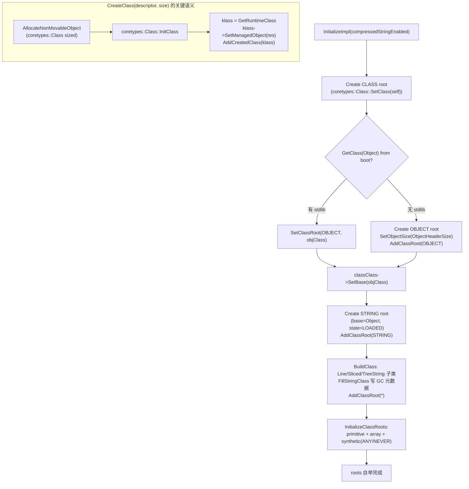

# `runtime/core/core_class_linker_extension.cpp`（逐行精读｜Core 语言 Extension：roots 自举 + CreateClass）

> 章节归属：Stage2 / 03_ClassLoading  
> 文件规模：481 行  
> 目标：把“默认 ClassLinkerExtension 抽象”在 core（PANDA_ASSEMBLY）语言下的落地讲清楚：**错误映射**、**根类自举（primitive/array/synthetic/String 子类）**、**CreateClass 的 heap 分配与 managed<->runtime 绑定**、以及各 root 的 vtable/IMT/size 策略。

> 术语速查：见 [FileNotes/_Glossary](_Glossary.md)（同目录）

## 一图读懂：Core roots 自举（Class/Object/String + String 子类 + primitive/array）

## 0. include 与定位（L16–L23）

- `core_class_linker_extension.h`：`CoreClassLinkerExtension` 声明（继承 `ClassLinkerExtension`）。
- `include/class_root.h`：`ClassRoot` 枚举（OBJECT/CLASS/STRING/ARRAY_* 等）。
- `coretypes/class.h`：managed `coretypes::Class` 与 runtime `Class` 的映射。
- `exceptions.h`、`panda_vm.h`：抛异常与拿 VM/heap manager。

## 1. ErrorHandler：把 ClassLinker::Error 映射为异常（L29–L60）

- 取当前线程 `ManagedThread::GetCurrent()`。
- 用 `PANDA_ASSEMBLY` 的 `LanguageContext` 作为抛异常语境（L32）。
- `switch(error)`：
  - `CLASS_NOT_FOUND` → `ClassNotFoundException`
  - `FIELD_NOT_FOUND` → `NoSuchFieldError`
  - `METHOD_NOT_FOUND` → `NoSuchMethodError`
  - `NO_CLASS_DEF` → `NoClassDefFoundError`
  - `CLASS_CIRCULARITY` → `ClassCircularityError`
  - default：FATAL

> 对齐点：这是 core 语言对 `ClassLinkerErrorHandler` 的默认实现；ETS 有自己的一套映射（见 `plugins/ets/runtime/ets_class_linker_extension.cpp`）。

## 2. InitializeClassRoots：primitive/array/synthetic roots（L62–L94）

### 2.1 primitive roots（L64–L76）
- 典型：`U1 -> "Z"`, `I32 -> "I"`, `F64 -> "D"`, `TAGGED -> "A"` 等。
- 通过基类 helper：`InitializePrimitiveClassRoot(root, typeId, descriptor)`（实现在 `runtime/class_linker_extension.cpp`）。

### 2.2 array roots（L77–L90）
- 典型：`ARRAY_I32 -> "[I"`，`ARRAY_STRING -> String[] descriptor`。

### 2.3 synthetic roots（L92–L93）
- `ANY -> "Y"`, `NEVER -> "N"`。

## 3. String 子类：FillStringClass + GetStringClassDescriptor（L96–L145）

### 3.1 FillStringClass（L96–L127）
- 进入 `INITIALIZING`。
- 对不同子类设置标志位：
  - `LINE_STRING`：仅 `SetLineStringClass()`
  - `SLICED_STRING` / `TREE_STRING`：**额外写入 GC 所需元数据**
    - `SetRefFieldsNum(...)`
    - `SetRefFieldsOffset(...)`
    - `SetObjectSize(common::{Sliced,Tree}String::SIZE)`（注意这里 cast 到 `BaseClass*` 写 object size）
- 最终：`SetStringClass()`、`SetState(INITIALIZED)`、`SetFinal()`

> 关键结论：**String 子类的 GC ref-fields 元数据在 root 初始化阶段就写死**，而不是由 LayoutFields 动态计算。

### 3.2 GetStringClassDescriptor（L129–L144）
- 直接返回固定 descriptor：`Lpanda/LineString;` / `Lpanda/SlicedString;` / `Lpanda/TreeString;`

## 4. InitializeStringClass：先 String，再用 BuildClass 造子类（L146–L185）

- 先用 `CreateClass(ctx.GetStringClassDescriptor(), ...)` 创建 String root：
  - `SetBase(objCls)`、`SetStringClass()`、`RemoveFinal()`、state=LOADED、loadContext=boot。
  - `AddClassRoot(STRING, strCls)`（写入 roots 表并插入 boot context）。
- 再创建 `LINE/SLICED/TREE` 子类：
  - 复用 base String 的 fields/methods/interfaces（空 span），用 `ClassLinker::BuildClass(descriptor, ..., base=strCls, bootContext)` 创建 runtime class。
  - 调 `FillStringClass(subStrCls, flag)` 写入子类特性与 GC 元数据。
  - `AddClassRoot(flag, subStrCls)` 注册。

> 对齐点：这条链路解释了 Stage1 中提到的“String 子类在初始化时显式写入 refFieldsNum/Offset/objectSize”的依据，但实现主体是在 **CoreClassLinkerExtension**。

## 5. InitializeImpl：class/classClass/object fallback + compressed strings（L187–L222）

- 创建 `ClassRoot::CLASS`：
  - `CreateClass(ClassDescriptor, ...)`
  - `coretypes::Class::FromRuntimeClass(classClass)->SetClass(classClass)`（class object 的 class 指向自身）
  - state=LOADED、loadContext=boot、`AddClassRoot(CLASS, classClass)`
- 获取/创建 `OBJECT`：
  - 尝试 `GetClassLinker()->GetClass(ObjectDescriptor, false, bootContext)`
  - 若没有 pandastdlib（返回空），就 `CreateClass(ObjectDescriptor, ...)` 并 `SetObjectSize(ObjectHeaderSize)`，再 `AddClassRoot(OBJECT, objClass)`
  - 否则 `SetClassRoot(OBJECT, objClass)`
- `classClass->SetBase(objClass)`
- `coretypes::String::SetCompressedStringsEnabled(compressedStringEnabled)`
- `InitializeStringClass()` + `InitializeArrayClassRoot(ARRAY_CLASS, CLASS, ...)` + `InitializeClassRoots(ctx)`

## 6. InitializeArrayClass/InitializeUnionClass/InitializePrimitiveClass/InitializeSyntheticClass（L224–L271）

- Array：
  - base=OBJECT；componentType；从 component 的 accessFlags 派生（去掉 interface，加 final|abstract）；state=INITIALIZED。
- Union：
  - base=OBJECT；写 constituentTypes；
  - accessFlags 取 constituent 交集，再加 final|abstract；state=INITIALIZED。
- Primitive/Synthetic：都设 `ACC_PUBLIC|ACC_FINAL|ACC_ABSTRACT` 且 state=INITIALIZED。

## 7. root 的 vtable/IMT/size 策略（L273–L436）

- `GetClassVTableSize/GetClassIMTSize`：
  - primitive/any/never/tagged → 0
  - array_* → 复用 OBJECT 的 array size getter
  - OBJECT/CLASS/STRING/LINE_STRING → 0
- `GetClassSize`：
  - 大多数 root 用 `Class::ComputeClassSize(vtableSize, imtSize, 0,0,0,0,0,0)`（无额外静态字段/方法空间）
  - array roots → `GetArrayClassSize()`
- `GetArrayClass*`：
  - 直接复用 OBJECT 的参数。

## 8. CreateClass：NonMovable 分配 + coretypes::Class InitClass + runtime 绑定（L438–L463）

- 取 `vm->GetHeapManager()`，分配 NonMovable object：
  - 若 classRoot==nullptr（创建 CLASS 自己时）走 `AllocateNonMovableObject<true>`
  - 否则走 `AllocateNonMovableObject<false>`（以 classRoot 作为 klass）
- `reinterpret_cast<coretypes::Class*>(objectHeader)`：
  - `res->InitClass(descriptor, vtableSize, imtSize, size)`
  - `klass = res->GetRuntimeClass()`
  - `klass->SetManagedObject(res)`（managed<->runtime 绑定）
  - `AddCreatedClass(klass)`（进入 createdClasses_，等待 prepared）

## 9. FreeClass 与析构（L465–L479）

- `FreeClass`：从 createdClasses_ 移除。
- 析构：若 initialized 则 `FreeLoadedClasses()`（由基类实现遍历 boot+contexts，并 free class data）。

## 证据链与关联阅读

- 抽象与容器语义：[FileNotes/runtime_include_class_linker_extension.h](runtime_include_class_linker_extension.h.md) + [FileNotes/runtime_class_linker_extension.cpp](runtime_class_linker_extension.cpp.md)
- ClassLinker roots 初始化调度：[FileNotes/runtime_class_linker.cpp](runtime_class_linker.cpp.md)（Initialize/InitializeRoots 调用 ext->Initialize/InitializeRoots）
- ETS 对应实现：[FileNotes/plugins_ets_runtime_ets_class_linker_extension.cpp](plugins_ets_runtime_ets_class_linker_extension.cpp.md)

