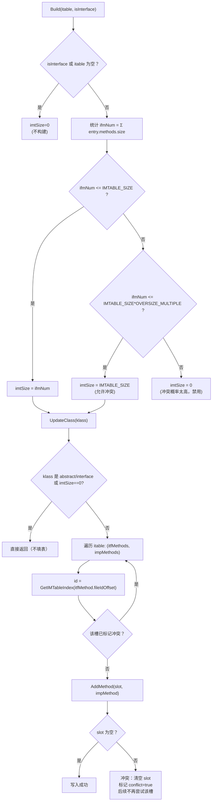

# `runtime/imtable_builder.cpp`（逐行精读）

> 章节归属：Stage2 / 03_ClassLoading  
> 文件类型：`IMTableBuilder` 实现（IMT 构建与写回）  
> 文件规模：约 129 行（实现非常集中）

> 术语速查：见 `FileNotes/_Glossary.md`（同目录）

## 一图读懂：IMT 的“是否构建/构建多大”与“冲突即清空槽”

## 1. Build：决定 IMT 的“是否构建 + 构建多大”策略（L21–L61）

该实现有两个 Build overload，但策略一致：
- **短路条件**（L23–L25 / L46–L48）：
  - 如果目标是 interface（接口本身），或 itable 为空 → 不构建（保持 imtSize_=0）。
- **统计接口方法总数 ifmNum**（L27–L32 / L50–L55）：
  - 遍历 itable 的每个 entry，把 `entry.GetMethods().Size()` 累加。
  - 注意：这里累加的是“实现方法数组”的长度，等价于该类需要实现的接口虚方法总数。
- **IMT size 规则**（L34–L41 / L57–L60）：
  - (1) `ifmNum <= Class::IMTABLE_SIZE`：IMT 取 `ifmNum`（刚好容纳）
  - (2) `Class::IMTABLE_SIZE < ifmNum <= Class::IMTABLE_SIZE * OVERSIZE_MULTIPLE`：IMT 固定为 `Class::IMTABLE_SIZE`
    - 也就是在 [32, 64]（注释例子）范围内，用固定槽数，接受一定冲突。
  - (3) `ifmNum` 更大：`imtSize_ = 0`
    - 原因：冲突概率太高，IMT 会“几乎全空/不可用”，不如直接放弃，让接口派发回退到 itable 路径。

> 关键点：IMT 不是“总是构建”，它是一个 **可选的加速结构**，并且对“接口方法数量过多”的类型会直接禁用。

## 2. UpdateClass：把 itable 映射填入 IMT（L63–L97）

### 2.1 适用对象过滤（L65–L72）
- interface：不构建
- abstract：不构建（因为抽象类可能有未实现接口方法，IMT 填充无意义或会误导派发）
- `imtableSize == 0`：不构建（Build 阶段已禁用）

### 2.2 冲突跟踪表（L74）
`std::array<bool, Class::IMTABLE_SIZE> isMethodConflict`：
- 每个槽位一个 bool，表示该槽是否已经被判定为冲突槽。
- 注意：数组维度固定为 `Class::IMTABLE_SIZE`，所以 `klass->GetIMTSize()` 即使小于它也没问题（使用时取 `itfMethodId`，该 id 必须 < imtableSize，见 AddMethod 的 ASSERT）。

### 2.3 填表逻辑（L76–L92）
数据源：
- `itable = klass->GetITable()`
- `imtable = klass->GetIMT()`（这是 Class 对象内部 IMT 区域的 span）

遍历策略：
- 遍历每个 itable entry：
  - `itfMethods = entry.GetInterface()->GetVirtualMethods()`（接口虚方法列表）
  - `impMethods = entry.GetMethods()`（该类对接口方法的实现映射，按同序对齐）
- 对每个接口方法 j：
  - `impMethod = impMethods[j]`
  - `itfMethodId = klass->GetIMTableIndex(itfMethods[j].GetFileId().GetOffset())`
    - 关键：IMT 槽位 id 来自 `Class::GetIMTableIndex(fileIdOffset)`，属于 Class 的 hash/映射策略（与 ART 的 imt hash 类似）。
  - 若该槽未被标记冲突：
    - `ret = AddMethod(imtable, imtableSize, itfMethodId, impMethod)`
    - `isMethodConflict[itfMethodId] = !ret`

这形成一个“二值冲突策略”：
- 第一次填入成功
- 第二次命中同槽 → `AddMethod` 会清空该槽并返回 false → 冲突标记为 true → 后续不再尝试填该槽

### 2.4 Debug dump（L94–L96）
仅在 `!NDEBUG` 下 dump IMT（打印每个槽的方法或 FREE SLOT）。

## 3. AddMethod：冲突即清空（L99–L111）

- **L103**：断言 `id < imtableSize`。
- **L104–L110**：
  - 若 `imtable[id] == nullptr` → 填入 method，返回 true
  - 否则 → 置回 nullptr，返回 false

> 设计含义：**IMT 槽是“单一候选”**，一旦冲突就把槽废弃，避免错误派发（宁可回退慢路径）。

## 4. DumpIMTable（L113–L127）

遍历 `i in [0, imtableSize)`：
- 非空打印方法全名
- 空打印 FREE SLOT

## 5. 与 `class_linker.cpp` 的对齐点

- `SetupClassInfo` 阶段调用 `imtableBuilder->Build(...)` 决定 `imtSize_`（随后影响 `Class::ComputeClassSize`）。
- `LinkMethods` 阶段调用 `imtableBuilder->UpdateClass(klass)` 真正写入 `klass->GetIMT()` 内容。

