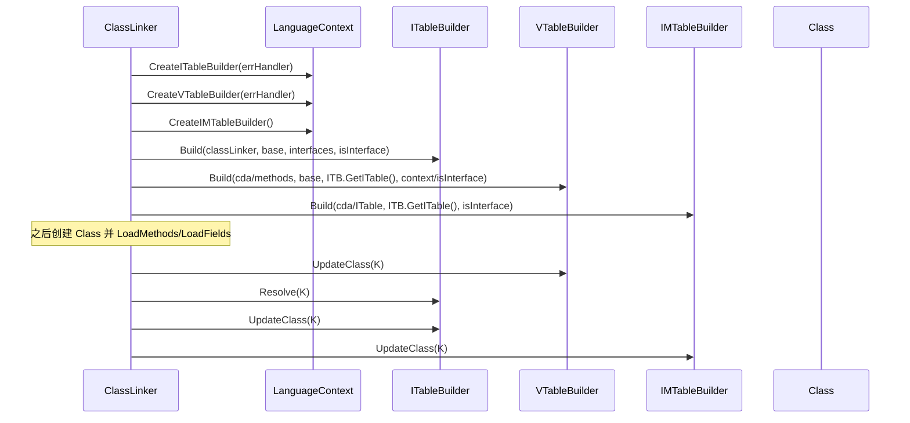
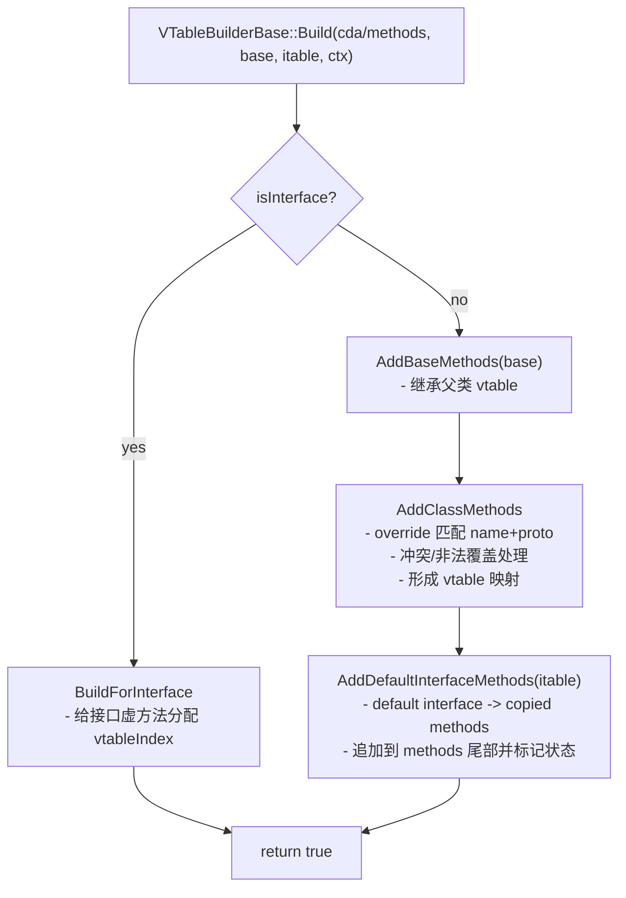
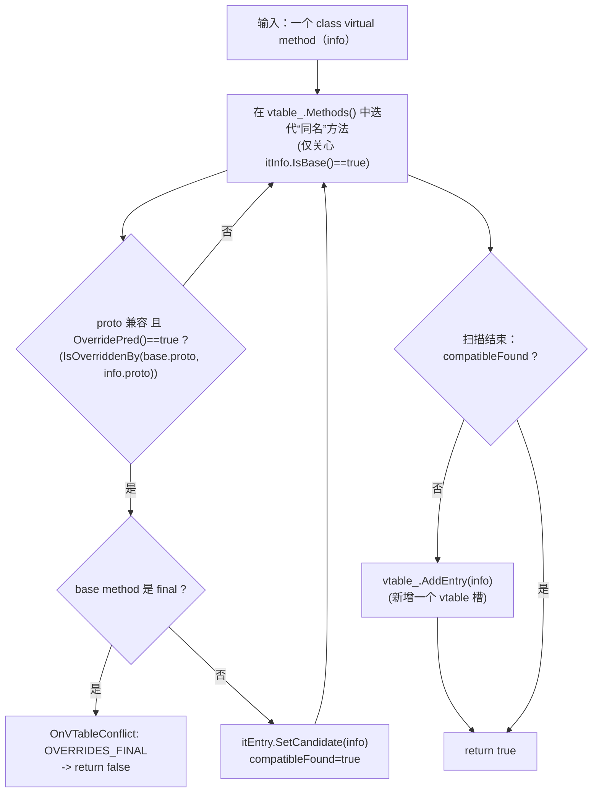
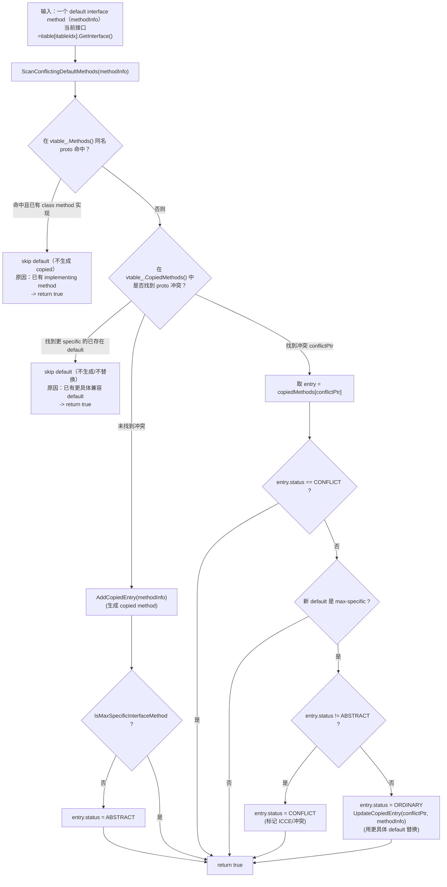
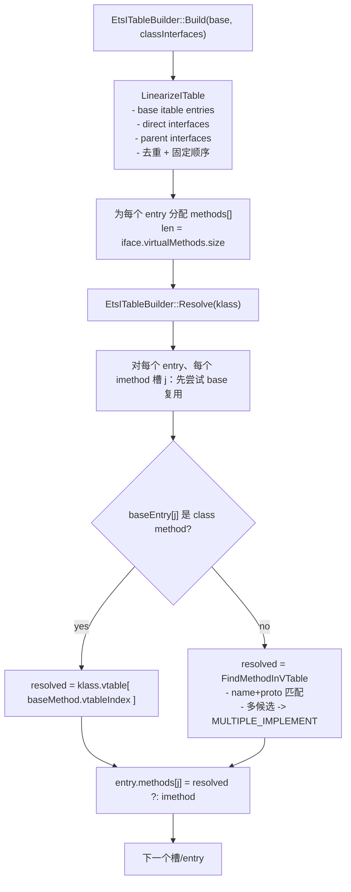

# Flow：Builders → LinkMethods（vtable / itable / IMT）

## 0) 在端到端主线图中的位置

- 总入口：[ClassLoading_EndToEnd（Flow）](ClassLoading_EndToEnd.md)（“LinkMethods：vtable/itable/imtable UpdateClass”框）

## 1) 发生在什么时候

在 `runtime/class_linker.cpp` 的 class 创建管线中：
- `SetupClassInfo` 阶段创建三类 builder，并先进行 Build（其中 vtable build 依赖 itable build 的结果）
- `LinkMethods` 阶段把 builder 的结果写回 `Class`

## 2) Mermaid：Build 与写回的调用顺序

## 3) 关键策略点（你需要记住的“规则”）

- **vtable builder**：
  - 负责 override/冲突策略（final override、多 override、default interface conflict）
  - 会产生 copied methods（default interface methods 的复制体），ClassLinker 会把它们追加到 methods 数组尾部并设置 stub
- **itable builder**：
  - 负责 itable entries 的线性化与 methods 槽分配
  - Resolve 时把每个接口方法映射到最终实现（ETS：优先复用 base 的 vtableIndex，再 vtable 反向匹配）
- **IMT builder**：
  - 是可选加速：接口方法数过大 → `imtSize=0` 禁用
  - 冲突策略：同槽冲突即清空槽，保证不会误派发（回退 itable）

## 3.1 vtable 构建算法（源码级步骤 + 图）

这里不是“概念描述”，而是按 `runtime/include/vtable_builder_base-inl.h` 的真实步骤拆解（核心路径）：

- **接口类**：`BuildForInterface(...)`（只做接口自己的虚方法索引）
- **普通类**：
  - `AddBaseMethods(baseClass)`：把父类 vtable 作为初始表
  - `AddClassMethods(cda/methods, ctx)`：把本类虚方法按 name+proto 做 override 匹配与冲突处理，决定落在“覆盖槽”还是“新增槽”
  - `AddDefaultInterfaceMethods(itable, superItableSize)`：把 default interface methods 变成 **copied methods**（追加到 methods 尾部），并在 vtable 映射里记录 copied method 的状态（冲突/普通等）

Mermaid（普通类 vtable build 主逻辑）：

> 新人最容易踩的点：**default interface method 并不直接“进 vtable 变一个槽”**，而是经常以 copied method 的形式追加到 methods 尾部；vtable builder 只负责把“该调用该跳到哪个 Method*”的映射关系写回 `Class`。

### 3.1.1 override / final 冲突：`ProcessClassMethod` 的判定树（标准实现）

对应源码：`runtime/include/vtable_builder_standard-inl.h::StandardVTableBuilder::ProcessClassMethod`

含义（对新人很关键）：
- **override 只会替换“继承自父类的槽”**（`itInfo.IsBase()`），不会在同一个类内对“新加槽”再做二次覆盖。
- **final 覆盖是 P0 级错误**：直接打到 errorHandler（`OVERRIDES_FINAL`）并终止加载。

### 3.1.2 default interface → copied methods：触发条件与 Status 落点（标准实现）

对应源码：
- `runtime/include/vtable_builder_base-inl.h::AddDefaultInterfaceMethods`（遍历 itable 上带 default 的接口，逐个 `ProcessDefaultMethod`）
- `runtime/include/vtable_builder_standard-inl.h::ProcessDefaultMethod/ScanConflictingDefaultMethods/IsMaxSpecificInterfaceMethod`
- `runtime/class_linker.cpp::SetupCopiedMethods`（把 `Status` 翻译成 stub entrypoint）

先给结论（新人可直接拿去排障）：
- **何时会产生 copied method**：当接口方法是 default（非 abstract），且没有被“某个 class method 实现”压制时，会被加入 `copiedMethods_`，并在 `LoadMethods` 阶段追加到 `methods[]` 尾部。
- **Status 语义**（最终体现在 entrypoint）：
  - `ORDINARY`：正常 default method（保持原始行为）
  - `ABSTRACT`：默认方法“不是 max-specific”，被降级为 AbstractMethodError stub（等价于“该 default 在该类上不可用”）
  - `CONFLICT`：default method 冲突（ICCE/冲突 stub），避免误派发

Mermaid（default method 决策树：是否加入 copied methods、以及 Status 如何落点）：

> 你关心的“Status 最终怎么影响运行”：`runtime/class_linker.cpp::SetupCopiedMethods` 会把 copied method 标成 `SetIsDefaultInterfaceMethod()`，并按 Status 设置 entrypoint：`ABSTRACT -> GetAbstractMethodStub()`，`CONFLICT -> GetDefaultConflictMethodStub()`。

## 3.2 itable 构建算法（以 ETS 为例，最常用也最清晰）

core 的 itable builder 是接口（`runtime/include/itable_builder.h`），ETS 有一套“最能看懂”的实现：`plugins/ets/runtime/ets_itable_builder.cpp`：

- **Build**（构建 itable 形状，不填实现）：
  - `LinearizeITable(...)`：把 base 的 itable + 直接接口 + 接口的父接口做去重线性化
  - 为每个新 entry 分配 `methods_` 数组：长度 = `entry.interface->GetVirtualMethods().size()`
- **Resolve**（把每个接口方法槽解析到最终实现）：
  - 优先复用 base 的 resolve 结果（如果 baseEntry[j] 已经是 class method，则用其 vtableIndex 去当前类 vtable 取实现）
  - 否则 `FindMethodInVTable(klass, imethod)`：在本类 vtable 里按 name+proto（ETSProtoIsOverriddenBy）反向匹配实现；多实现候选直接报 `MULTIPLE_IMPLEMENT`
  - 最终写回：`entry.methods[j] = resolved != nullptr ? resolved : imethod`（找不到实现则回退为接口方法本身）

Mermaid（ETS itable Build+Resolve）：

## 4) 证据链

- [runtime_class_linker.cpp（FileNotes）](../FileNotes/runtime_class_linker.cpp.md)（SetupClassInfo/LinkMethods/LoadMethods/copied methods）
- `FileNotes/runtime_include_vtable_builder_*`（vtable builder 契约与策略）
- [runtime_include_itable_builder.h（FileNotes）](../FileNotes/runtime_include_itable_builder.h.md) + [plugins_ets_runtime_ets_itable_builder.cpp（FileNotes）](../FileNotes/plugins_ets_runtime_ets_itable_builder.cpp.md)
- [runtime_imtable_builder.cpp（FileNotes）](../FileNotes/runtime_imtable_builder.cpp.md)
 - 关键源码锚点：
   - `runtime/include/vtable_builder_base-inl.h`（Build/AddBaseMethods/AddClassMethods/AddDefaultInterfaceMethods/UpdateClass）
   - `runtime/include/vtable_builder_standard-inl.h`（ProcessClassMethod/ProcessDefaultMethod/Status 判定树）
   - `plugins/ets/runtime/ets_itable_builder.cpp`（LinearizeITable/Build/Resolve/FindMethodInVTable）
   - `runtime/class_linker.cpp::SetupCopiedMethods`（把 CopiedMethod::Status 翻译成 stub entrypoint）

## 下一步（新人推荐）

- 想先把 GetClass/LoadClass 主线对齐 → [GetClass_and_LoadClass（Flow）](GetClass_and_LoadClass.md)
- 想看“接口派发结构与回退语义” → [ITable_and_IMT（DataStructure）](../DataStructures/ITable_and_IMT.md)
- 想看“字段布局/offset 写回” → [LayoutFields_and_LinkFields（Flow）](LayoutFields_and_LinkFields.md)

