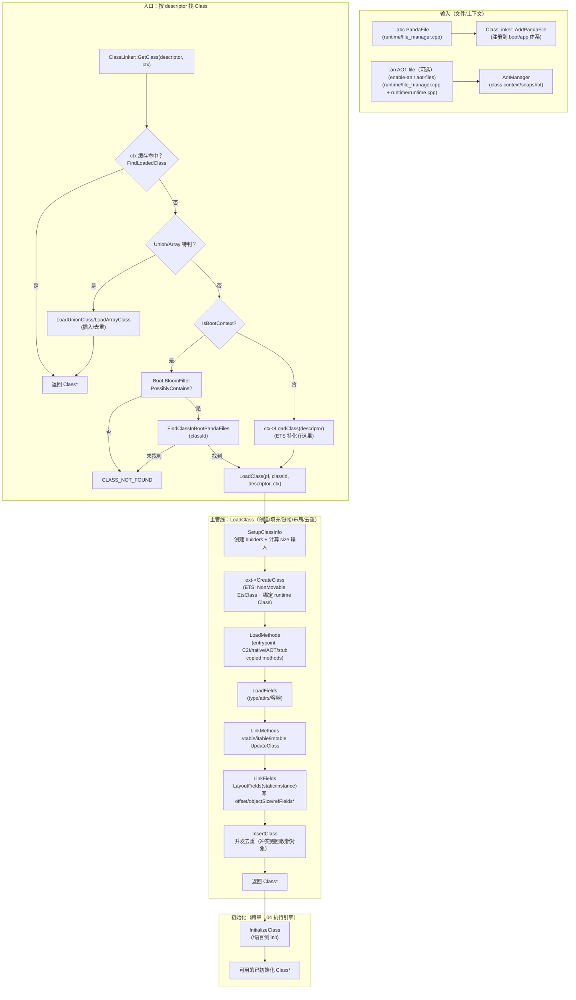

# Flow：类加载端到端主线（新人“脊柱图”）

> 目标：给新同学一条**唯一主线**——先用一张图把“类是怎么被找到/加载/链接/初始化的”串起来，然后每个框都能**一键下潜**到对应 Flow / DataStructures / FileNotes。

## 0) 你该怎么用这份文档（新人推荐顺序）

建议打开 3 个页签：

- 术语速查：`../FileNotes/_Glossary.md`
- 新人快速自检：`../Newbie_MinDebug_Playbook.md`
- 本文（端到端主线图）

阅读顺序：

1. **先看 2) 总图**：建立 ClassLoading 的整体 mental model
2. **再按你关心的框下潜**：每个框下都有“进一步阅读”入口，进入对应 flow/卡片
3. **最后才读逐行证据**：Flow → FileNotes 是最稳定的证据链

## 1) 先记住三条现实规则（新人最常误判）

- **“加载”≠“<clinit> 初始化执行”**：`LoadClass` 的主线会调用 `ext->InitializeClass(klass)` 做语言侧“元数据收尾”（例如 managed<->runtime 绑定等），但 `<clinit>`/语言语义初始化的执行细节仍属于 04 执行引擎（建议对照 `../04_ExecutionEngine/README.md`）。
- **Context 决定可见域**：同名 descriptor 在不同 `ClassLinkerContext` 里可以是不同的 `Class*`；ETS 额外引入 parent/shared-libs 链，关系不是简单树。
- **“找不到类”并不总是 CNFE**：在 Extension 层经常把底层 CNFE 包装成 NCDFE（证据：`FileNotes/runtime_class_linker_extension.cpp.md` 的 `WrapClassNotFoundExceptionIfNeeded` 段）。
- **接口派发的真实成本与坑点**：LinkMethods 阶段不仅“写回表”，还涉及 vtable 的 override/copy/default 冲突与 itable 的线性化+resolve（建议优先读：`Flows/Builders_and_LinkMethods.md` 与 `DataStructures/ITable_and_IMT.md`）。
- **Class 是尾随变长布局**：`Class*` 后面跟着 vtable/imt/static 区（placement new 构造），调试时不要把它当普通成员数组（建议读：`DataStructures/Class.md` 的“变长对象尾随布局”段）。

## 2) Mermaid：类加载端到端总图（主线）

## 3) “按框下潜”导航（每个框都能继续看细节）

### 3.1 文件如何进入 ClassLinker（.abc/.an）

- Flow：`FileManager_ABC_AN.md`
- 逐行证据：`../FileNotes/runtime_file_manager.cpp.md`、`../FileNotes/runtime_include_file_manager.h.md`
- 相关提醒（跨章）：AOT class context/装载入口见 04 章 FileNotes：
  - `../04_ExecutionEngine/FileNotes/compiler_aot_aot_manager.cpp.md`
  - `../04_ExecutionEngine/FileNotes/compiler_aot_aot_file.cpp.md`

### 3.2 GetClass（boot vs app 的决策树）

- Flow：`GetClass_and_LoadClass.md`
- 卡片：`../DataStructures/ClassLinkerContext.md`
- 逐行证据：`../FileNotes/runtime_class_linker.cpp.md`（GetClass/boot filter 段）、`../FileNotes/runtime_class_linker_extension.cpp.md`（AppContext LoadClass）

### 3.3 LoadClass（主管线：builders/layout/link）

- Flow：`GetClass_and_LoadClass.md`（第 3 节）
- Flow：`Builders_and_LinkMethods.md`、`LayoutFields_and_LinkFields.md`
- 卡片：`../DataStructures/Class.md`、`../DataStructures/Method.md`、`../DataStructures/Field.md`
- 逐行证据：`../FileNotes/runtime_class_linker.cpp.md`（SetupClassInfo/LoadMethods/LoadFields/Link*）

### 3.4 并发与递归：为什么可能“重复构建”，以及 CLASS_CIRCULARITY 怎么来的

- Flow：`Concurrency_and_ClassLock.md`
- 逐行证据：`../FileNotes/runtime_class_linker.cpp.md`（InsertClass 冲突回收 + ClassLoadingSet）

### 3.5 ETS：context 的 native→managed 两段式加载

- Flow：`ETS_Context_Native_vs_Managed_Load.md`
- 卡片：`../DataStructures/ETS_Plugin_Summary.md`
- 逐行证据：`../FileNotes/plugins_ets_runtime_ets_class_linker_context.cpp.md`

