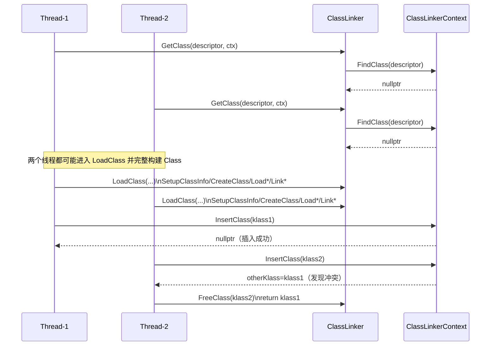
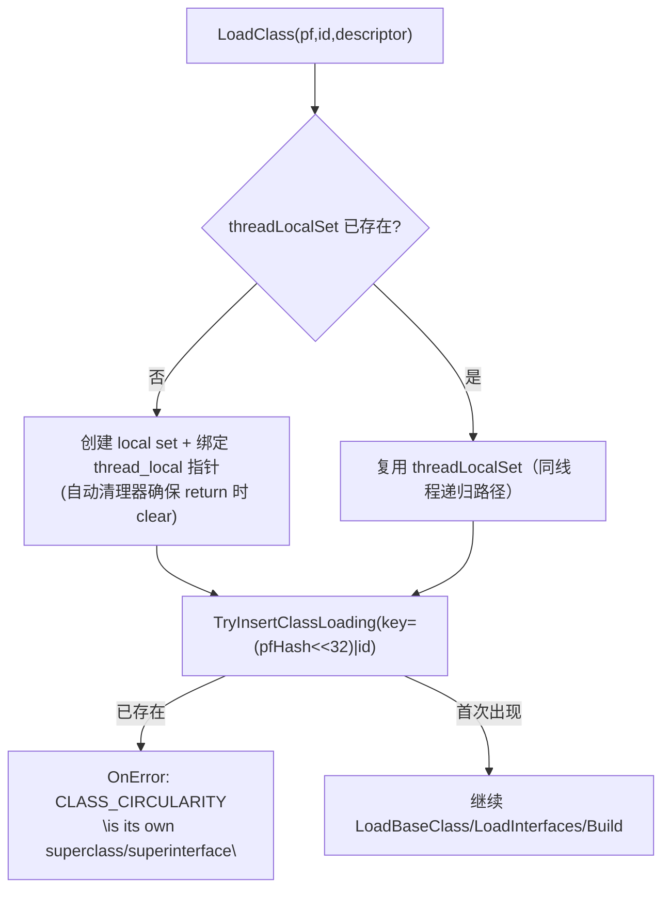

# Flow：并发类加载（InsertClass 去重）与 ClassLock（per-class condvar）

## 0) 在端到端主线图中的位置

- 总入口：[ClassLoading_EndToEnd（Flow）](ClassLoading_EndToEnd.md)（“InsertClass 并发去重”框 + “Context 并发协调”规则）

## 1) 先给结论（新人必须先记住的现实）

03 章里最容易被“概念图”误导的一点是：**同一个 descriptor 的类，在并发场景下并不是“只有一个线程会进入 LoadClass”**。

在当前实现里（`runtime/class_linker.cpp::LoadClass(pf,id,descriptor,context,...)`）：

- **并发策略更接近“乐观并行 + InsertClass 去重”**：
  - 多个线程都可能把同一个类完整走完 `SetupClassInfo → CreateClass → LoadMethods/Fields → LinkMethods/Fields`
  - 最后由 `context->InsertClass(klass)` 决定“谁赢”，后来的会 `FreeClass(klass)` 并返回已有对象
- **同线程递归加载的循环依赖**不是靠“锁”解决，而是靠 `ClassLoadingSet`（thread_local set）检测：
  - 当某个类在加载过程中再次尝试加载“自己作为自己的父类/接口”时，直接报 `CLASS_CIRCULARITY`

> 如果你在排障时看到“偶现重复创建/偶现释放/偶现 prepare event 顺序”，先默认它是这个策略带来的副作用，而不是一定有锁 bug。

## 2) 并发去重：InsertClass 的真实语义

`runtime/class_linker_context.h::ClassLinkerContext::InsertClass`（伪代码）：

- `classesLock_` 加锁
- 再查一次 `FindClass(descriptor)`：
  - 如果已经存在：返回 `otherKlass`（调用者应回收自己新建的 klass）
  - 否则插入 `loadedClasses_[descriptor]=klass`，并在 `mutexTable_` 中为该 Class 创建一个 `ClassMutexHandler`

Mermaid（两线程并发加载同一类的“真实时序”）：

> 结论：**InsertClass 是“最后一道门”，不是“唯一入口门”**。它保证最终 context 内只有一个 descriptor 对应一个 Class*，但不保证“不会重复构建”。

## 3) 同线程递归加载防护：ClassLoadingSet（CLASS_CIRCULARITY）

`runtime/class_linker.cpp` 在 `LoadClass(pf,id,...)` 内维护一个 `thread_local ClassLoadingSet*`：

- key 是 `(pfHash<<32)|classId`（`GetClassUniqueHash`）
- 在加载 base class 前调用 `TryInsertClassLoading(...)`
  - 如果同一个 key 再次出现，直接上报 `CLASS_CIRCULARITY`

Mermaid（递归自指/循环依赖的最小判定）：

## 4) ClassLock：per-class RecursiveMutex + CondVar（“存在但未在 LoadClass 主线上使用”）

这里是第二个容易误判的点：`ClassLinkerContext` 确实维护了 `mutexTable_[Class*]`，并且提供了 `ClassLock` RAII（`runtime/class_lock.{h,cpp}`）：

- `ClassLock(obj)`：
  - `cls = Class::FromClassObject(obj)`
  - `clsMtx = cls->GetLoadContext()->GetClassMutexHandler(cls)`
  - 切线程状态为 `IS_BLOCKED` 并 `Lock()`
- `Wait()`：切线程状态 `IS_WAITING` 并 `CondVar.Wait()`
- `Notify/NotifyAll()`：Signal/SignalAll
- 析构：Unlock

**但需要强调**：当前 `runtime/class_linker.cpp` 的类加载/去重主线并没有调用 `ClassLock`（也没有直接调用 `GetClassMutexHandler`）。  
所以你在排查“类加载并发”问题时，应先按 **InsertClass 去重 + 重复构建** 的模型理解，而不是先假设这里有一套“按 Class 粒度排队加载”的锁机制。

## 5) 新人排障速查（并发相关症状→落点）

| 症状 | 第一落点 | 第二落点 |
|---|---|---|
| 同一类日志里出现“重复创建/重复 FreeClass/prepare 顺序偶现” | `runtime/class_linker.cpp::LoadClass(... addToRuntime)`（InsertClass 冲突回收） | [runtime_class_linker.cpp（FileNotes）](../FileNotes/runtime_class_linker.cpp.md)（InsertClass 段） |
| 报 `CLASS_CIRCULARITY`（自己的父类/父接口） | `runtime/class_linker.cpp::TryInsertClassLoading` | [runtime_class_linker.cpp（FileNotes）](../FileNotes/runtime_class_linker.cpp.md)（ClassLoadingSet 段） |
| 你怀疑某处在等待 class init（IS_WAITING/condvar） | `runtime/class_lock.cpp`（ClassLock Wait/NotifyAll） | [runtime_class_lock.cpp（FileNotes）](../FileNotes/runtime_class_lock.cpp.md)（若后续接入到初始化/反射路径） |

## 证据链

- `runtime/class_linker.cpp`（InsertClass 冲突回收；ClassLoadingSet/CLASS_CIRCULARITY；LoadClass 内 ext->InitializeClass hook）
- `runtime/class_linker_context.h`（InsertClass/loadedClasses_/mutexTable_/ClassMutexHandler）
- `runtime/class_lock.h` + `runtime/class_lock.cpp`（ClassLock RAII/Wait/NotifyAll）

## 下一步（新人推荐）

- 想把“并发去重”放回 GetClass/LoadClass 主线对齐 → [GetClass_and_LoadClass（Flow）](GetClass_and_LoadClass.md)
- 想看 copied methods/default method 的真实落地效果 → [Builders_and_LinkMethods（Flow）](Builders_and_LinkMethods.md)

