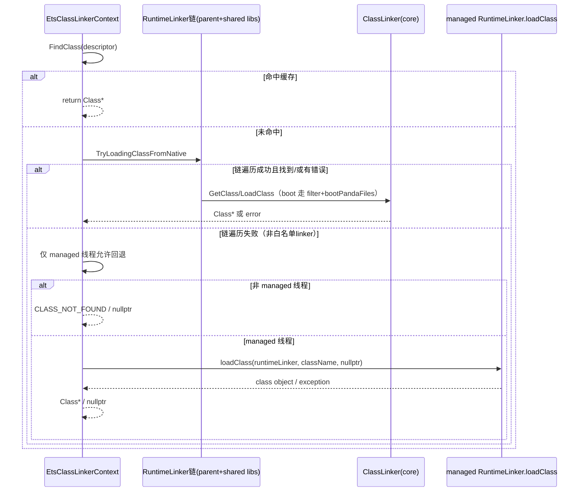

# Flow：ETS Context 的 native 链式加载 vs managed 回退

## 0) 在端到端主线图中的位置

- 总入口：[ClassLoading_EndToEnd](ClassLoading_EndToEnd.md)（“ETS：context 的 native→managed 两段式加载”框）

## 1) 为什么 ETS 要这么做

ETS 的非 boot 类加载由 managed `RuntimeLinker` 驱动（类似 class loader），但 VM 内部线程（JIT/AOT 等）不能随意 re-enter managed。  
因此 `EtsClassLinkerContext::LoadClass` 采用“两段式”：
- **native 优先**：仅对白名单 linker（coreAbcRuntimeLinker/coreMemoryRuntimeLinker）复刻链式查找逻辑
- **必要时 managed 回退**：只允许在 managed 线程/协程中调用 `RuntimeLinker.loadClass(final)`

## 2) Mermaid：两段式加载

## 3) 证据链

- [FileNotes/plugins_ets_runtime_ets_class_linker_context.cpp](FileNotes/plugins_ets_runtime_ets_class_linker_context.cpp.md)
- [FileNotes/plugins_ets_runtime_ets_class_linker_extension.cpp](FileNotes/plugins_ets_runtime_ets_class_linker_extension.cpp.md)（CreateApplicationRuntimeLinker）

## 下一步（新人推荐）

- 想看“为什么非 managed 线程禁止回退”的决策树版本 → [../Newbie_MinDebug_Playbook](../Newbie_MinDebug_Playbook.md)（实验 2）
- 想把 “GetClass/LoadClass 主线” 与 ETS 特化对齐 → [GetClass_and_LoadClass](GetClass_and_LoadClass.md)

