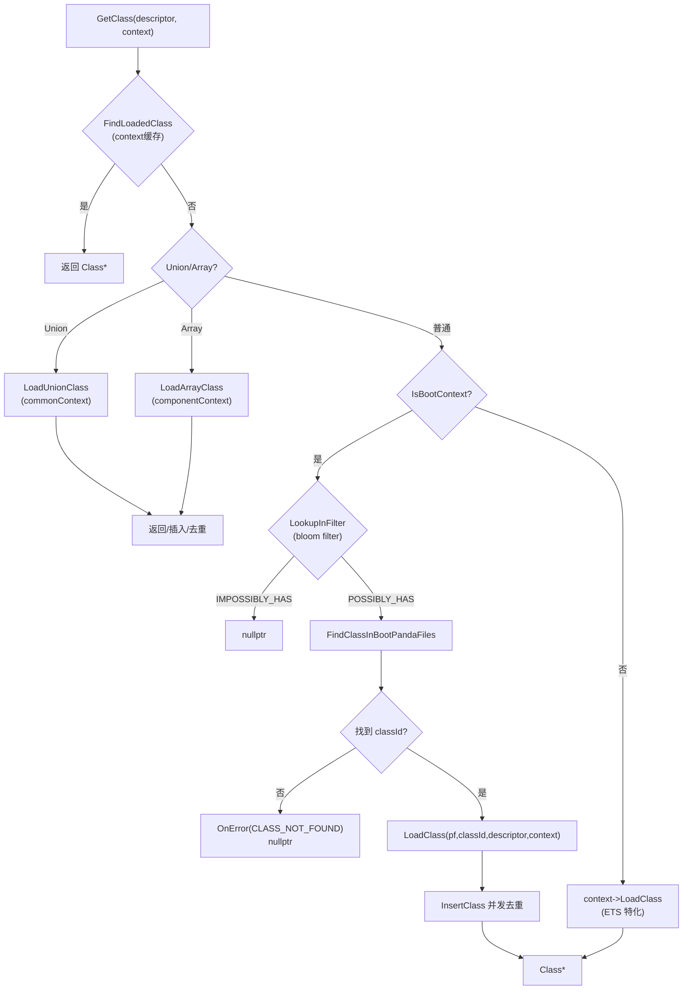

# Flow：GetClass → LoadClass（boot vs app 总链路）

## 0) 在端到端主线图中的位置

- 总入口：[ClassLoading_EndToEnd（Flow）](ClassLoading_EndToEnd.md)（“入口：按 descriptor 找 Class”与“主管线：LoadClass”框）

## 1) 背景：GetClass 是“入口”，LoadClass 是“主管线”

你可以把 `ClassLinker::GetClass` 看作“按 descriptor/pf,id 找到一个可用的 Class*”，它负责：
- 缓存命中直接返回
- union/array descriptor 特判
- boot context：用 bloom filter + boot panda files 查找并加载
- app context：委托 `context->LoadClass`（ETS 有特化）

补充一个非常实用但容易漏掉的细节（影响排障与性能判断）：
- **`GetClass(pf, id, ...)` 先查 `pf.GetPandaCache()->GetClassFromCache(id)`**，命中后会绕过后续的大部分路径；未命中但最终加载成功时，会 `SetClassCache(id, cls)` 写回缓存。

而真正的“创建一个新 Class 对象、填充 methods/fields、构建派发表、计算 offset”的主管线在 `LoadClass(...)` 内。

## 2) Mermaid：GetClass 决策树（概念同 README）

## 3) LoadClass 主管线（核心步骤）

对应 `runtime/class_linker.cpp`：
- `SetupClassInfo`：创建 `ITableBuilder/VTableBuilder/IMTableBuilder`，并计算 `Class::ComputeClassSize` 输入
- `ext->CreateClass`：创建 Class 对象（ETS：NonMovable `EtsClass` + 内嵌 runtime Class 绑定）
- `LoadMethods`：初始化 Method 数组（含 copied methods）、设置 entrypoint（C2I/native/AOT/stub）
- `LoadFields`：初始化 Field 数组（type 位段编码到 accessFlags）
- `LinkMethods`：vtable.UpdateClass；itable.Resolve+UpdateClass；imtable.UpdateClass
- `LinkFields`：`LayoutFields(static/instance)` 写 offset/refFields*/objectSize
- `InsertClass`：并发去重（另线程先插入则回收新对象并返回已有对象）

## 3.1 并发与递归加载：你必须知道的两条“真实策略”

### 3.1.1 并发：不是“一个线程加载”，而是“允许重复构建，最后 InsertClass 去重”

当前实现更接近“乐观并行 + 最后去重”，而不是“按 descriptor 串行排队”：

- 多个线程可能同时走完整个 `LoadClass`（builders/layout/link 都会做）
- 最终由 `context->InsertClass(klass)` 决定“谁赢”
  - 赢者：插入成功（返回 nullptr）
  - 输者：得到 `otherKlass`，调用方 `FreeClass(klass)` 并返回已有对象

> 详细时序图见：[Concurrency_and_ClassLock（Flow）](Concurrency_and_ClassLock.md)

### 3.1.2 递归：CLASS_CIRCULARITY 不是锁检测，而是 thread_local 的 ClassLoadingSet

`LoadClass(pf,id,...)` 内维护 `thread_local ClassLoadingSet*`（key = `(pfHash<<32)|classId`）。  
在加载 base class 前会尝试插入该 key，重复即上报 `CLASS_CIRCULARITY`（“自己的父类/父接口”）。

## 3.2 Boot BloomFilter：Add/Lookup 的确切语义（避免新手误判）

- 什么时候 Add：
  - `ClassLinker::AddPandaFile` 把文件加入 `bootPandaFiles_` 时，如果 `--use-boot-class-filter` 打开，会调用 `AddBootClassFilter(file)`
  - `AddBootClassFilter` 遍历 `pf->GetClasses()`，把每个 className 加入 `bootClassFilter_`
- 什么时候 Lookup：
  - 在 boot context 的 `GetClass(descriptor)` 路径里会先 `LookupInFilter(descriptor)`
  - 如果 `PossiblyContains==false`：
    - 没有 errorHandler：直接返回 `IMPOSSIBLY_HAS`（快速失败）
    - 有 errorHandler：同时上报 `CLASS_NOT_FOUND` 并返回 `IMPOSSIBLY_HAS`

> 直觉：filter 只用于“快速否定”，不会保证“POSSIBLY_HAS 一定存在”；真正查找仍要遍历 boot panda files。

## 4) 证据链（逐行可审计）

- [runtime_class_linker.cpp（FileNotes）](../FileNotes/runtime_class_linker.cpp.md)（GetClass/LoadClass/SetupClassInfo/LoadMethods/LoadFields/Link*）
- [runtime_include_class_linker.h（FileNotes）](../FileNotes/runtime_include_class_linker.h.md)（管线分解）
- [plugins_ets_runtime_ets_class_linker_context.cpp（FileNotes）](../FileNotes/plugins_ets_runtime_ets_class_linker_context.cpp.md)（非 boot 的 ETS context->LoadClass）
- [plugins_ets_runtime_ets_class_linker_extension.cpp（FileNotes）](../FileNotes/plugins_ets_runtime_ets_class_linker_extension.cpp.md)（ext->CreateClass / native entrypoint）
 - 关键源码锚点：
   - `runtime/class_linker.cpp::AddPandaFile/AddBootClassFilter/LookupInFilter`
   - `runtime/class_linker.cpp::ClassLoadingSet/TryInsertClassLoading`（CLASS_CIRCULARITY）
   - `runtime/class_linker_context.h::InsertClass`（并发去重的最后一道门）

## 下一步（新人推荐）

- 想把“文件装载→boot/app 可见域”串起来 → [FileManager_ABC_AN（Flow）](FileManager_ABC_AN.md)
- 想看“vtable/itable/IMT 构建与冲突” → [Builders_and_LinkMethods（Flow）](Builders_and_LinkMethods.md)
- 想看“字段布局/offset 写回” → [LayoutFields_and_LinkFields（Flow）](LayoutFields_and_LinkFields.md)
- 想看“并发与递归加载（重复构建/去重/CLASS_CIRCULARITY）” → [Concurrency_and_ClassLock（Flow）](Concurrency_and_ClassLock.md)

