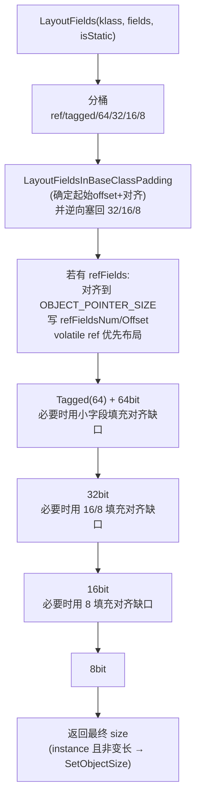

# Flow：LayoutFields → LinkFields（offset/对齐/基类 padding 回填）

## 0) 在端到端主线图中的位置

- 总入口：`ClassLoading_EndToEnd.md`（“LinkFields：LayoutFields 写回 offset/objectSize/refFields*”框）

## 1) 发生在什么时候

在 `runtime/class_linker.cpp`：
- `LoadFields` 只创建 Field 数组并填 type/flags，不填 offset
- `LinkFields` 阶段调用 `LayoutFields(static)` 与 `LayoutFields(instance)` 写回 offset，并写回 `Class` 的 objectSize/refFields* 元数据

## 2) Mermaid：字段布局算法框架

## 3) 关键规则（简记）

- **顺序约束**：注释明确要求保持“语言侧 class 表示的字段相对顺序”——因此会出现“从 vector 头删元素”的实现方式（保证序）。
- **ref 字段**：
  - 先布局 volatile ref 再布局非 volatile ref
  - 写回 `SetRefFieldsNum/Offset/SetVolatileRefFieldsNum`
- **基类 padding 回填**：
  - 若对齐导致产生 padding，优先把子类小字段逆向塞入 padding 末尾
- **instance objectSize**：
  - 非 static 且非 variable-size 才写 `klass->SetObjectSize(size)`

## 4) 证据链

- `FileNotes/runtime_class_linker.cpp.md`（LayoutFieldsWithoutAlignment/LayoutReferenceFields/LayoutFieldsInBaseClassPadding/LayoutFields/LinkFields）
- `FileNotes/runtime_include_field.h.md`（Field::offset_ 语义）
- `FileNotes/runtime_include_class.h.md`（ref fields 元数据字段与访问）

## 下一步（新人推荐）

- 想先把 GetClass/LoadClass 主线对齐 → `GetClass_and_LoadClass.md`
- 想看“builder 写回顺序（vtable/itable/IMT）” → `Builders_and_LinkMethods.md`
- 想看“Class/Field 的关键字段语义” → `../DataStructures/Class.md` 与 `../DataStructures/Field.md`

