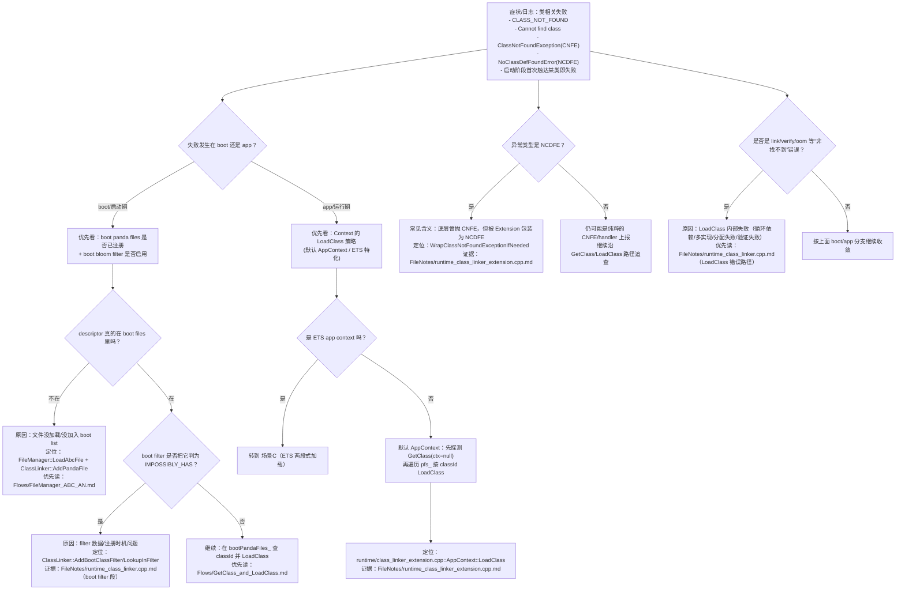
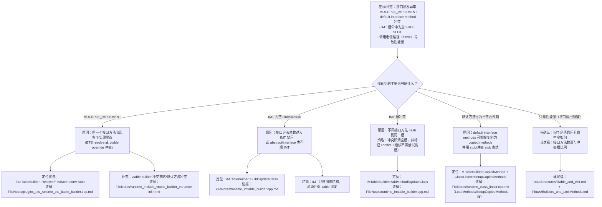
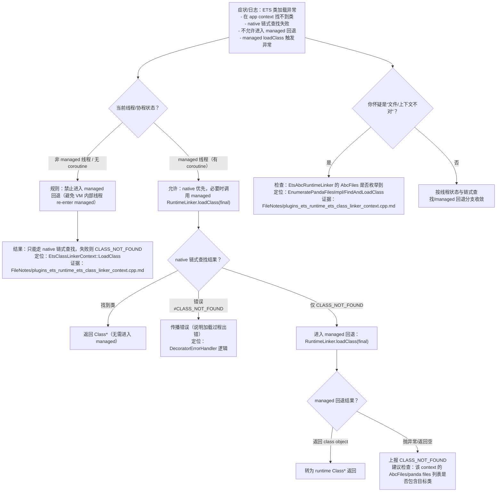
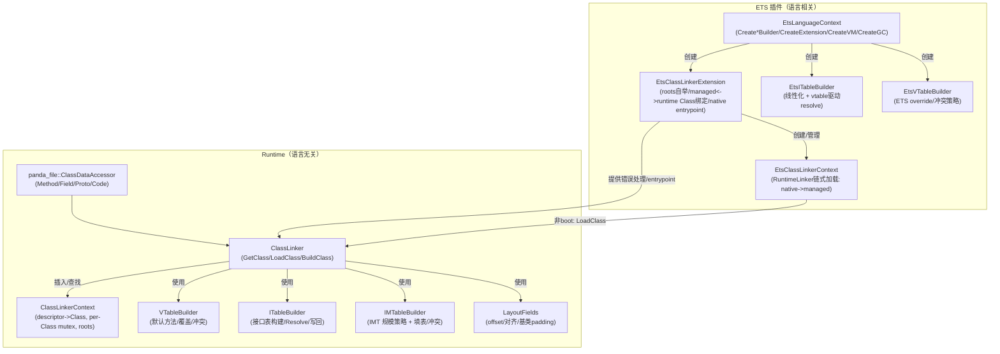
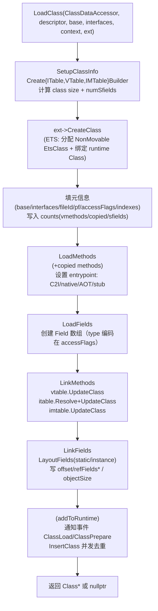
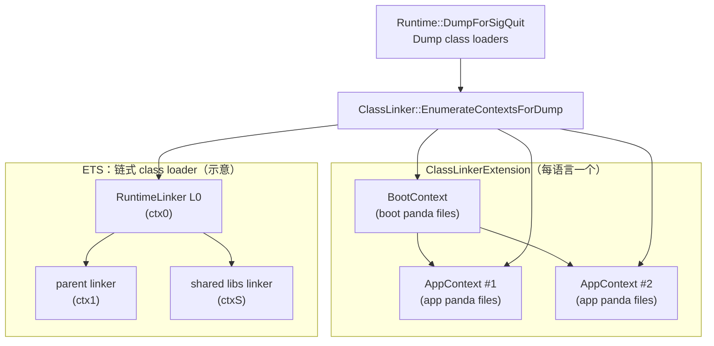
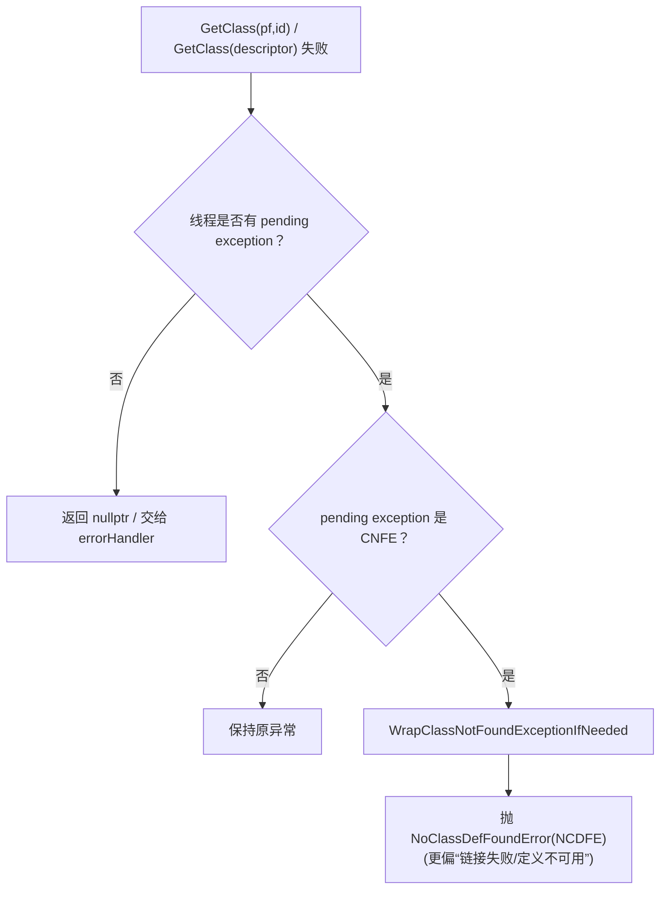

---
hide:
  - navigation
---

# 03_ClassLoading（Stage2）

> 阶段二：逐行精读与 wiki 沉淀（**已闭环到代码实现与 ETS 插件落地**）。

## 你读完应该能回答什么（面向新同学）
- **类是怎么被“找到/加载/链接/初始化”的**：从 `GetClass(descriptor|pf,id)` 到 `LoadClass` 管线、到 `InitializeClass`。
- **派发表（vtable / itable / IMT）是谁建的、怎么建的、冲突怎么处理的**：default interface method、multiple implement、IMT 冲突即清空槽。
- **Field offset/对象布局是谁算的**：静态/实例字段分桶、对齐、基类 padding 回填、ref/volatile 统计写回。
- **上下文（Context/Loader）如何隔离与并发协调**：descriptor→Class 缓存、per-Class mutex+condvar、GC roots、ETS 的 RuntimeLinker 链式加载。
- **ETS 插件怎么把“策略”落到“实现”**：LanguageContext 工厂（builder/extension/VM/GC/verification）、Extension 自举 roots、Context 的 native/managed 两段式加载。

## 快速上手（不读 FileNotes 也能建立整体模型）

### 0) 先看“端到端脊柱图”（新人最推荐的第一入口）

- [Flows/ClassLoading_EndToEnd](Flows/ClassLoading_EndToEnd.md)：一张图把“文件装载→GetClass→LoadClass→builders/layout/link→并发去重→初始化交界”串起来；每个框都能一键下潜到对应 Flow/卡片/逐行证据。

### 1) 先记住一句话（本章主线）

**类加载 = “文件进来” → “按 descriptor 找类” → “创建 Class + 填 methods/fields” → “建派发表/算 offset” → “插入 context 缓存并发去重”**。  
其中“语言差异”主要通过 `ClassLinkerExtension/LanguageContext/ClassLinkerContext` 三个点注入。

### 2) 三个你最常遇到的场景（对应三条阅读路线）

- **场景 A：启动后第一次解析某个类**（为什么找不到？为什么是 NCDFE？）
  - 看 `GetClass` 决策树 + `LoadClass` 管线 + Extension 的异常包装（CNFE→NCDFE）。
- **场景 B：接口方法派发/默认方法冲突**（为什么 MULTIPLE_IMPLEMENT？为什么 IMT 为空？）
  - 看 vtable/itable/IMT 的构建顺序与冲突策略。
- **场景 C：ETS app context 加载**（为什么 native 先尝试？为什么不让非 managed 线程回退？）
  - 看 ETS `EtsClassLinkerContext::LoadClass` 两段式加载。

#### 场景 A 排障：从“找不到类/初始化失败”到定位点（决策树）



#### 场景 B 排障：接口派发/默认方法/冲突（决策树）



#### 场景 C 排障：ETS app context 加载（native/managed 两段式）（决策树）



### 3) 术语速查（建议打开在侧边）

- [FileNotes/_Glossary](FileNotes/_Glossary.md)：本章术语解释（descriptor、PandaFile、EntityId、Context、roots、ITable/IMT、CNFE/NCDFE…）

### 4) 新人最小调试手册（独立文档）

- [Newbie_MinDebug_Playbook](Newbie_MinDebug_Playbook.md)：新人 10 分钟定位 **找不到类 / CNFE vs NCDFE / IMT 冲突与禁用 / ETS 两段式加载 gate / .abc/.an 装载** 的最短路径（含可复现实验）
- **更强交付标准入口**：Playbook 内含“日志关键词 → 第一落点函数 → 必查分支条件 → 第二落点”的症状矩阵（见 [Newbie_MinDebug_Playbook](Newbie_MinDebug_Playbook.md) 的 2.1 节）。

## 本章产物导航（建议先看这些“总览型”文档）

- **学习路线图**：[Index](Index.md)（30 分钟/2 小时/1 天三档）
- **本章沉淀**：
  - [DataStructures/Index](DataStructures/Index.md)：关键数据结构卡片（Class/Method/Field/ITable/IMT/Contexts/ETS）
  - [Flows/Index](Flows/Index.md)：按调用链组织的流程讲解（每条 flow 都可直接复用到排障/分享）
  - [Diagrams/Index](Diagrams/Index.md)：可复用 Mermaid 图（README 里嵌了主图，这里是单文件版本）
- **逐行证据链**：`FileNotes/`（当你需要“为什么一定是这样”时再下潜）
- **阶段一校正**：[Errata_to_Stage1](Errata_to_Stage1.md)
- **章节完工审查（交付验收）**：[Completion_Review](Completion_Review.md)（逐断言核验 + 源码证据点 + 可执行优化项）

## 章节总览：组件边界与数据流

下面这张图把 03 章涉及的核心组件串起来（“语言无关管线”与“语言相关插件”分层）：



## 关键流程（Mermaid，可复制复用）——看图先建立直觉

### 1) `GetClass(descriptor)` 决策树（boot vs app）

```mermaid
flowchart TD
  A["GetClass(descriptor, context)"] --> B{"context 内已加载？\nFindLoadedClass"}
  B -->|是| R1["返回已加载 Class*"]
  B -->|否| C{"descriptor 类型？"}
  C -->|union| U["LoadUnionClass\n(需要 commonContext)"] --> R2["返回/缓存/插入context"]
  C -->|array| AR["LoadArrayClass\n(componentContext 决定插入域)"] --> R2
  C -->|普通| D{"IsBootContext?"}
  D -->|是| F{"Boot BloomFilter\nPossiblyContains?"}
  F -->|否(IMPOSSIBLY_HAS)| R0["返回 nullptr\n(可上报 CLASS_NOT_FOUND)"]
  F -->|是| G["在 bootPandaFiles_ 查 classId"] --> H{"找到?"}
  H -->|否| R3["上报 CLASS_NOT_FOUND\n返回 nullptr"]
  H -->|是| I["LoadClass(pf,classId,context)"] --> J["InsertClass 并发去重\n(冲突则回收新对象)"] --> R4["返回 Class*"]
  D -->|否| K["context->LoadClass()\n(虚函数/ETS 特化)"] --> R4
```

### 2) `LoadClass` 主管线（builder + layout + link）



### 2.1 你必须知道的并发现实：可能“重复构建”，最后 InsertClass 去重

> 这是 03 章最容易被忽略但最影响排障的点：同一个 descriptor 在并发场景下**可能被多个线程完整构建**，最后才在 `InsertClass` 处决出胜负；同线程递归自指依赖用 `ClassLoadingSet` 检测并报 `CLASS_CIRCULARITY`。

- Flow（含两线程时序图 + 递归加载判定）：[Flows/Concurrency_and_ClassLock](Flows/Concurrency_and_ClassLock.md)

### 3) ETS `EtsClassLinkerContext::LoadClass`（native 优先，必要时 managed）

```mermaid
flowchart TD
  A["EtsClassLinkerContext::LoadClass(descriptor)"] --> B{"本context缓存命中？\nFindClass"}
  B -->|是| R1["返回 Class*"]
  B -->|否| C["TryLoadingClassFromNative\n(沿 RuntimeLinker parent+shared libs 链)"]
  C --> D{"链遍历成功？"}
  D -->|成功且找到/有错误| R2["返回 Class* 或传播错误"]
  D -->|失败(非白名单linker)| E{"当前线程可调用 managed？\n(coro && IsManagedCode)"}
  E -->|否| R3["禁止进入 managed\n上报 CLASS_NOT_FOUND 返回 nullptr"]
  E -->|是| F["构造 args(runtimeLinker, etsClassName, nullptr)\n调用 managed RuntimeLinker.loadClass(final)"]
  F --> G{"有异常？"}
  G -->|无| R4["把返回的 class object 转为 Class* 返回"]
  G -->|有| R5["上报 CLASS_NOT_FOUND 返回 nullptr"]
```

## 再补两张“新手最需要”的图（把边界讲清楚）

### 4) Boot/App/Chained Context 的关系（以及 DumpForSigQuit 如何输出）



> 直觉：**BootContext 是基础可见域**；AppContext 是“每个应用/加载器一份”；ETS 额外引入“parent/共享库链”，所以它的 context 关系不是一棵简单树。

### 5) “找不到类”到底抛什么（CNFE vs NCDFE）



> 这个行为在 Stage2 已逐行闭环：见 [FileNotes/runtime_class_linker_extension.cpp](FileNotes/runtime_class_linker_extension.cpp.md)（WrapClassNotFoundExceptionIfNeeded）。

## DataStructures / Flows / Diagrams（本章沉淀产物）

- **DataStructures**：关键结构卡片（字段含义 + 关键不变量 + 与 FileNotes 的对齐）
  - 见 [DataStructures/Index](DataStructures/Index.md)
- **Flows**：按“调用链”组织的流程讲解（每条流程都回链到实现）
  - 见 [Flows/Index](Flows/Index.md)
- **Diagrams**：可复用 Mermaid 图（README 中也嵌入了核心图）
  - 见 [Diagrams/Index](Diagrams/Index.md)

## 证据链（从总述跳到逐行）

本章所有结论都应能回溯到逐行笔记：
- **ClassLinker 主管线**：[FileNotes/runtime_class_linker.cpp](FileNotes/runtime_class_linker.cpp.md)
- **ClassLinkerExtension 默认行为**（Boot/AppContext LoadClass / new|created|obsolete classes）：[FileNotes/runtime_class_linker_extension.cpp](FileNotes/runtime_class_linker_extension.cpp.md)
- **Core roots 自举（PANDA_ASSEMBLY）**：[FileNotes/runtime_core_core_class_linker_extension.cpp](FileNotes/runtime_core_core_class_linker_extension.cpp.md)
- **字段布局与 offset 写入**：同上（LayoutFields 段）+ [FileNotes/runtime_include_field.h](FileNotes/runtime_include_field.h.md)
- **Method entrypoint/编译状态位段**：[FileNotes/runtime_include_method.h](FileNotes/runtime_include_method.h.md)
- **IMT 策略**：[FileNotes/runtime_imtable_builder.cpp](FileNotes/runtime_imtable_builder.cpp.md)
- **ETS itable resolve**：[FileNotes/plugins_ets_runtime_ets_itable_builder.cpp](FileNotes/plugins_ets_runtime_ets_itable_builder.cpp.md)
- **ETS Context 链式加载**：[FileNotes/plugins_ets_runtime_ets_class_linker_context.cpp](FileNotes/plugins_ets_runtime_ets_class_linker_context.cpp.md)
- **ETS Extension roots/entrypoint**：[FileNotes/plugins_ets_runtime_ets_class_linker_extension.cpp](FileNotes/plugins_ets_runtime_ets_class_linker_extension.cpp.md)
- **ETS façade（对外 API + async 注解解析）**：[FileNotes/plugins_ets_runtime_ets_class_linker.cpp](FileNotes/plugins_ets_runtime_ets_class_linker.cpp.md)
