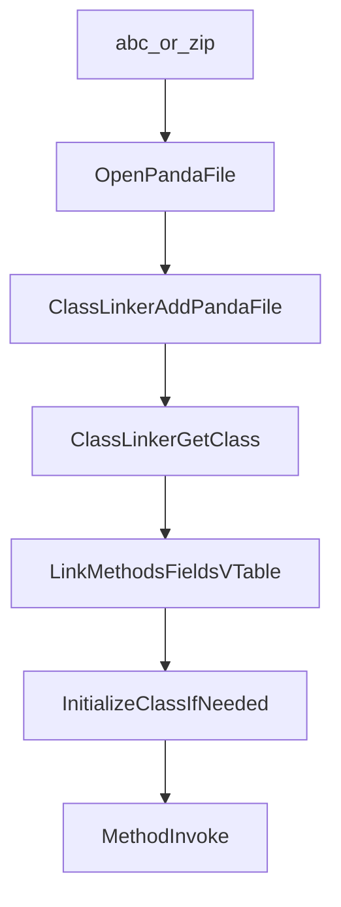
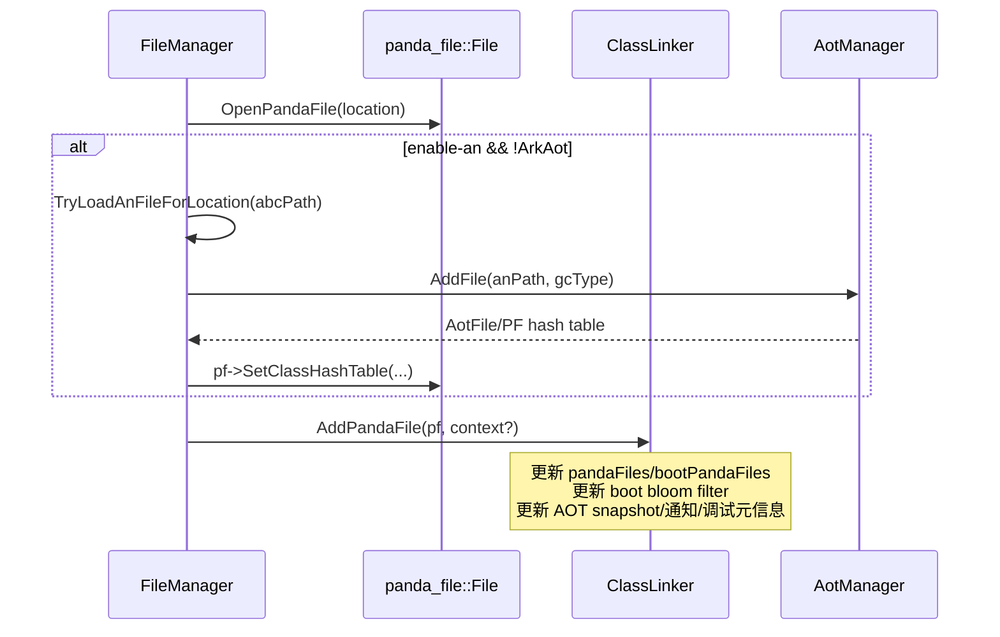
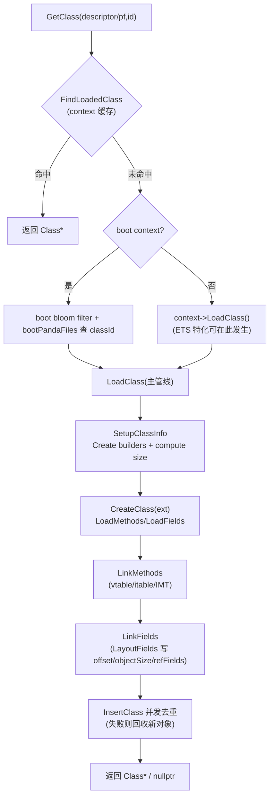
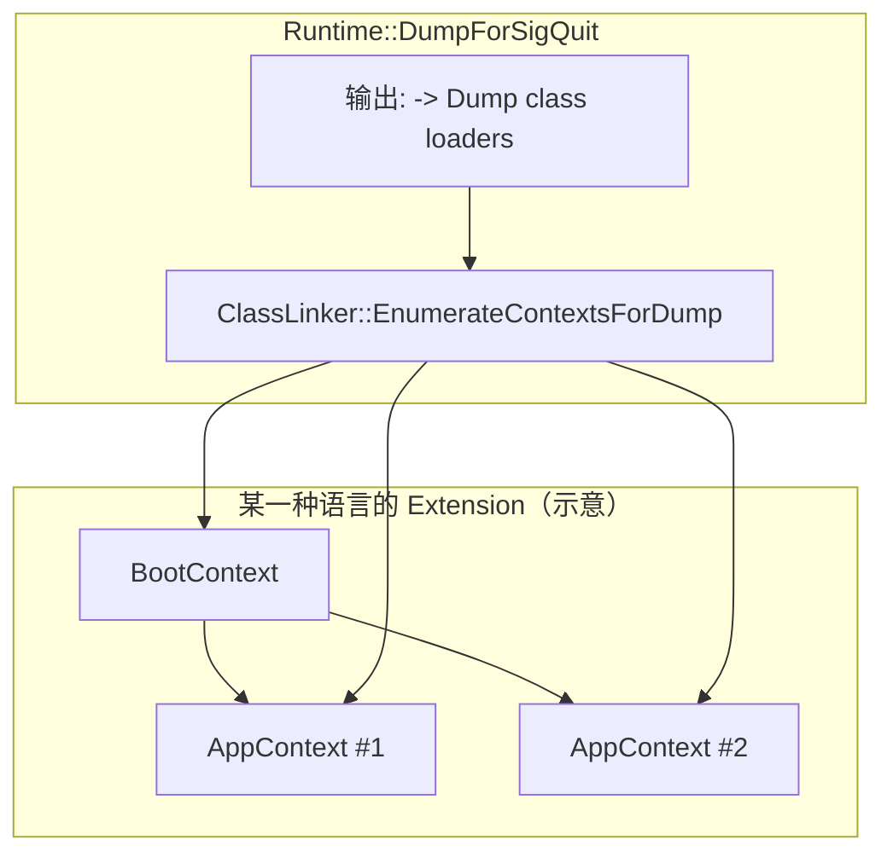
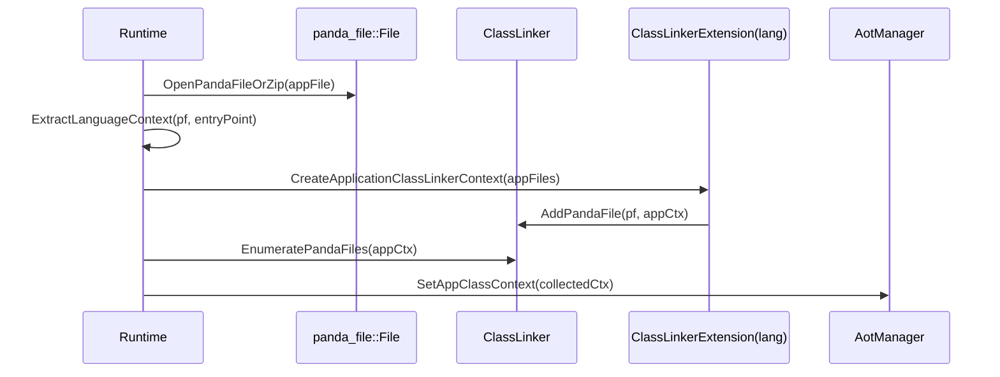
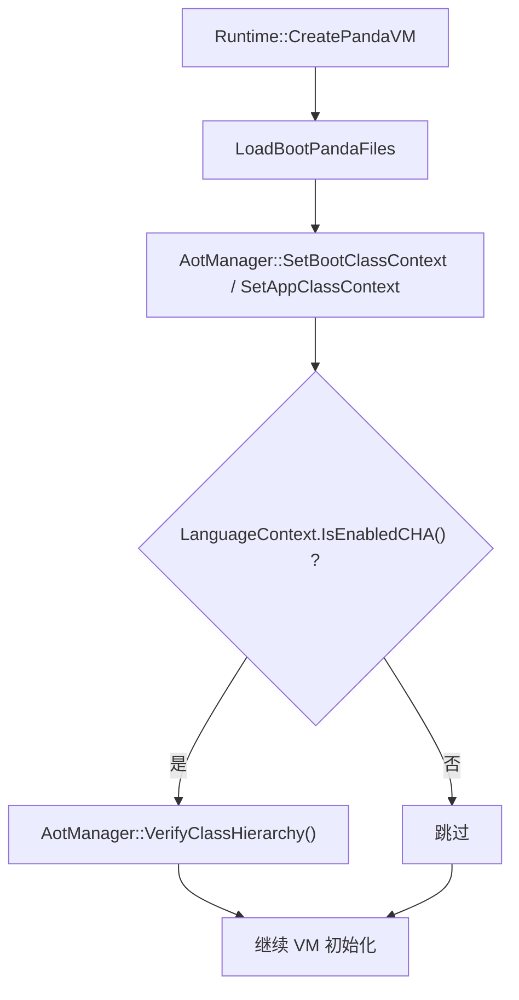

# Chapter 3：类加载与链接（Class Loading & Linking）

> 本章把“类从哪里来、怎么被链接成可执行的 Method/Class 对象”拆成三个层次：`FileManager`（文件装载）→ `ClassLinker`（语言无关容器）→ `ClassLinkerExtension/Context`（语言扩展 + 加载上下文）。

---

### 1. 总览：从 abc/pandafile 到 Class/Method

### 1.1 新手心智模型：ClassLoading 到底“加载了什么”

- **加载（LoadClass）**：创建并填充 `Class/Method/Field` 元数据对象，构建派发表（vtable/itable/IMT），计算字段 offset 与对象大小，并把结果插入 `ClassLinkerContext` 缓存。
- **初始化（InitializeClass）**：语言相关（例如执行 `<clinit>`，异常包装，校验等）。本章只覆盖“接口点在哪里被调用/由谁调用”，执行细节更偏执行引擎与验证章节。

对应代码入口：
- 文件装载：`runtime/file_manager.cpp`（`FileManager::LoadAbcFile` / `TryLoadAnFileForLocation` / `LoadAnFile`）
- 类链接器：`runtime/include/class_linker.h`、`runtime/class_linker.cpp`
- 语言扩展（抽象 + 默认实现 + core/ETS 落地）：
  - 抽象与容器：`runtime/include/class_linker_extension.h`
  - 默认实现（Boot/AppContext LoadClass、new/created/obsolete classes、CNFE→NCDFE 包装）：`runtime/class_linker_extension.cpp`
  - core（PANDA_ASSEMBLY）实现（roots 自举、String 子类 GC 元数据、CreateClass NonMovable 分配）：`runtime/core/core_class_linker_extension.cpp`
  - ETS façade（对外 API + async 注解解析）：`plugins/ets/runtime/ets_class_linker.h`、`plugins/ets/runtime/ets_class_linker.cpp`

---

### 2. FileManager：PandaFile/Abc 与 AOT（.an）的装载

#### 2.1 Boot panda files 与应用 panda files

在 CLI 路径里，默认 boot panda file 来自 `runtime/options.yaml` 的 `boot-panda-files`（例如 `arkstdlib.abc`），应用文件通过 `panda/panda.cpp` 的 tail args 填入（并可能被塞到 boot list 末尾，见 `runtime/runtime.cpp` 的注释）。

#### 2.2 LoadAbcFile：装载 abc 并注册到 ClassLinker

`runtime/file_manager.cpp`：
- 通过 `panda_file::OpenPandaFile(location, "", openMode)` 打开文件
- 若启用 `--enable-an` 且非 ArkAOT，尝试为该 abc 自动加载同名 `.an`（AOT 文件）
  - `TryLoadAnFileForLocation()`：先看 `boot-an-location`，再回退到 abc 所在目录
  - 成功后可把 AOT 的 class hash table 绑定到 pf：`pf->SetClassHashTable(...)`
- 最终：`runtime->GetClassLinker()->AddPandaFile(std::move(pf))`

#### 2.2.1 Mermaid：LoadAbcFile（含可选 AOT `.an`）时序

#### 2.3 LoadAnFile：AOT 文件进入 AotManager

`FileManager::LoadAnFile()` 会：
- 计算 `gcType = Runtime::GetGCType(...)`（AOT 需要与 GC 配置一致）
- `AotManager::AddFile(realAnFilePath, runtimeIface, gcType, force)` 把 `.an` 注册到运行时

---

### 3. ClassLinker：语言无关的“类/方法/字段容器”

`runtime/include/class_linker.h` 的定位非常明确：**Thread-safe + language-agnostic**。它提供：

- **GetClass / GetMethod / GetField**：通过 descriptor 或 panda_file entityId 解析
- **AddPandaFile**：注册新的 panda file（boot 或 app context）
- **EnumeratePandaFiles / EnumerateBootPandaFiles**：遍历已装载文件集合
- **AotManager**：通过 `GetAotManager()` 与 AOT 子系统联动（class context、profile、重链接等）

> 读代码提示：`ClassLinker` 内部把 “boot files” 与 “pandaFiles_（含 context）”分开管理，并用 mutex 保护；你看 class 查找/缓存/过滤（BloomFilter）时非常关键。

### 3.1 Mermaid：GetClass → LoadClass 的主管线（概念图）

---

### 4. Context：ClassLinkerContext 与 ClassLinkerExtension 的分工

#### 4.1 ClassLinkerContext：加载上下文与已加载类表

`runtime/class_linker_context.h`：
- `loadedClasses_`：以 descriptor 为 key 的已加载类表（由 `InsertClass()`/`FindClass()` 管理）
- `EnumeratePandaFiles()`：默认空实现，交给具体 context（boot/app/链式上下文）覆写
- **GC roots 支撑**：context 内维护 `roots_`，提供 `VisitGCRoots`/`UpdateGCRoots`
- 并发协调：为每个 Class 维护 `ClassMutexHandler`（递归 mutex + condvar），用于解决并发加载/初始化的协调问题

#### 4.2 ClassLinkerExtension：语言扩展点

`runtime/include/class_linker_extension.h`：
- 每种语言一个 `ClassLinkerExtension(lang)`
- 内置 `bootContext_`，并持有多个 `contexts_`（app contexts）
- 负责：
  - 初始化 class roots（`SetClassRoot` 会把 root 插入 boot context）
  - 实现 `InitializePrimitiveClass/ArrayClass/SyntheticClass` 等语言差异
  - 提供 `GetNativeEntryPointFor(Method*)` 等 native 绑定能力
  - 创建应用 context：`CreateApplicationClassLinkerContext(path)`
  - 枚举 classes/contexts（含“只枚举新增 root”以支持并发 GC root recording）

#### 4.3 Mermaid：BootContext / AppContext / Chained contexts（以及 dump）

---

### 5. Runtime 如何创建 App Context：与 entrypoint 绑定

`runtime/runtime.cpp` 中的 `Runtime::CreateApplicationClassLinkerContext(filename, entryPoint)` 是理解“应用文件如何进入 classloader”最直观的入口：

- 如果文件未在 boot panda files 中：
  - `panda_file::OpenPandaFileOrZip(filename)` 打开文件
  - `ExtractLanguageContext(pf, entryPoint)`：从 entrypoint 方法/类推断 SourceLang（决定使用哪个 Extension）
  - `ext->CreateApplicationClassLinkerContext(appFiles)`：为 appFiles 建立 context
  - 枚举 context 的 panda files，生成 AOT app class context：`AotClassContextCollector` → `AotManager::SetAppClassContext(...)`

这段逻辑把 “entrypoint” 与 “语言选择/加载策略”绑定在一起：**运行时并不只靠文件扩展名决定语言，而是基于 panda file 元信息 + entrypoint 解析决定语言上下文**。

### 5.1 Mermaid：CreateApplicationClassLinkerContext（含 AOT app class context）

---

### 6. ETS 案例：EtsClassLinkerExtension 如何扩展 ClassLinker

ETS 插件给了一个非常好的“语言扩展模板”：

- `plugins/ets/runtime/ets_class_linker_extension.cpp`
  - 定义 ETS 的 error mapping（把 `ClassLinker::Error` 映射成 ETS 侧异常 descriptor）
  - 初始化 class roots：primitive、array、string 子类（Line/Sliced/TreeString）等
  - 同时也参与 native/ANI 侧的约束（例如对 “unsafe quick/direct” 注解决定 native 调用模式）
- `plugins/ets/runtime/ets_class_linker.h` / `plugins/ets/runtime/ets_class_linker.cpp`
  - 作为对外 façade：缓存 `EtsClassLinkerExtension`，把 `Class*` 语义包装成 `EtsClass*`，并提供 async 注解 → impl method 的解析入口（失败抛 ETS 链接异常）

> 读代码提示：**String 子类的 GC ref-fields 元数据**在 roots 初始化阶段就会被固化（不仅 ETS，core 语言也同样如此）。例如：
> - `runtime/core/core_class_linker_extension.cpp`：`FillStringClass` 对 `SLICED_STRING/TREE_STRING` 写 `refFieldsNum/refFieldsOffset/objectSize`
> - `plugins/ets/runtime/ets_class_linker_extension.cpp`：ETS 的 String 子类构建也会设置相同一类 GC 元数据

---

### 7. 阶段 2（执行状态复查：已完成 / 仍待补齐）

- **已完成：把 `runtime/class_linker.cpp` 的关键路径拆解并落盘**：
  - 对应 Stage2/03：`Runtime_Architecture_Internals_and_Developer_Guide/03_ClassLoading/Flows/*`
  - 推荐从 `03_ClassLoading/README.md` 的三张主流程图开始，再顺着 `03_ClassLoading/Index.md` 深读 `FileNotes/runtime_class_linker.cpp.md`
- **仍待补齐：CHA 与 AotManager 的交互补图（VerifyClassHierarchy 调用点在 Runtime）**：
  - 真实调用点：`runtime/runtime.cpp`（`CreatePandaVM` 等路径会在启用 CHA 时调用 `classLinker_->GetAotManager()->VerifyClassHierarchy()`）
  - 建议归属：更贴近“启动/运行时初始化”，可放在 Stage2/01（Startup）或在 03 章补一个“Runtime 与 ClassLinker/AotManager 交界面”小节
- **仍待补齐：classloader/context 关系图 + `EnumerateContextsForDump` 输出格式**：
  - 真实调用点：`runtime/runtime.cpp::DumpForSigQuit` 会调用 `ClassLinker::EnumerateContextsForDump` 并输出 “Dump class loaders”
  - 03 章当前已覆盖：`ClassLinkerExtension`/`ClassLinkerContext` 的容器语义与 parent 查找接口（见 Stage2/03 的 `FileNotes/runtime_include_class_linker_extension.h.md` 等）
  - 仍缺少：把 “boot context + app contexts + chained contexts（parent loader）” 画成一张可复用 Mermaid 图，并配一段对 dump 输出的解读

### 7.1 Mermaid：CHA/VerifyClassHierarchy 在 Runtime 初始化边界的位置（补图）

> 说明：CHA 更偏“编译/优化一致性检查”，但它在 runtime 初始化阶段触发，所以在阅读 ClassLoading 时需要知道它属于哪一层、在哪里发生。

