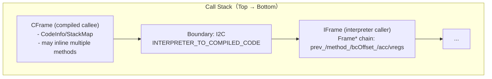
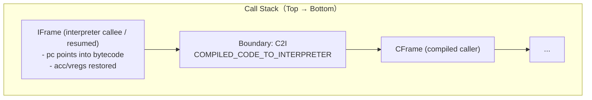
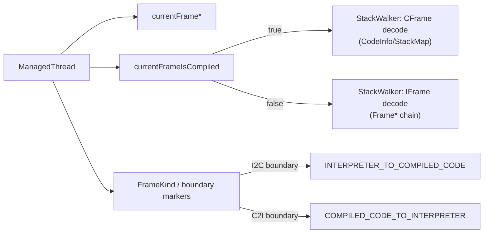
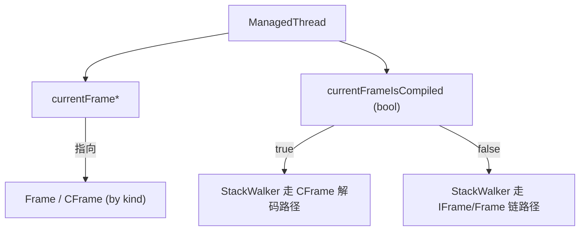
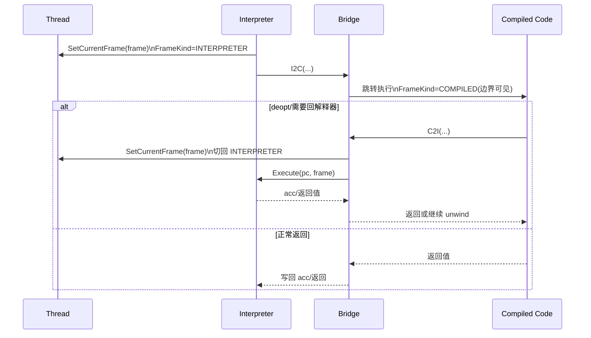

# Bridge（I2C/C2I）与 FrameKind（边界语义）

## 0) 在端到端主线图中的位置

- 总入口：`../Flows/ExecutionEngine_EndToEnd.md`（“调用/桥接（解释器 ↔ compiled）”框；以及“异常/栈遍历/Deopt”都会依赖 FrameKind 与 boundary frame）

## 它是什么

Bridge 是解释器与编译代码的“边界协议”，核心目标是：
- 让解释器能按 ABI 把参数传给 compiled code（I2C）
- 让 compiled code 能在需要时回到解释器并继续执行（C2I/InvokeInterpreter）
- 让栈遍历/异常/unwind 能识别当前帧属于哪一侧（FrameKind）

## FrameKind 为什么重要

StackWalker、deopt、异常 unwind 都需要“判断一个帧是解释器帧还是编译帧”。  
FrameKind 不一致通常会表现为：
- 栈回溯缺帧/顺序错
- 从 compiled 回解释器后 acc/返回值错
- deopt 重建 frame 时读取错误的数据源

## 关键不变量（新人排障必记）

- **Thread 同时维护“当前帧指针 + 当前帧是否 compiled”两个维度**：
  - 桥接/InvokeInterpreter/deopt 需要把它们切到一致状态（例如回解释器前 `SetCurrentFrame(frame)` 且 `SetCurrentFrameIsCompiled(false)`）。
- **FrameKind/边界帧是 StackWalker 的“分岔点”**：
  - 一旦边界帧识别错，StackWalker 可能把 IFrame 当 CFrame 解析（或反过来），轻则缺帧，重则崩溃。
- **acc 写回是边界协议的一部分**：
  - 解释器→compiled：调用前会把 acc 写回 frame；返回后再从 frame 恢复（否则 GC/hook/返回值语义可能不一致）。
  - compiled→解释器：`InvokeInterpreter` 返回前必须从 `frame->GetAcc()` 取回结果并恢复 thread 的前一帧状态。

## ABI/栈帧形态（把“边界协议”讲到可画图可 debug）

> 这一节的目标：当你看到“栈不对/缺帧/返回值错”，能立刻知道：
> - 哪些帧是 **语义帧**（IFrame/CFrame）
> - 哪些帧是 **边界帧**（I2C/C2I boundary）
> - Thread 的状态位应当如何切换（currentFrame 指针 + currentFrameIsCompiled）

### 1) 逻辑栈形态（I2C / C2I）

### 2) “双状态开关”与 FrameKind 的关系（排障 checklist）

- **你 debug 时同时看三件事**：
  - `currentFrame*` 是否指向你认为的“当前语义帧”（Frame* 还是 CFrame）
  - `currentFrameIsCompiled` 是否与当前执行侧一致（compiled vs interpreter）
  - boundary frame 是否能被 StackWalker 识别（否则上一帧跳错）

### 3) deopt/异常与 StackWalker 的交界（为什么边界帧必须可识别）

- **异常两段式**：stackless IFrames 里找不到 catch → 进入 CFrames 搜索 → 找到后可能 `Deoptimize` 回解释器 catch pc。
- **deopt 的关键动作**：`StackWalker::ConvertToIFrame` 会把 CFrame 重建成一串 IFrame（包含 inlined 展开），并需要正确跨过 boundary frame。

> 所以：只要你看到 “FindCatchBlockInCallStack/Deoptimize/ConvertToIFrame” 出现，优先怀疑 FrameKind/boundary 与 thread 状态位是否一致。

## Mermaid：Thread 的“当前帧语义”开关（你排障时要同时看这两个状态）

## Mermaid：桥接与 FrameKind 切换（概念时序）

## 证据链（本章内）

- `runtime/bridge/bridge.h`（对外 ABI 与桥接符号）
- `runtime/bridge/bridge.cpp`（InvokeInterpreter、frame kind 切换、acc 写回）
- `runtime/include/stack_walker.h` + `runtime/stack_walker.cpp`（FrameKind 驱动的栈遍历）
- 解释器侧 i2c 调用点：`runtime/interpreter/interpreter-inl.h::CallCompiledCode`

### arch 汇编证据链（I2C/C2I/proxy/deopt 的物理落地）

> 这组链接把 “FrameKind/边界语义” 从概念直接落到 **栈布局/寄存器保存/TLS 更新点**。  
> 当你需要证明某条断言（VM 架构审计）或排查缺帧/错帧/异常跨边界问题（工程落地），优先看这里。

- **I2C（aarch64）**：[FileNotes/runtime_bridge_arch_aarch64_interpreter_to_compiled_code_bridge_aarch64.S.md](../FileNotes/runtime_bridge_arch_aarch64_interpreter_to_compiled_code_bridge_aarch64.S.md)
- **C2I（aarch64）**：[FileNotes/runtime_bridge_arch_aarch64_compiled_code_to_interpreter_bridge_aarch64.S.md](../FileNotes/runtime_bridge_arch_aarch64_compiled_code_to_interpreter_bridge_aarch64.S.md)
- **proxy（aarch64）**：[FileNotes/runtime_bridge_arch_aarch64_proxy_entrypoint_aarch64.S.md](../FileNotes/runtime_bridge_arch_aarch64_proxy_entrypoint_aarch64.S.md)
- **deopt-after（aarch64）**：[FileNotes/runtime_bridge_arch_aarch64_deoptimization_aarch64.S.md](../FileNotes/runtime_bridge_arch_aarch64_deoptimization_aarch64.S.md)

- **I2C（amd64）**：[FileNotes/runtime_bridge_arch_amd64_interpreter_to_compiled_code_bridge_amd64.S.md](../FileNotes/runtime_bridge_arch_amd64_interpreter_to_compiled_code_bridge_amd64.S.md)
- **C2I（amd64）**：[FileNotes/runtime_bridge_arch_amd64_compiled_code_to_interpreter_bridge_amd64.S.md](../FileNotes/runtime_bridge_arch_amd64_compiled_code_to_interpreter_bridge_amd64.S.md)
- **proxy（amd64）**：[FileNotes/runtime_bridge_arch_amd64_proxy_entrypoint_amd64.S.md](../FileNotes/runtime_bridge_arch_amd64_proxy_entrypoint_amd64.S.md)
- **deopt-after（amd64）**：[FileNotes/runtime_bridge_arch_amd64_deoptimization_amd64.S.md](../FileNotes/runtime_bridge_arch_amd64_deoptimization_amd64.S.md)

- **dyn 版本（TaggedValue calling convention）**：
  - aarch64：I2C/C2I（dyn）[I2C](../FileNotes/runtime_bridge_arch_aarch64_interpreter_to_compiled_code_bridge_dyn_aarch64.S.md) / [C2I](../FileNotes/runtime_bridge_arch_aarch64_compiled_code_to_interpreter_bridge_dyn_aarch64.S.md)
  - amd64：I2C/C2I（dyn）[I2C](../FileNotes/runtime_bridge_arch_amd64_interpreter_to_compiled_code_bridge_dyn_amd64.S.md) / [C2I](../FileNotes/runtime_bridge_arch_amd64_compiled_code_to_interpreter_bridge_dyn_amd64.S.md)

## 下一步（新人推荐）

- 想看“桥接主调用链 + arch 证据链入口（更集中）” → `../Flows/Bridge_I2C_C2I.md`
- 想看“缺帧/错帧/异常两段式如何依赖边界帧” → `../Flows/StackWalking.md`
- 想看“deopt-after/OSR 为什么经常与边界帧耦合” → `../Flows/Deopt_and_OSR.md`

