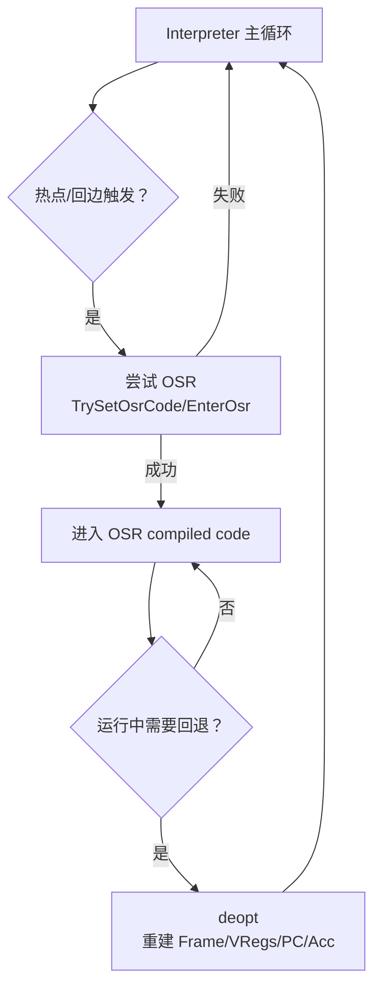

# Deopt 与 OSR（状态重建与中途切换）

## 0) 在端到端主线图中的位置

- 总入口：`../Flows/ExecutionEngine_EndToEnd.md`（“JIT/OSR（热点触发）”与“Deopt（compiled→解释器恢复）”框）

## 它是什么

- **Deopt（去优化）**：把编译态的执行恢复为解释器可继续执行的状态（Frame/VRegs/PC/Acc）。
- **OSR（On-Stack Replacement）**：在解释器执行中途（常见是循环回边）切到编译版本继续执行。

二者共同点：都在“解释器↔编译代码边界”发生，都要求对执行状态有明确的编码/恢复规则。

## 核心不变量（排障必记）

- **deopt 的输出必须是“可执行的解释器帧”**：PC 必须落在正确字节码边界，VRegs/Acc 必须满足该 PC 的语义前置条件。
- **OSR 的进入点必须与解释器状态对齐**：OSR code 约定的输入（vregs/acc/locals）要与解释器当前值一致。
- **“方法被 deopt 标记”会影响 OSR 安装**：常见现象是“热了但就是不 OSR”。

## 新人最容易漏掉的点：OSR 的触发点通常在“回边/分支插桩”

在本工程里，解释器会在 **回边（loop backedge）** 处做：

- safepoint 检查（`TestAllFlags()` → `RuntimeIfaceT::Safepoint()`）
- hotness/OSR 计数递减（`UpdateHotnessOSR`）
- 若 OSR 满足条件，会“伪造一条 RETURN 指令”让解释器主循环退出，从而进入 OSR 入口

对应证据链（本章）：

- `runtime/interpreter/instruction_handler_base.h::InstrumentBranches/UpdateHotnessOSR`（OSR 触发点与 fakeInst）
- `runtime/osr.*`（PrepareOsrEntry/OsrEntry）
- `runtime/compiler.*`（TrySetOsrCode：OSR code 安装条件）

## 常见现象 → 可能原因（给新同学的排障映射）

- **“循环很热但 OSR 不触发”**：
  - OSR 被 runtime option 关闭
  - frame 被标记为 deoptimized / method 不允许安装 OSR code
  - 某些特殊 frame（例如 INITOBJ 在特定语言路径）会显式 DisableOsr
- **“deopt 回退后语义错/返回值错”**：
  - vreg/acc/pc 还原不一致（尤其是边界帧/内联帧）
  - thread 的 currentFrameIsCompiled 与 frame kind 没切回一致状态

## Mermaid：deopt 与 OSR 的位置

## 证据链（本章内）

- OSR：`runtime/osr.h`、`runtime/osr.cpp`
- deopt：`runtime/deoptimization.h`、`runtime/deoptimization.cpp`
- OSR code 写入条件：`runtime/compiler.h/.cpp`（TrySetOsrCode 相关）
- 桥接边界：`runtime/bridge/bridge.cpp`
- 触发点（解释器回边）：`runtime/interpreter/instruction_handler_base.h`

## 下一步（新人推荐）

- 想看“deopt/OSR 的端到端 flow（含架构约束）” → `../Flows/Deopt_and_OSR.md`
- 想看“OSR 触发点如何绑在解释器回边/分支插桩” → `../Flows/Interpreter_Execute.md`
- 想看“deopt-after 回解释器时跨边界/缺帧” → `../Flows/Bridge_I2C_C2I.md` 与 `../Flows/StackWalking.md`

