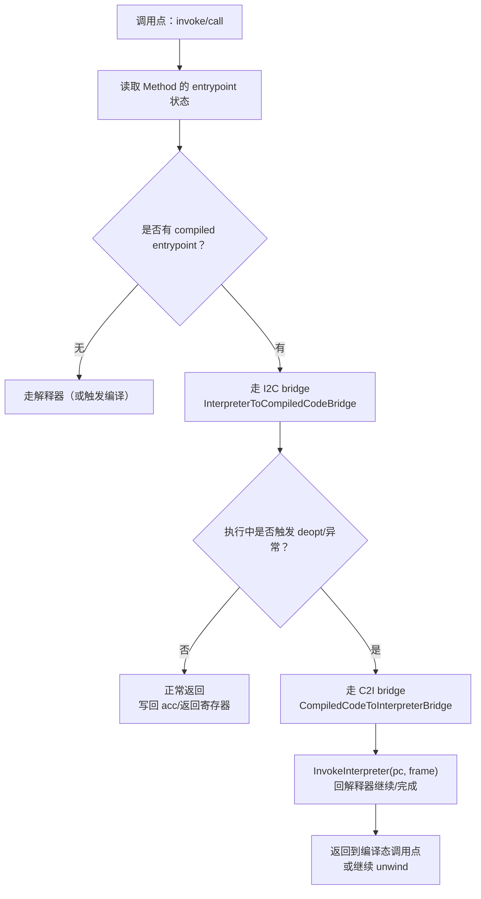

# Method Entrypoint 与派发决策（解释器/编译/OSR/native）

## 0) 在端到端主线图中的位置

- 总入口：`../Flows/ExecutionEngine_EndToEnd.md`（“调用/桥接（解释器 ↔ compiled）”与“JIT/OSR（热点触发）”框：本卡片解释 Method 的 entrypoint/OSR code 如何驱动派发决策）

## 它是什么

“方法怎么被调用”本质上是一个**entrypoint 选择问题**：同一个 `Method` 在不同阶段可能指向不同入口：
- **解释器入口**（或 C2I bridge）：未编译/需要回退时
- **已编译入口**（JIT/AOT）：热点方法走快路径
- **OSR 入口**：循环中途切换到编译版本
- **native 入口**：JNI/ANI（跨章 05）

## entrypoint 的存放位置（跨章提示）

`Method` 的字段与状态位段在 03 章已经逐行闭环（避免在 04 章重复逐行）：
- 见 03：`03_ClassLoading/FileNotes/runtime_include_method.h.md`

04 章主要关注：**谁在什么时候写入这些 entrypoints，以及调用方如何使用**。

## Mermaid：一次调用的派发决策（概念图）

## OSR 的不变量（为什么 OSR 常“看起来没生效”）

- OSR 不是“有循环就一定 OSR”，它通常需要：
  - 方法处于可编译状态（未被 deopt 禁用）
  - runtime/编译器能成功安装 OSR code（TrySetOsrCode 通过）
  - 触发点命中（回边计数/热度）

## 证据链（本章内）

- bridge：`runtime/bridge/bridge.h`、`runtime/bridge/bridge.cpp`
- OSR：`runtime/osr.h`、`runtime/osr.cpp`
- JIT runtime interface：`runtime/compiler.h`、`runtime/compiler.cpp`（TrySetOsrCode/SetCompiledEntryPoint）
- 03（Method 字段定义）：`03_ClassLoading/FileNotes/runtime_include_method.h.md`

## 下一步（新人推荐）

- 想看“派发决策如何落到 I2C/C2I 边界” → `../Flows/Bridge_I2C_C2I.md`
- 想看“OSR 安装条件/触发点/回退路径” → `../Flows/Deopt_and_OSR.md`
- 想看“compiled code 调 runtime 慢路径 + 编译期写回入口” → `../Flows/Entrypoints_and_RuntimeInterface.md`

