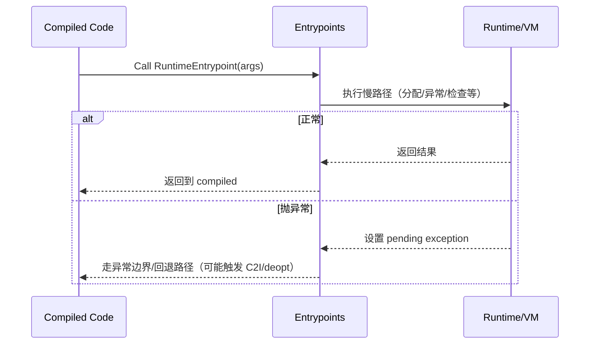

# Entrypoints（运行时慢路径入口）

## 0) 在端到端主线图中的位置

- 总入口：`../Flows/ExecutionEngine_EndToEnd.md`（“Entrypoints（runtime slow paths）”框：compiled code 通过 entrypoints 进入 runtime 慢路径）

## 它是什么

`entrypoints` 是“编译代码调用 runtime 的慢路径函数集合”。典型包括：
- 对象/数组/字符串分配
- 类型检查、边界检查、null check
- 异常创建与抛出/重抛
- 写屏障/读屏障相关慢路径（跨章 02）

在执行引擎视角，它们是：
1) 编译代码遇到“不能内联/不能快路径处理”的情况时的落点  
2) 解释器/桥接在边界上调用 runtime helper 的统一位置之一

## Mermaid：compiled code → entrypoints → 返回

## 证据链（本章内）

- `runtime/entrypoints/entrypoints.h`
- `runtime/entrypoints/entrypoints.cpp`
- 交界面：`runtime/bridge/bridge.cpp`、`runtime/compiler.*`（编译器生成代码会引用 entrypoints）

## 下一步（新人推荐）

- 想看“entrypoints 与 RuntimeInterface 的完整 flow（运行期+编译期两条线）” → `../Flows/Entrypoints_and_RuntimeInterface.md`
- 想看“entrypoints 异常如何跨边界/导致回解释器” → `../Flows/Bridge_I2C_C2I.md` 与 `../Flows/StackWalking.md`

