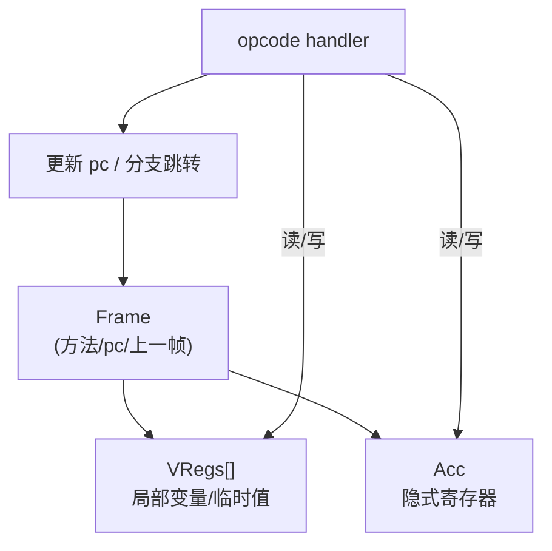
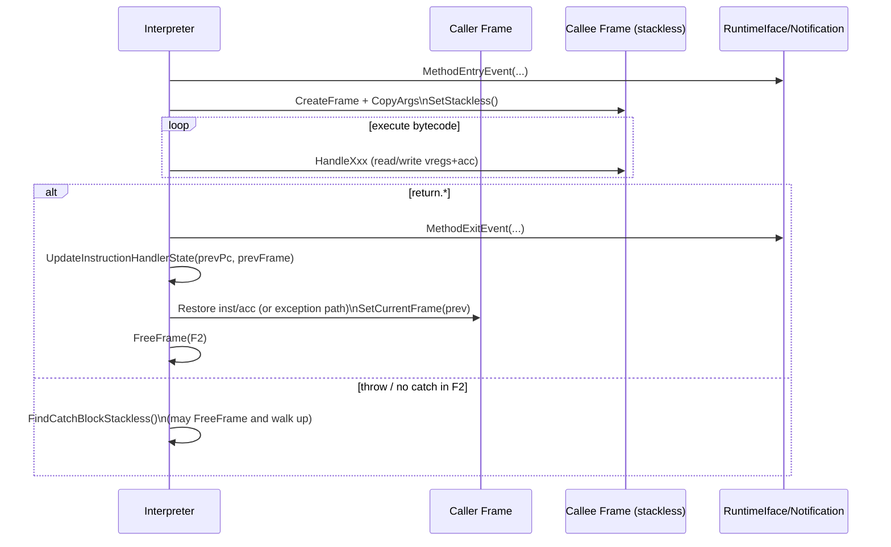

# Frame / VRegister / Acc（解释器执行状态）

## 0) 在端到端主线图中的位置

- 总入口：[ExecutionEngine_EndToEnd（Flow）](../Flows/ExecutionEngine_EndToEnd.md)（“解释器执行（主循环）”框；以及桥接/异常/栈遍历会反复读写 Frame/Acc）

## 它是什么

解释器执行 bytecode 时，需要一个“可恢复、可遍历、可桥接”的执行状态容器。本工程将其拆成三层：
- **Frame**：方法级执行上下文（当前 method、pc、上一帧链接、frame kind 等）
- **VRegister（vreg）**：虚拟寄存器数组（承载局部变量与临时值）
- **Acc（accumulator）**：累加器寄存器（大量指令的隐式输入/输出）

## 为什么是 vreg-based（不是 stack-based）

从 `frame.h`/`vregister.h` 的设计可以直接看出：值主要落在 vreg 槽位里，acc 作为“隐式寄存器”，而不是“操作数栈 push/pop”。  
这使得：
- 编译器更容易做 SSA/寄存器分配映射（vreg index 明确）
- OSR/deopt 更容易恢复“某个 vreg 的值”

## 静态/动态语言差异（关键点）

常见两种 vreg 表达：
- **静态语言**：payload vregs + mirror/tag（mirror 用于标注对象/原始值等）
- **动态语言**：payload 内部自带 tag（例如 TaggedValue），mirror 可能不需要

> 这会直接影响：acc/vreg 的读取 API、GC root 识别、以及桥接返回值如何写回。

## 关键不变量（新同学强烈建议背下来）

- **acc 必须可被 GC 看见**：很多路径在触发 runtime hook/safepoint/解析前，会先把 acc 写回 `Frame::acc`，回来再恢复到寄存器/状态（见 `InstructionHandlerBase::InstrumentInstruction`、`ResolveMethod/ResolveField/ResolveType` 的写回逻辑）。
- **静态/动态语言的 vreg 访问不是同一种东西**：静态语言是 payload+mirror/tag（`StaticVRegisterRef`），动态语言通常是 `TaggedValue`（`DynamicVRegisterRef`），混用会导致“对象识别/tag 错”。
- **stackless frame 会在解释器内部弹栈**：stackless 调用返回不是“直接 return 出解释器”，而是 `HandleReturnStackless()` 更新 state 到 caller 并 `FreeFrame`（这对异常/找 catch 同样成立）。

## Mermaid：解释器状态如何流动

## Mermaid：stackless 调用/返回（最容易被误解的执行流）

## 常见坑（排障用）

- **acc 写回遗漏**：某些 opcode 以 acc 为输出，如果 handler 忘记更新，会造成“返回值/分支条件错”
- **静态/动态分支混用**：同一条逻辑在静态/动态语言下走不同访问路径，写错会导致 tag/对象识别错
- **FrameKind 切换不一致**：桥接/stack walker/deopt 依赖 FrameKind；一旦不一致会出现“栈遍历缺帧/崩溃”

## 证据链（本章内）

- `runtime/interpreter/frame.h`（Frame layout 与注释图）
- `runtime/interpreter/vregister.h`（VRegister/StaticVRegisterRef/DynamicVRegisterRef）
- `runtime/interpreter/acc_vregister.h`（AccVRegister）
- 关键执行原语：`runtime/interpreter/instruction_handler_base.h`（acc 写回/异常跳转/OSR 触发点）
- stackless 路径：`runtime/interpreter/interpreter-inl.h`（HandleReturnStackless/FindCatchBlockStackless）

## 下一步（新人推荐）

- 想看“解释器主循环/handler 读写点” → [Interpreter_Execute（Flow）](../Flows/Interpreter_Execute.md)
- 想看“call 指令如何跨到 compiled、以及 acc/返回值协议” → [Bridge_I2C_C2I（Flow）](../Flows/Bridge_I2C_C2I.md)
- 想看“异常两段式/缺帧/StackWalker 读帧规则” → [StackWalking（Flow）](../Flows/StackWalking.md)

