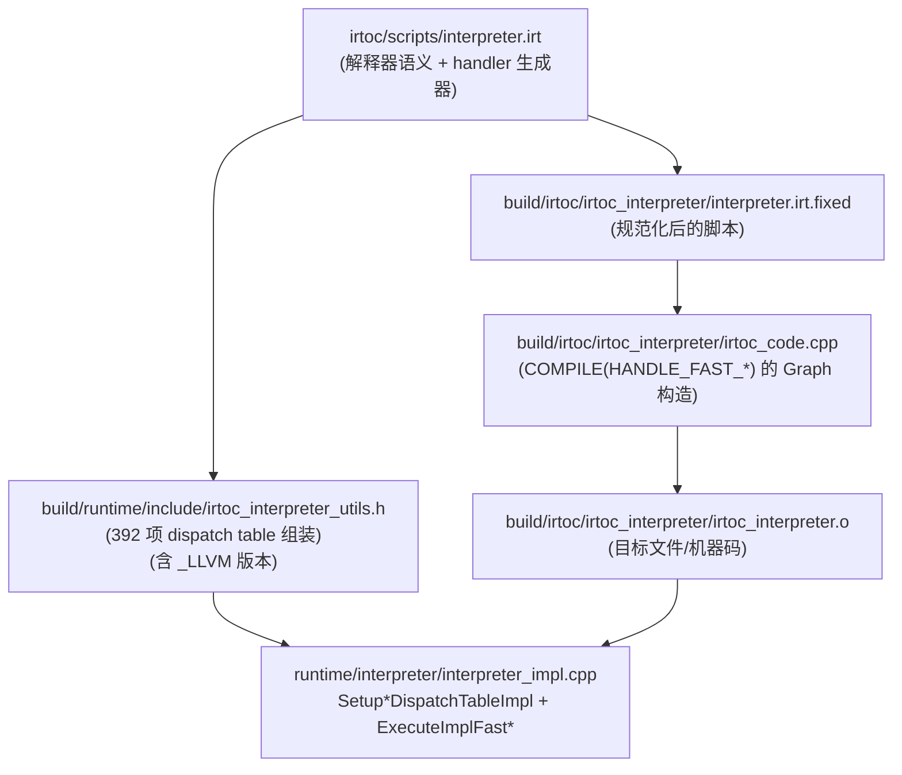

# IRTOC/LLVM Fast Interpreter（真实场景默认路径）

> 本卡片回答：**“真实跑在生产上的解释器到底是谁？”**  
> 结论：在当前工程配置里，`--interpreter-type` 默认是 **`llvm`**（见 `runtime/options.yaml`），也就是 **IRTOC 解释器语义 + LLVM backend**。  
> CPP 解释器主要用于 debug / 兼容特定模式（例如 `--debug-mode=true` 限制只能用 cpp）。

## 0) 在端到端主线图中的位置

- 总入口：`../Flows/ExecutionEngine_EndToEnd.md`（“解释器选型（运行时真实入口）”与“解释器执行（主循环）”框：fast interpreter 是默认执行路径之一）

## 1) 三种解释器实现：cpp / irtoc / llvm

- **cpp**：`runtime/interpreter/*` 的 C++ handler（便于调试、断点、日志；但不一定是性能路径）。
- **irtoc**：**IRTOC 脚本描述的解释器语义**（`irtoc/scripts/interpreter.irt`），由自研 backend 编译生成机器码。
- **llvm**：同一份 IRTOC 解释器语义，但 **使用 LLVM backend** 生成（覆盖路径更广、优化更完整）。

运行时选择逻辑见：`runtime/interpreter/interpreter_impl.cpp::GetInterpreterTypeFromRuntimeOptions/ExecuteImplType`。

## 2) Fast interpreter 的“内部 ABI”（为什么它快）

IRTOC/LLVM fast interpreter 并不是“每次 dispatch 都回 C++”，而是靠一套内部 calling convention：

- `ExecuteImplFast(tr, pc, frame, dispatch_table)` 进入 fast interpreter
- 解释器把核心状态长期放在 **固定寄存器**（per-arch regmap），减少内存 load/store

在 `irtoc/scripts/interpreter.irt` 里可以看到固定寄存器分配（示例）：
- `x86_64`: `dispatch=8, pc=4, frame=5, acc=11, acc_tag=3`
- `arm64`: `dispatch=24, pc=20, frame=23, acc=21, acc_tag=22, moffset=25, method_ptr=26`

> 这解释了为什么 CPP interpreter 的“Frame/VReg/Acc 模型”仍然重要：fast interpreter 只是把状态“缓存到寄存器”，语义仍围绕 Frame/VReg/Acc。

## 3) dispatch table：392 个 handler 的函数指针数组

build 阶段生成的 `build/runtime/include/irtoc_interpreter_utils.h` 提供两套表：

- `SetupDispatchTableImpl()`：IRTOC backend 的 `HANDLE_FAST_*`
- `SetupLLVMDispatchTableImpl()`：LLVM backend 的 `HANDLE_FAST_*_LLVM`

它们都返回 `dispatch_table.data()`，类型是 `void (*)()` 的数组指针，规模为 **392**。

更精确地说：

- fast interpreter 的表长度来自生成模板 `runtime/interpreter/templates/irtoc_interpreter_utils.h.erb`：
  - `392 = Panda::dispatch_table.handler_names.size() + 1`（`+1` 为 `HANDLE_FAST_EXCEPTION(_LLVM)` 槽位）
- 同时它与 C++ interpreter 的 label dispatch table **同长度、同 ISA 空间**（因此你会看到“同一批 opcode+prefix”）：
  - `392 = 256 + NUM_PREFIXED + 1`（见 `runtime/interpreter/templates/interpreter-inl_gen.h.erb` 与 `isa_constants_gen.h.erb` 的 `EXCEPTION_HANDLER` 槽位解释）

## 4) build 生成链（你在 build/ 里该看什么）

下面这条链路把“脚本”变成“可执行的 fast interpreter”：

## 4.1 “脚本行号 → Graph IR → 机器码”三段式追溯（审计方法）

这是你做性能/正确性问题时最可靠的一条证据链：

1. **脚本行号**（最终以 fixed 版为准）  
   看 `build/irtoc/irtoc_interpreter/interpreter.irt.fixed` 里的行号（它是 `Loc(..., line)` 的来源）。
2. **Graph IR 节点**  
   在 `build/irtoc/irtoc_interpreter/irtoc_code.cpp` 里查 `Loc(DIR_0, FILE_0, <line>)`，得到对应 `INST(id, Opcode::Xxx)`。
3. **最终汇编**  
   在 `build/irtoc/irtoc_interpreter/disasm.txt` 里找到同名 method 的 `# [inst] <id>`，看它下方的真实机器码。

一个最典型的例子是 dispatch：

- `interpreter.irt` 的 `dispatch(table, pc)` 在 `disasm.txt` 中会落成：  
  **`mov (%rcx,%rax,8), %rax` + `jmp %rax`**（computed-goto 的机器码证据）

## 5) 新人排障抓手（最常见的 4 个问题）

- **“为什么我看 C++ handler 改了没生效？”**：你可能运行的是 `--interpreter-type=llvm/irtoc`，实际走的是 fast interpreter 的 `HANDLE_FAST_*`（来自 IRTOC 生成）。
- **“为什么动态语言默认不是 llvm？”**：`GetInterpreterTypeFromRuntimeOptions` 明确：动态语言默认用 cpp（除非显式设置 option）。
- **“debug-mode 为什么必须 cpp？”**：`ExecuteImpl` 会直接 `LOG(FATAL)` 限制 `--debug-mode=true` 只能配 `--interpreter-type=cpp`。
- **“llvm/irtoc 为啥被降级？”**：根据编译开关（`PANDA_LLVM_INTERPRETER` / `PANDA_WITH_IRTOC`）与 GC 类型，会把默认值降级到可用实现（见 `interpreter_impl.cpp`）。

## 6) VM 架构师视角：`.irt` 是什么？你需要掌握到什么程度才算“会改”

新人理解 IRTOC 的门槛通常不是“看懂 dispatch table”，而是：

- 不知道 `.irt` 是 Ruby DSL（以脚本形式**构造 IR Graph**）
- 不知道哪些语法是 Ruby，哪些语法是 IR 节点构造器（`LoadI/AddI/If/Phi/Intrinsic...`）
- 不知道应该改哪里（dispatch？decode？call？OSR？异常？）
- 不知道如何验证“改动真的进入机器码”（只看运行结果容易误判）

因此建议把学习拆成三步：

1) **能识别结构**：`macro`/`handler`/`Panda.instructions.each` 生成段各负责什么  
2) **能做小改动**：改一个宏或一个 handler 的一小段逻辑  
3) **能做闭环验证**：`.irt.fixed → irtoc_code.cpp → disasm.txt` 三段式证据链

对应工具书：

- `../Flows/IRTOC_DSL_Primer.md`（新人工具书：最小语法集 + 改动落点表 + 验证闭环）
- 逐行证据：`../FileNotes/irtoc_scripts_common.irt.md`、`../FileNotes/irtoc_scripts_interpreter.irt.md`

## 7) 典型“改动模式”速查（新人最容易上手的 3 类）

> 这不是让你第一次就改复杂 opcode；而是让你知道“改动落点”长什么样。

- **改 decode/operand 读取**（影响面大，但模式稳定）
  - 落点：`macro(:readbyte)`、`macro(:as_vreg_idx)`、`macro(:as_id)`
  - 何时改：你新增/变更了 operand 编码、或发现某类 operand 在某 arch 下读错
- **改边界不变量（acc/pc/thread state）**
  - 落点：`save_acc/restore_acc`、`update_bytecode_offset`、`safepoint`
  - 何时改：你遇到 GC/safepoint/异常边界相关的偶现错（先确保你理解不变量，再动它）
- **改高层控制流（call/return/OSR/exception）**
  - 落点：`generic_call`/`generic_return`、`instrument_branches`/`handle_fake_return`、`move_to_exception`/`find_catch_block`
  - 何时改：你在“解释器↔compiled 边界”看到语义不一致或难复现的控制流错误

## 证据链（本章）

- 运行时选择：`runtime/interpreter/interpreter_impl.cpp`
- IRTOC 解释器语义：`irtoc/scripts/interpreter.irt`
- build 产物（本机证据）：`build/runtime/include/irtoc_interpreter_utils.h`、`build/irtoc/irtoc_interpreter/*`
- 机器码证据：`build/irtoc/irtoc_interpreter/disasm.txt`（可用来验证 tail-call dispatch/exception slot 等关键约定）

## 下一步（新人推荐）

- 想看“选型规则 + dispatch table + build 生成链（Flow 版）” → `../Flows/IRTOC_FastInterpreter.md`
- 想从“opcode→handler→runtime 交界面”建立直觉 → `../Flows/Opcode_DeepDives_IRTOC.md`
- 想搞清“opcode 定义如何驱动生成” → `ISA_and_OpcodeModel.md`

