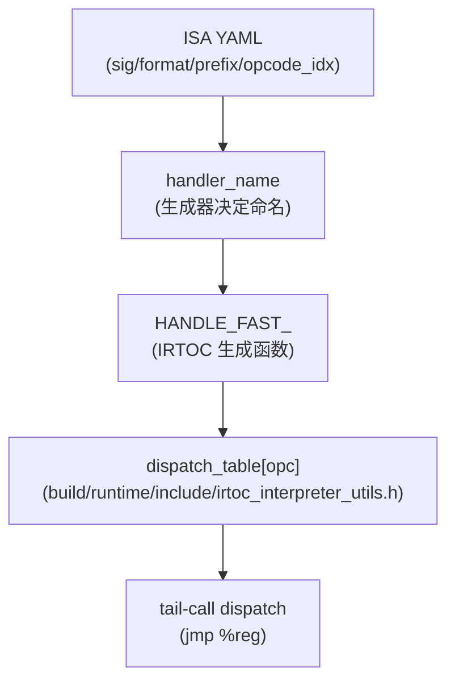

# ISA 与 Opcode Model（`isa/isa.yaml` + `plugins/ets/isa/isa.yaml`）

> 本卡片回答：**“opcode 的定义在哪里？它如何驱动解释器/JIT/IRTOC 生成？”**  
> 结论：`isa/isa.yaml` 是 core bytecode 的**规范源**；语言插件（如 ETS）通过 `plugins/ets/isa/isa.yaml` 增加 prefix/指令扩展。  
> IRTOC 的 `interpreter.irt` 使用 `Panda.instructions` 遍历 ISA，自动生成 `HANDLE_FAST_*`。

## 0) 在端到端主线图中的位置

- 总入口：[ExecutionEngine_EndToEnd（Flow）](../Flows/ExecutionEngine_EndToEnd.md)（“解释器执行（主循环）”与“fast interpreter（IRTOC/LLVM）”相关框：ISA 是 opcode/handler 的规范源）

## 1) ISA YAML 的结构（你需要掌握的字段）

- **chapters**：高层概念（register-based + accumulator calling sequence 等），这部分就是“规范文字”。
- **properties**：指令的语义标签（如 `method_id/field_id/call/return/jump/init_obj`），用于生成器/验证器/编译器做分组与策略。
- **exceptions**：该指令可能抛出的异常类别（如 `x_null/x_call/x_oom`）。
- **verification**：验证器对操作数/acc 类型的约束（如 `acc_obj_or_null`、`branch_target`）。
- **prefixes**：前缀 opcode（core 里有 `any/f32/cast/unsigned/bit` 等），用于扩展编码空间。
- **groups / instructions**：
  - group 提供人类可读的 description + pseudo code
  - instructions 给出 `sig/acc/format/opcode_idx/(prefix)` 等“可生成”的精确描述

## 2) ETS ISA 扩展（plugin）的角色

`plugins/ets/isa/isa.yaml` 做两件事：

- **声明 prefix `ets`**：把 ETS 指令放进一个独立的 opcode 空间（通过 pref_op_* 格式编码）。
- **定义 ETS 特有指令族**：例如：
  - `ets.ldobj.name*` / `ets.stobj.name*`：按名字解析 field/getter/setter
  - `ets.call.name*`：按名字解析 method 并调用

这些扩展会影响：
- fast interpreter 的 `HANDLE_FAST_ETS_*` 生成
- 编译器的 ETS intrinsics（`intrinsic_name` 字段）

## 3) “ISA → handler name → dispatch table” 的关键映射

你在 fast interpreter 中看到的名字链路通常是：

新人常见误区：
- “我改了 C++ handler 怎么没生效？”：因为默认跑的是 fast interpreter，而它的 handler 来自 ISA→IRTOC 生成。

## 4) 与 04 章其他内容的连接

- **IRTOC fast interpreter**：[IRTOC_FastInterpreter（DataStructure）](IRTOC_FastInterpreter.md)
- **IRTOC 语义实现**：[irtoc_scripts_interpreter.irt（FileNotes）](../FileNotes/irtoc_scripts_interpreter.irt.md)
- **dispatch table 组装**：[build_runtime_include_irtoc_interpreter_utils.h（FileNotes）](../FileNotes/build_runtime_include_irtoc_interpreter_utils.h.md)

## 下一步（新人推荐）

- 想把“ISA→handler→dispatch table→机器码”串起来 → [IRTOC_FastInterpreter（DataStructure）](IRTOC_FastInterpreter.md) 与 [IRTOC_FastInterpreter（Flow）](../Flows/IRTOC_FastInterpreter.md)
- 想从几个常用 opcode 直接下潜到生成/实现细节 → [Opcode_DeepDives_IRTOC（Flow）](../Flows/Opcode_DeepDives_IRTOC.md)

