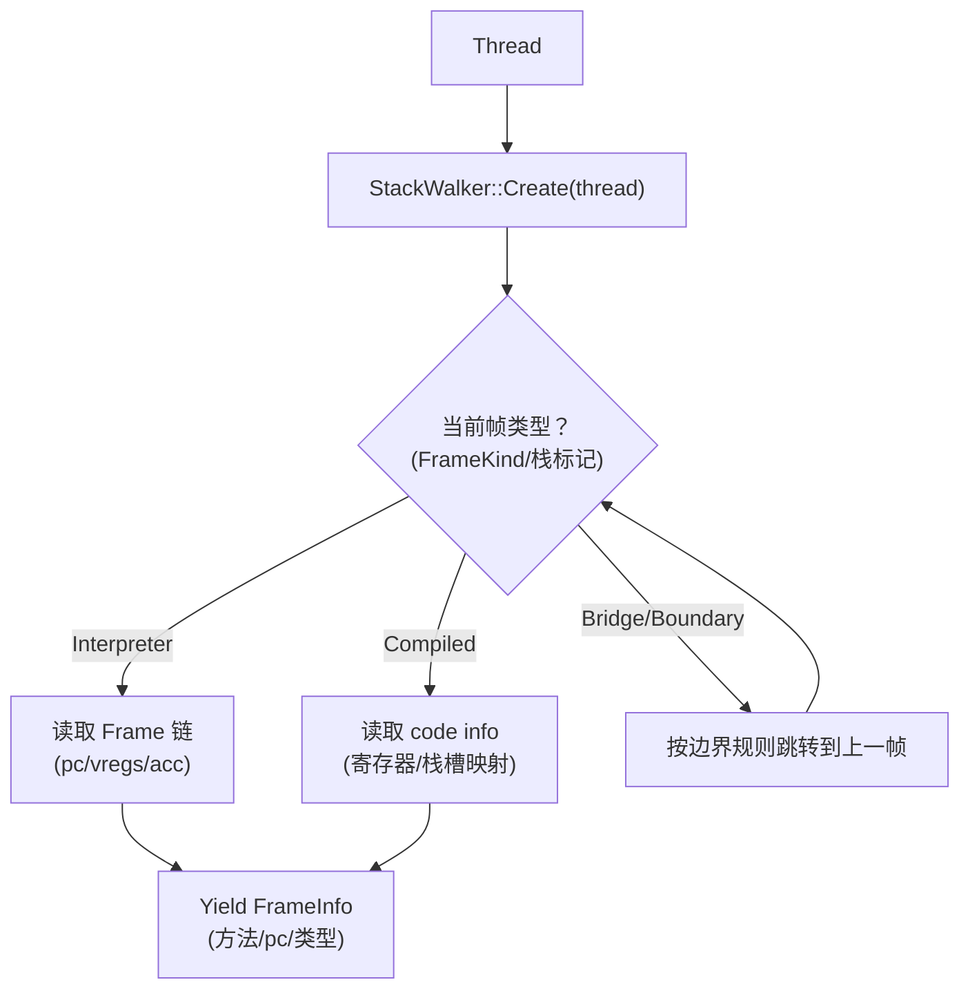

# StackWalker（统一栈遍历抽象）

## 0) 在端到端主线图中的位置

- 总入口：[ExecutionEngine_EndToEnd（Flow）](../Flows/ExecutionEngine_EndToEnd.md)（“异常/栈遍历（调试/异常/去优化都会用）”框：StackWalker 串起解释器帧/编译帧/边界帧）

## 它是什么

`StackWalker` 负责把“当前线程的执行栈”抽象成可遍历的序列，即便栈里同时存在：
- 解释器帧（Frame/VRegs/PC）
- 编译帧（依赖 code info/寄存器保存约定）
- 桥接帧（I2C/C2I 边界）

它服务于：
- 调试/信号 dump
- 异常 unwind 与栈打印
- profiler/采样
- deopt/OSR 的边界判定（哪些帧能恢复/如何恢复）

## 关键不变量

- **FrameKind 必须可信**：否则 StackWalker 会把“解释器帧当编译帧”或反之，导致崩溃或缺帧。
- **边界帧必须可识别**：桥接通常会用特定 layout/标记让 walker 能正确跨越。

## 新人友好补充：StackWalker “看到的栈”不等于“物理栈帧数”

StackWalker 会把以下三类差异统一成“逻辑帧序列”：

- **inlined frames**：一个编译帧（CFrame）里可能包含多个内联方法；walker 会把它们拆成多个逻辑帧（method/pc 不同）。
- **boundary frames**：桥接边界（I2C/C2I）是“物理上存在、语义上是过渡”的帧；walker 会按规则跳过或转换它们。
- **deopt/异常联动**：异常处理可能先在解释器 stackless 帧内 unwind，再进入 CFrame 搜索并 deopt 回解释器；walker 是把这两段串起来的统一工具。

## 排障 checklist（缺帧/错帧时先看这三点）

- **currentFrameIsCompiled 与 currentFrame 指针是否匹配当前执行侧**（桥接/InvokeInterpreter/deopt 常切换）
- **是否踩到了 boundary frame（I2C/C2I）但未正确识别**（表现为上一帧跳错）
- **是否处于 inlined method 展开**（表现为“一个物理帧对应多个 method”）

## Mermaid：StackWalker 的高层视图

## 证据链（本章内）

- `runtime/include/stack_walker.h`
- `runtime/stack_walker.cpp`
- 交界面：`runtime/bridge/bridge.cpp`、`runtime/deoptimization.*`
- 异常跨帧：`runtime/include/exceptions.h`、`runtime/exceptions.cpp`

## 下一步（新人推荐）

- 想看“StackWalking 主调用链（含异常两段式）” → [StackWalking（Flow）](../Flows/StackWalking.md)
- 想看“边界帧/FrameKind 对遍历的影响（最常见缺帧根因）” → [Bridge_ABI_and_FrameKind（DataStructure）](Bridge_ABI_and_FrameKind.md) 或 [Bridge_I2C_C2I（Flow）](../Flows/Bridge_I2C_C2I.md)
- 想看“deopt-after 与 StackWalker 的交界” → [Deopt_and_OSR（Flow）](../Flows/Deopt_and_OSR.md)

