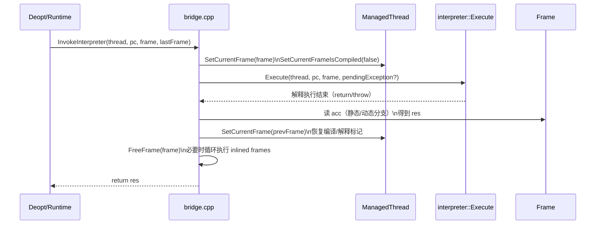

# `runtime/bridge/bridge.cpp`（逐行精读）

> 章节归属：Stage2 / 04_ExecutionEngine  
> 文件规模：154 行  
> 本文件角色：提供 **C++ 层的桥接“语义骨架”**：选择 C2I stub、以及 `InvokeInterpreter`（通常由 deopt 路径调用）如何回到解释器并取回结果。

## 一图读懂：InvokeInterpreter 的语义骨架

## 0. includes 与依赖（L16–L27）

- **L20**：`interpreter/acc_vregister.h`：用于读取 `Frame::GetAcc()` 并拿到 vreg-ref（静态/动态不同）。
- **L21**：`runtime/entrypoints/entrypoints.h`：桥接边界经常与运行时入口交织（本文件只引入，但在其他桥接实现/慢路径里也经常会用到）。
- **L24**：`runtime/interpreter/interpreter.h`：`InvokeInterpreter` 调用 `interpreter::Execute`。
- **L25–L26**：bytecode instruction：为 INITOBJ 特判提供 opcode 判定。

## 1. 选择 C2I stub：`GetCompiledCodeToInterpreterBridge`（L30–L45）

- **L35–L43**：按“是否动态语言”选择 `CompiledCodeToInterpreterBridge` vs `...Dyn`：
  - 若 `method->GetClass()==nullptr`，直接认为 dynamic（动态方法可无 class）。
  - 否则检查 `method->GetClass()->GetSourceLang()` 是否 dynamic language。

> 这条逻辑与 `StackWalker::IsDynamicMethod()`（见 `runtime/stack_walker.cpp`）在语义上应保持一致：动态语言路径的栈布局/返回值/寄存器语义可能不同。

## 2. acc/vreg 统一取值：`GetVRegValue`（L57–L61）

- **L60**：若 vreg 有对象（`HasObject()`）则把引用地址转成整数；否则取 long 值。  
  用途：把“acc 的值”归一到 `int64_t` 作为 `InvokeInterpreter` 的返回值（便于 C ABI 返回）。

## 3. deopt 入口骨架：`InvokeInterpreterCheckParams`（L68–L96）

> 注释 **L63–L66** 明确指出：该函数“supposed to be called from the deoptimization code”，并且会在退出时释放输入 frame。

逐行要点：
- **L76–L78**：保存并切换当前线程的“帧类型”：
  - `prevFrameKind = thread->IsCurrentFrameCompiled()`
  - `thread->SetCurrentFrame(frame)`
  - `thread->SetCurrentFrameIsCompiled(false)`：显式切到解释器帧语义
- **L81**：调用 `interpreter::Execute(thread, pc, frame, thread->HasPendingException())`  
  第四参把“是否已有 pending exception”传入解释器，影响解释器如何进入异常路径。
- **L84–L89**：从 `frame->GetAcc()` 读取结果并归一化：
  - dynamic：`acc.AsVRegRef<true>()`
  - static：`acc.AsVRegRef()`
- **L91–L94**：恢复 thread 当前帧到 `prevFrame`，释放本次执行的 `frame`。
- **L95**：返回 `(prevFrameKind, res, prevFrame, acc)`，给外层循环继续用（尤其是 `acc` 需要在“找 catch/内联帧”时传播）。

## 4. `InvokeInterpreter` 主体：处理“内联帧/找 catch/FreeFrame 顺序”（L98–L143）

### 4.1 第一段：执行目标 frame（L100）

- **L100**：先执行 `InvokeInterpreterCheckParams`，得到首次执行的 `res/acc/prevFrame` 等。

### 4.2 第二段：循环执行 inlined frames（L102–L139）

注释（**L102–L104**）给出关键动机：
- 为了“find catch block”，需要在所有 inlined methods 上执行。
- 否则会执行到更早的 interpreter frames，导致 `FreeFrame` 顺序不正确。

循环条件（**L104**）：
- `prevFrame != nullptr && lastFrame != frame`  
  其中 `lastFrame` 用于控制“最多 unwind 到哪里”（调用方提供的边界）。

循环体关键点：
- **L105**：断言 `prevFrame` 不是解释器边界帧（避免把 boundary 当普通 iframe 执行）。
- **L110**：从 `frame->GetMethod()->GetInstructions() + frame->GetBytecodeOffset()` 恢复 pc。
- **L112–L127**：若无 pending exception，则 decode 当前 bytecode：
  - **L115–L120**：INITOBJ 特判（关键！）
    - 注释解释：编译器可能把 `InitObj` 拆为 `NewObject + CallStatic`。
    - 若 deopt 发生在 `CallStatic`，acc 里可能仍保留 `NewObject` 的结果；此时不能被 `CallStatic` 的 acc 覆盖。
  - **L123**：把 pc 更新到 `next` 指令地址，以便继续执行。
  - 若有 pending exception（**L125–L127**），则直接写回 `acc`。
- **L128**：再次执行 `interpreter::Execute(...)`。
- **L130–L135**：更新 `acc/res`（静态/动态分支同前）。
- **L137–L139**：`thread->SetCurrentFrame(prevFrame)` 并 `FreeFrame(frame)`，保证释放顺序与“逐帧 unwind”一致。

### 4.3 收尾：恢复帧类型并返回（L140–L142）

- **L140**：`thread->SetCurrentFrameIsCompiled(prevFrameKind)`：恢复 deopt 进入前的“当前帧是编译/解释器”的标记。
- **L142**：返回 `res`（来自最后一次解释执行后的 acc）。

## 5. 两个 stub 地址接口（L145–L153）

- `GetAbstractMethodStub()` / `GetDefaultConflictMethodStub()`：返回对应 stub 的函数地址。

## 本文件对排障最有价值的“断言与信号”

- **FrameKind 切换**：`SetCurrentFrameIsCompiled(false/prev)` 必须成对出现，否则 StackWalker/异常 unwind 会失真。
- **INITOBJ 特判**：若看到“构造对象 + 调用构造函数”相关 deopt 语义错误，优先看这段逻辑。
- **FreeFrame 顺序**：本文件明确强调“释放顺序错误会出大问题”，因此任何修改都要谨慎验证 unwind 路径。

