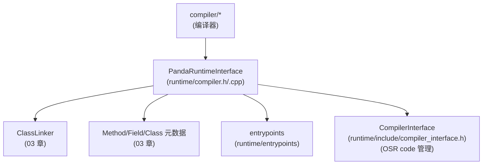

# `runtime/compiler.h`（逐行精读｜按“接口面”分段）

> 章节归属：Stage2 / 04_ExecutionEngine  
> 文件规模：859 行（偏大；以“接口面与关键不变量”为主做分段记录）  
> 本文件角色：运行时侧的 JIT/AOT 入口与 **`PandaRuntimeInterface`（compiler::RuntimeInterface 的实现）**：编译器需要的信息查询、以及编译产物（compiled entrypoint / OSR code）的写回。

## 一图读懂：编译期接口如何消费 03/04 章能力

## 0. 顶部依赖与“小工具”（L18–L55）

- **L18–L20**：引入 compiler 的 runtime_interface/compile_method/task_runner：说明本文件是 runtime 与 compiler 的接口边界。
- **L23**：引入 `entrypoints.h`：编译器 codegen 需要知道 runtime slowpath 入口符号。
- **L39**：引入 `osr.h`：OSR code 的写回/查询会走 `CompilerInterface` 与 `osr.*` 闭环。
- **L47–L50**：`MethodCast`：把 `RuntimeInterface::MethodPtr` 还原成 `ark::Method*`（编译器接口大量使用 opaque 指针）。
- **L52–L54**：`ScopedMutatorLock`：对 mutator lock 的读锁封装（保证读 runtime 元数据/对象安全）。

## 1. 三个“附加接口”wrapper（L56–L82）

### 1.1 `ClassHierarchyAnalysisWrapper`（L56–L67）

- `GetSingleImplementation/IsSingleImplementation`：直接访问 `Method` 的 CHA 信息（03/04 章都在消费 CHA）。
- `AddDependency(callee, caller)`：把编译期依赖回写到 runtime 的 CHA 管理器（实现见 `compiler.cpp`）。

### 1.2 `InlineCachesWrapper`（L69–L73）

- 从 profiling data/inline cache 提取 callsite 的 classes（用于 inline/virtual call 去虚化决策；实现见 `.cpp`）。

### 1.3 `UnresolvedTypesWrapper`（L75–L82）

- 为“未解析类型”维护一个 method→(typeId,slotKind)→slot 的表，供编译器生成 lazy resolve 代码。

## 2. `PandaRuntimeInterface`：最关键的运行时接口实现（L84–约 L702+）

### 2.1 返回理由：RET_OK / RET_DEOPTIMIZATION（L106–L113）

- 显式把 `CompilerInterface::ReturnReason` 映射为 compiler 侧的数值常量：
  - `GetReturnReasonOk()` → RET_OK
  - `GetReturnReasonDeopt()` → RET_DEOPTIMIZATION

> 与 04 的 `entrypoints.cpp::DeoptimizeEntrypoint`、`deoptimization.cpp::Deoptimize` 形成闭环：编译代码可用返回理由触发回退。

### 2.2 编译产物写回：compiled entrypoint / OSR code（L202–L225）

- **L202–L205**：`SetCompiledEntryPoint(method, ep)`：写入 method 的 compiled entrypoint。
- **L206–L217**：`TrySetOsrCode(method, ep)`：OSR code 的“有条件写入”
  - 先拿 `ScopedMutatorLock`（读锁）
  - **L209–L212**：若 method 已被 deopt/没有 compiled code，则拒绝写入（避免“OSR 编译过程中被失效”的竞态）
  - **L213–L216**：通过 `CompilerInterface` 写入 OSR code，并断言之前没有 OSR code
- **L218–L225**：`GetOsrCode/HasCompiledCode`：从 VM compiler 读取 OSR code 或判断 compiled 状态。

> 这与 04 的 `osr.cpp::OsrEntry/PrepareOsrEntry`、`deoptimization.cpp::InvalidateCompiledEntryPoint(RemoveOsrCode)` 是同一个闭环的三角形。

### 2.3 Class/Method/Field 查询：典型 fast path（声明见 L125+，实现主要在 `.cpp`）

典型模式（以 `GetClass(method, id)` 为例，见 `.cpp`）：
- 先尝试 `ClassLinker::GetLoadedClass`（无锁 fast path）
- miss 时：创建 error handler + `ScopedMutatorLock`，走 `ClassLinker::GetClass(...)` 加载

> 这使得编译期解析不会“无谓触发加载”，也能在需要时安全加载（与 03 章 class loading pipeline 对齐）。

### 2.4 是否允许 inline：Verifier 约束（L311–L321）

- 若 verification mode 是 ON_THE_FLY 且 method 还没 VERIFIED_OK → 禁止 inline  
  原因：未验证方法的语义/类型信息不可靠，inline 会放大风险。

### 2.5 与语言扩展的连接点（多个 API）

本接口在多个地方把语言相关决策下沉到 `ClassLinkerExtension` / `LanguageContext`：
- `IsMethodNativeApi` / `CanThrowException` / `IsNecessarySwitchThreadState` / `CanNativeMethodUseObjects`

> 这和 03 章的 `ClassLinkerExtension` 合约一致：语言差异由 extension 兜底。

## 3. `Compiler`（类声明在 L703 之后）

本文件后半段还声明 `Compiler : CompilerInterface`（实现见 `runtime/compiler.cpp`），负责：
- 收任务（method 热度触发）
- 同步/异步编译调度
- OSR entry 与编译状态机

