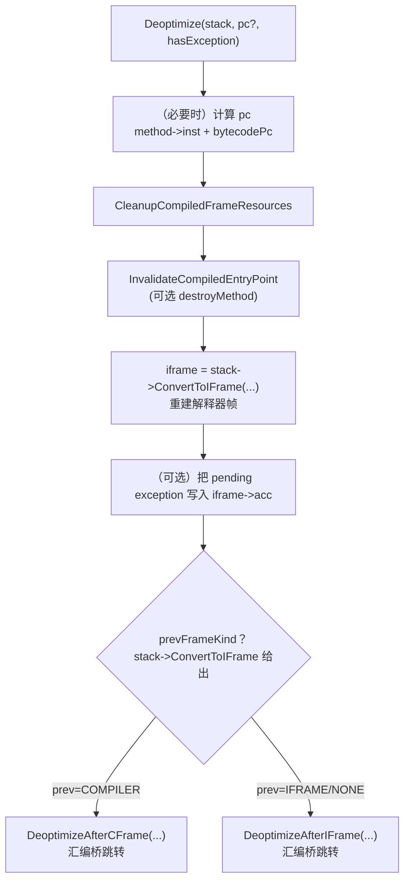

# `runtime/deoptimization.cpp`（逐行精读｜按函数簇分段）

> 章节归属：Stage2 / 04_ExecutionEngine  
> 文件规模：255 行  
> 本文件角色：实现去优化（deopt）与 entrypoint 失效：  
> 1) **InvalidateCompiledEntryPoint**：跨线程扫描栈并标记需要 deopt 的 CFrame  
> 2) **Deoptimize**：把目标 CFrame 转成解释器 Frame，并通过汇编桥跳回解释器执行  
> 3) **DropCompiledFrame**：丢弃 CFrame 并 return

## 一图读懂：Deoptimize 的“不可返回”跳转

## 0. 汇编桥声明：`DeoptimizeAfter*Frame` / `DropCompiledFrameAndReturn`（L32–L67）

- **L44–L45**：`DeoptimizeAfterCFrame(...)`：当目标 CFrame 的“下方（callee）”也是 CFrame 时使用。
- **L58–L59**：`DeoptimizeAfterIFrame(...)`：当目标 CFrame 下方是解释器帧（或顶部）时使用。
- **L67**：`DropCompiledFrameAndReturn(...)`：直接丢弃 CFrame 并 return。

共同点：
- 都是 `extern "C" [[noreturn]]`：由汇编实现，完成栈指针/返回地址/寄存器恢复，并跳转到解释器入口或 return。
- 都需要 `calleeRegs`：由 `StackWalker::GetCalleeRegsForDeoptimize()` 提供的 callee-saved regs 快照/指针（见 04 的 stack_walker FileNotes）。

## 1. 失效路径：`InvalidateCompiledEntryPoint`（L77–L133）

### 1.1 扫描每个线程栈并标记 CFrame（L83–L104）

- **L86**：对每个线程创建 `StackWalker`，遍历所有帧。
- **L87–L90**：命中目标方法的 CFrame：
  - `cframe.SetShouldDeoptimize(true)`：告诉执行侧“下次走到这里要回退”
  - `cframe.SetDeoptCodeEntry(stack.GetCompiledCodeEntry())`：保存“原 code entry”，因为常规 entrypoint 可能随失效改变（对应 `stack_walker.cpp::CreateCFrame` 的 codeEntry 三态选择）
- **L91–L97**：区分 CHA 与 IC（日志标记不同）。

### 1.2 全局停世界 + 枚举线程（L109–L132）

- **L110**：`ScopedSuspendAllThreadsRunning`：暂停所有线程，保证遍历栈与修改状态安全。
- **L112–L121**：对每个 method，遍历所有线程调用 `InvalidateCompiledMethod`。
- **L126**：`method->SetInterpreterEntryPoint()`：强制把 entrypoint 切回解释器。
- **L127**：`RemoveOsrCode(method)`：移除 OSR code（避免继续进入已失效的 OSR）。
- **L128–L131**：修正 compilation status（如果不是 COMPILATION 进行中，则置为 NOT_COMPILED）。

> 结论：Invalidate 不只是“改 entrypoint”，还要兼顾“已经在栈上的编译帧”（通过 ShouldDeoptimize + DeoptCodeEntry）。

## 2. 选择汇编桥：`PrevFrameDeopt`（L135–L170）

- 根据 `prevFrameKind` 分流：
  - **prev=COMPILER**（L139–L159）：
    - 先 `thread->SetCurrentFrameIsCompiled(true)`（重要注释：可能从另一次 Deoptimize 的解释器执行路径回到这里，帧类型标记已变）
    - 调 `DeoptimizeAfterCFrame(...)`
  - **prev=NONE/INTERPRETER**（L160–L168）：
    - 调 `DeoptimizeAfterIFrame(...)`

`EVENT_DEOPTIMIZATION` 在两支都会记录（区分 after cframe/iframe/top）。

## 3. `Deoptimize` 主体：先失效，再转换，再跳转（L181–L242）

关键顺序：

1) 输入与 pc 计算（L184–L195）
- 必须 `stack->IsCFrame()`。
- 若 `pc==nullptr`：使用 `method->GetInstructions() + stack->GetBytecodePc()`。

2) 清理编译帧资源（L200–L202）
- `CleanupCompiledFrameResources(thread->GetCurrentFrame())`：为回退做资源回收/解绑（语言/VM 相关）。

3) **先 Invalidate，再 Convert**（L204–L215）
- **L204–L205 的注释非常关键**：  
  “必须在 Convert 之前运行 InvalidateCompiledEntryPoint，因为 GC 可能已经在收集阶段并移动 deoptimized frame 中的对象。”  
  这说明 ConvertToIFrame 过程中会读取对象引用；若对象移动且栈上引用未按 GC 规则更新，就会恢复错误甚至崩溃。

4) ConvertToIFrame + 处理 inlined 方法数（L210–L223）
- **L214–L215**：`iframe = stack->ConvertToIFrame(&prevFrameKind, &numInlinedMethods)`  
  这一步把 cframe 的 vregs/acc/env 等按 codeinfo/stackmap 映射回解释器 frame（详见 `stack_walker.cpp` 的 FileNotes）。
- **L217–L223**：沿 prevFrame 链回退 `numInlinedMethods` 次，得到 `lastIframe`，并断言不会踩到解释器边界帧（**L222**）。

5) pending exception 处理（L228–L238）
- 若线程已有异常：把异常对象放入 `iframe->GetAcc()`（通过 `LanguageContext::SetExceptionToVReg`）——保证解释器能在正确语义下继续传播异常。
- 若 `hasException==false`：清理异常；否则必须仍有 pending exception。

6) 最终跳转（L240–L241）
- 调 `PrevFrameDeopt(...)`，不会返回。

## 4. `DropCompiledFrame`（L244–L252）

- 获取 cframe fp，记录事件，ASAN unpoison，然后 `DropCompiledFrameAndReturn(fp, calleeRegsEnd)`。
- 同样 `[[noreturn]]`。

