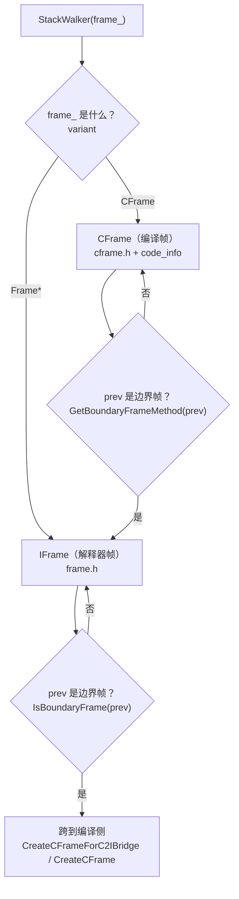

# `runtime/include/stack_walker.h`（逐行精读）

> 章节归属：Stage2 / 04_ExecutionEngine  
> 文件规模：421 行  
> 本文件角色：定义 `StackWalker` 抽象：**把解释器帧（Frame*）与编译帧（CFrame）统一成可遍历序列**，并提供对象/vreg 遍历能力（用于调试/异常/GC roots/去优化）。

## 一图读懂：StackWalker 的三类帧与边界识别

## 0. 关键类型：`UnwindPolicy`（L28–L32）

- **ALL**：遍历全部帧（包含内联帧）。
- **SKIP_INLINED**：跳过内联帧（只看“物理帧”）。
- **ONLY_INLINED**：仅遍历单个 cframe 内的内联帧（用于某些诊断/恢复场景）。

> 这三种策略在 `stack_walker.cpp::NextFromCFrame()` 的内联深度处理上有直接体现。

## 1. `FrameAccessor`：统一 Frame*/CFrame 的轻量访问器（L34–L75）

- **L37**：`FrameVariant = variant<Frame*, CFrame>`，StackWalker 的 `frame_` 就是这种 variant。
- **L41–L44**：`IsValid()` 的定义：CFrame 一定 valid；IFrame 需非空。

> 这使得 “GetNextFrame() 返回的不是裸指针”——调用方可按 variant 处理不同帧类型。

## 2. `StackWalker` 的核心 API 面（L78–L207）

### 2.1 构造与重置（L90–L103）

- **L90–L92**：强调必须在构造前确认 `thread->IsRuntimeCallEnabled()`，否则 ctor 里取 top frame 可能崩。
- **L92**：`Create(thread, policy)` 为推荐入口（便于做 assert/verify）。
- **L95**：可用 `(fp, isFrameCompiled, npc)` 直接构造（常见于信号/采样路径）。
- **L102**：`Reset(thread)` 复用 walker，更新起点。

### 2.2 遍历（L106–L135）

- **L106**：`NextFrame()`：走到上一帧（内部按 cframe/iframe 分流）。
- **L108**：`GetMethod()`：统一获取当前帧的方法；对 cframe 可能需要 stackmap/inline 信息。
- **L115–L123**：`GetBytecodePc()` / `GetNativePc()`：统一拿 bytecode PC / native PC。
- **L125–L129**：`GetFp()`：对 cframe 返回 frame origin；对 iframe 返回 `Frame*` 自身地址（作为 fp）。

### 2.3 “遍历寄存器/对象”能力（L136–L152）

- `IterateObjects`：只遍历对象（GC roots/验证/调试常用）。
- `IterateObjectsWithInfo` / `IterateVRegsWithInfo`：带 `VRegInfo` 元信息（来自 `compiler::CodeInfo`）。

> 这对应 `stack_walker.cpp` 中：
> - cframe：从 `codeInfo_` 取 vreg list + stackmap，然后读寄存器/栈槽
> - iframe：从 `Frame` 直接拿 vregs/acc

## 3. 边界帧：跨解释器/编译的关键约定（L209–L233, L318–L344）

### 3.1 如何判定“这是边界帧”（L209–L233）

- **L226–L233**：`IsBoundaryFrame<KIND>(ptr)` 的判定基于“边界帧的 METHOD_SLOT 值”：
  - 若 `KIND==INTERPRETER`：method slot == `COMPILED_CODE_TO_INTERPRETER`
  - 若 `KIND==COMPILER`：method slot == `INTERPRETER_TO_COMPILED_CODE`

> 关键理解：边界帧并不是真正的 `Method*`，而是一个“特殊标记值”。  
> 这让 StackWalker 可以不依赖符号表/调试信息，仅通过栈布局快速识别边界。

### 3.2 从边界帧提取 prev/fp/return address（L209–L216, L318–L344）

- **L209–L216**：`GetPrevFromBoundary<KIND>(ptr)`：依赖 `BoundaryFrame<KIND>::FP_OFFSET == 0` 的约定（static_assert 保证）。
- **L318–L344**：`GetMethodFromBoundary` / `GetReturnAddressFromBoundary` / `GetCalleeStackFromBoundary`：按固定 offset 从边界帧读元信息。

## 4. callee-saved regs 与 deopt（L80–L88, L274–L286）

StackWalker 需要知道“callee-saved regs 在栈上哪里”，以便：
- 读取/修改编译帧的 vregs（由 code info 描述）
- 生成 deopt 需要的寄存器快照（`GetCalleeRegsForDeoptimize` 在 `.cpp`）

