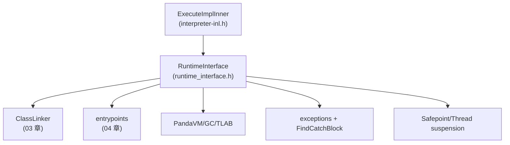

# `runtime/interpreter/runtime_interface.h`（逐行精读｜执行引擎相关 API）

> 章节归属：Stage2 / 04_ExecutionEngine  
> 文件规模：346 行  
> 本文件角色：解释器使用的“运行时接口”（`RuntimeInterface`）：把类加载/解析、对象分配、异常、帧创建/释放、safepoint 等运行时能力以静态函数形式暴露给 `ExecuteImplInner`。

## 一图读懂：RuntimeInterface 在解释器主循环中的位置

## 1. Resolve/Initialize：方法/字段/类解析都走 03 章 ClassLinker（L41–L122）

典型模式（以 ResolveMethod/ResolveField/ResolveClass 为代表）：
- 先把 bytecode 的 index（BytecodeId）通过 caller 的 class 解析成真实 EntityId（`Resolve*Index`）
- 调 `ClassLinker::GetMethod/GetField/GetClass`
- 若需要，检查并 `InitializeClass(thread, klass)`
- 失败时返回 nullptr（由上层 handler 负责抛异常或进入慢路径）

> 这就是 03→04 的最重要消费关系：解释器的“解析/初始化”完全委托 ClassLinker。

## 2. JIT 触发信息：hotness threshold / enable flag（L129–L137）

- `GetCompilerHotnessThreshold` / `IsCompilerEnableJit`：解释器主循环在热点点（常见是回边/调用点）会用这些开关决定是否触发编译。

## 3. 对象/数组分配：TLAB fast path + slow path（L149–L182）

### 3.1 数组：`CreateArray`（L149–L152）

直接委托 `coretypes::Array::Create`（失败由上层处理 pending exception）。

### 3.2 普通对象：`CreateObject`（L154–L182）

关键策略：
- 字符串类特殊处理：创建 empty string（L158–L161）。
- 若 klass 可实例化：
  - 尝试 TLAB 分配（L164–L173）
  - 若 TLAB 空间不足或对象需要 finalizer，走 slow path `ObjectHeader::Create(thread, klass)`（L167–L170）
  - 否则在 TLAB 上 alloc 并 init object header（L171–L175）
- 若不可实例化：抛 `InstantiationError`（L178–L181）

> 这与 `entrypoints.cpp` 中大量 “Create*SlowPathEntrypoint” 的存在一致：执行引擎会尽量走 fast path，必要时下沉 slow path。

## 4. 异常与 catch：`FindCatchBlock`（L189–L192）

解释器侧 catch 查找直接调用 `Method::FindCatchBlock(cls,pc)`，并由 `entrypoints.cpp::FindCatchBlockInIFrames*` 在 unwind 时驱动 frame 扫描/释放。

## 5. Frame 创建/释放：把 Frame layout 与 entrypoints ABI 统一起来（L259–L288）

关键点：
- `CreateFrame` / `CreateFrameWithActualArgs` / `CreateNativeFrameWithActualArgs`：
  - 用 `Frame::GetActualSize<IS_DYNAMIC>(nregs)` 计算真实 vreg 区大小
  - 委托到 `ark::CreateFrameWith*AndSize`（定义在 `entrypoints.h`）
- `FreeFrame(thread, frame)`：
  - 直接释放 `frame->GetExt()`（stack frame allocator）

> 这把 04 的三块拼成闭环：  
> `Frame`（layout/actual size）←→ `entrypoints`（分配实现）←→ `RuntimeInterface`（解释器调用点）

## 6. Safepoint：线程终止/挂起与可选 debug GC（L306–L341）

- Debug 下可启用 “每次 safepoint 都尝试触发 GC”（要求持有 mutator lock）——仅用于一致性/压力测试。
- 必须满足 `thread->IsRuntimeCallEnabled()`。
- 若 runtime terminated：执行 termination 处理。
- 若 thread suspended：进入 `WaitSuspension()`。

> 这解释了为什么某些慢路径/桥接在启用特定选项时会触发更频繁的 thread 状态变化：解释器显式在 safepoint 做了这些检查。

