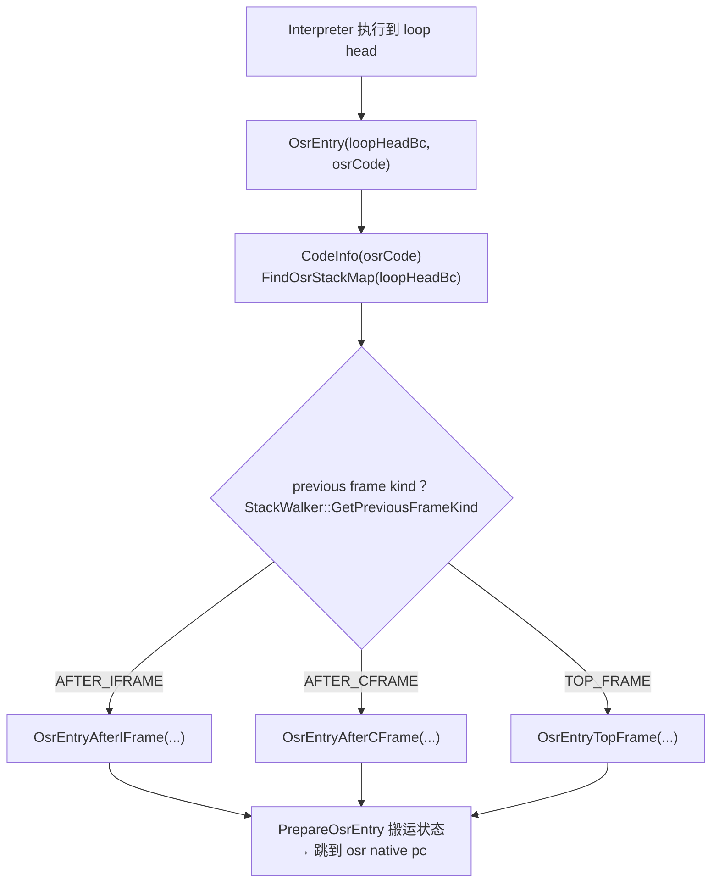

# `runtime/osr.cpp`（逐行精读｜按函数簇分段）

> 章节归属：Stage2 / 04_ExecutionEngine  
> 文件规模：298 行  
> 本文件角色：实现 OSR：  
> 1) **OsrEntry**：定位当前解释器帧与 previous frame kind，分流到不同汇编入口  
> 2) **PrepareOsrEntry**：把 iframe 的 vregs/acc/env 搬运到 OSR cframe（含寄存器 buffer）  
> 3) **SetOsrResult**：把 OSR 执行结果写回解释器 acc（含 tag）

## 一图读懂：OSR “从解释器切到编译态”

## 0. OsrEntry：分流到 AfterIFrame/AfterCFrame/TopFrame（L63–L112）

- **L65–L67**：`stack = StackWalker::Create(...)`；`frame = stack.GetIFrame()`  
  OSR 是从解释器执行点触发，因此主操作对象是 iframe（解释器帧）。
- **L69–L71**：用 `osrCode` 构造 `CodeInfo` 并查 `FindOsrStackMap(loopHeadBc)`：
  - stackmap 无效（**L71–L76**）则返回 false，并可记事件（WriteOsrEventError）。
- **L78–L110**：按 `stack.GetPreviousFrameKind()` 分流：
  - **prev=INTERPRETER**（L79–L84）：`OsrEntryAfterIFrame(frame, loopHeadBc, osrCode, frameSize, stackParams)`
  - **prev=COMPILER**（L85–L101）：
    - 动态方法额外校验（L86–L94）：`num_actual_args < num_args` 会禁用 OSR 并失败  
      注释指出需要调整来自上一编译帧的参数区；这里选择保守失败。
    - 之后 `UnpoisonAsanStack(frame->GetPrevFrame())`（L95），调用 `OsrEntryAfterCFrame(...)` 并 `UNREACHABLE()`（OSR 后不返回）。
  - **prev=NONE**（L102–L107）：`OsrEntryTopFrame(...)`

> 结论：OSR 的“入口选择”完全依赖 StackWalker 的边界判定与 previous frame kind；这与 deopt 的 PrevFrameDeopt 分流是对偶关系。

## 1. 从 iframe 读取值：`GetValueFromVregAcc`（L114–L135）

用于把解释器的 acc/vreg/env 读成统一的 `int64_t`：
- accumulator：`iframe->GetAcc().GetValue()`（L117–L118）
- 普通 vreg：`iframe->GetVReg(index).GetValue()`（L119–L121）
- special vreg（环境/寄存器映射外数据）：`ctx.GetOsrEnv(iframe, vreg)`（L122–L124）

并做平台相关修正：
- 32-bit managed pointer + target 64：对象值截断到 32-bit（L125–L128）
- target 64：对 `INT32` 做 `uint32` 截断（L129–L132，源码是 `NOTE(urandon): Investigate in #26258`）  
  - 这是一个带 issue 编号的 **已知行为/技术债标注**，不是“本章文档未补齐的 TODO”。

## 2. `PrepareOsrEntry`：构造 OSR CFrame 并搬运 vregs/acc/env（L137–L199）

核心步骤：

1) 构造 CodeInfo + OSR stackmap（L142–L146）
- `stackmap = FindOsrStackMap(bcOffset)` 必须 valid。

2) 初始化 CFrame 元信息（L149–L152）
- `cframe.SetMethod(iframe->GetMethod())`
- `cframe.SetFrameKind(OSR)`
- `cframe.SetHasFloatRegs(codeInfo.HasFloatRegs())`

3) 初始化 OSR 参数区（L163–L167）
- 计算 `paramSlots`：指向 `cframe.GetStackArgsStart()`，长度由 `GetStackParamsSize(iframe)` 决定。
- `ctx.InitializeOsrCframeSlots(paramSlots)`：语言相关的 OSR slot 初始化（env/隐式参数等）。

4) 遍历 vregList 并按 location 搬运（L170–L193）
- 只处理 `vreg.IsLive()`（L171–L173）。
- `value = GetValueFromVregAcc(...)`（L174）。
- 按 location 分流：
  - SLOT：直接 `cframe.SetVRegValue(vreg, value, nullptr)`（L176–L178）
  - REGISTER：写入 `regBuffer[vreg.GetValue()]`（L179–L182）
  - FP_REGISTER：写入 `fpRegBuffer[vreg.GetValue()]`（L183–L186）
  - CONSTANT：跳过（L188–L189）

5) 切换线程当前帧为 compiled（L195–L197）
- `thread->SetCurrentFrame(reinterpret_cast<Frame *>(cframePtr))`
- `thread->SetCurrentFrameIsCompiled(true)`

6) 返回 OSR 目标地址（L198）
- `osrCode + stackmap.GetNativePcUnpacked()`：汇编入口会跳到这个 native pc。

## 3. `SetOsrResult`：把返回值写回解释器 acc（L201–L244）

- 使用 method shorty 的返回类型（ShortyIterator）决定如何写回：
  - 整数类：`acc.SetValue(uval)` + tag=PRIMITIVE（L209–L220）
  - 引用：tag=GC_OBJECT（L221–L224）
  - 浮点：`acc.SetValue(bit_cast<int64_t>(fval))` + tag=PRIMITIVE（L225–L229）
  - **VOID：必须把 acc 清零**（L230–L235）  
    注释解释：解释器即便 callee void 也会从 callee 恢复 acc；如果不清零，acc 可能残留旧对象并在后续被误认为 live（极易引发 GC/验证问题）。
  - TAGGED：动态语言 tag 值自带语义，只设 value（L236–L238）

## 4. `GetStackParamsSize`：OSR 入口需要的参数区大小（L246–L295）

- 动态方法：`numArgs = max(numArgs, numActualArgs)`，按 TaggedType/slot 大小计算并对齐（L250–L254）。
- 静态方法：用 `arch::ArgCounter` 统计“需要走栈的参数空间”：
  - 先 count 隐式 `Method*`（L256–L257）
  - 若非 static 方法，count `this`（L258–L260）
  - 遍历 shorty 的每个参数类型并 count（L261–L294）
  - 返回 stack-only size 并按 `2 * SLOT_SIZE` 对齐（L295）

