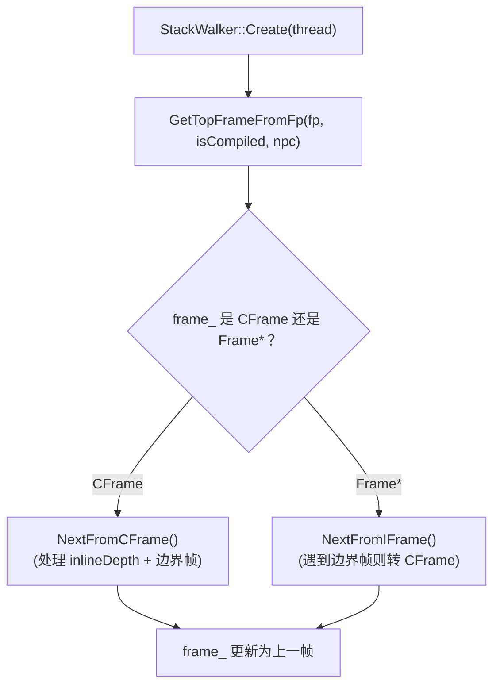

# `runtime/stack_walker.cpp`（逐行精读｜按函数簇分段）

> 章节归属：Stage2 / 04_ExecutionEngine  
> 文件规模：838 行  
> 本文件角色：实现 `StackWalker`：**创建当前顶帧（含边界识别）→ 解析 CodeInfo/StackMap → 逐帧回溯**，并提供“把编译帧恢复成解释器帧（ConvertToIFrame）”等去优化关键能力。

## 一图读懂：Create → NextFrame 的核心分流

## 0. Create/ctor/reset：构造时的安全前置条件（L29–L55）

- **L33**：`ASSERT(thread->IsRuntimeCallEnabled())`：强调“构造 walker 前必须允许 runtime call”，否则取栈顶帧可能崩。
- **L34–L37**：可选的 VerifyCallStack：构造临时 walker 并 `Verify()`。
- **L39**：返回 walker（值返回，内部仍是不可拷贝/不可移动语义在头里限制）。
- **L45**：ctor 里 `frame_ = GetTopFrameFromFp(fp, isFrameCompiled, npc)`：顶帧获取是核心。
- **L46–L48**：`SKIP_INLINED` 时把 `inlineDepth_=-1`（强制“不在 cframe 内下潜内联方法”）。
- **L54–L55**：`Reset(thread)`：复用 walker，重新取顶帧。

## 1. 顶帧选择：`GetTopFrameFromFp`（L58–L77）

核心分支：
- **若当前是编译帧**（`isFrameCompiled==true`）：
  - **L61–L73**：若 fp 指向“解释器边界帧”（`IsBoundaryFrame<INTERPRETER>(ptr)`）：
    - 取边界帧的 prev（`GetPrevFromBoundary<INTERPRETER>`），并检查 compiler 边界是否 BYPASS（**L63**）。
    - BYPASS：用 compiler 边界的 prev/return address/callee stack 创建 CFrame（**L64–L66**）。
    - 否则：用解释器边界的 prev/return address/callee stack 创建 CFrame（**L68–L72**）。
  - **L74**：若不是边界帧：直接 `CreateCFrame(reinterpret_cast<SlotType*>(ptr), npc, nullptr)`。
- **若当前是解释器帧**：直接把 fp 解释为 `Frame*`（**L76**）。

> 结论：顶帧获取第一优先级是“识别边界帧”，因为边界帧本身不是可直接解析的普通帧结构。

## 2. Method 获取：处理内联方法与 AOT snapshot（L79–L116）

- **L82–L95**：`GetInlinedMethod(cframe)`：
  - 从 `codeInfo_` 取出“内联方法标识”（可能是 `uint32_t entityId`，也可能是直接的指针）。
  - 若是 entityId：
    - 通过 `inlineInfo.GetFileIndex()` 判断是否来自 AOT snapshot index（**L87–L92**）。
    - 若是：走 `AotManager::GetPandaFileBySnapshotIndex` 找到 pf，再用 `classLinker->GetMethod(*pf, entityId, loadContext)` 解析。
    - 否则：用 `classLinker->GetMethod(*cframe.GetMethod(), entityId)` 解析。
- **L98–L116**：`GetMethod()`：
  - iframe：直接 `frame->GetMethod()`。
  - cframe：
    - 非 native 且 stackmap 无效时返回 nullptr（**L106–L110**：JIT trampolines 暂时放宽）。
    - 若处于内联深度：返回 `GetInlinedMethod()`。
    - 否则返回 `cframe.GetMethod()`。

## 3. 创建 CFrame：codeEntry 的三态选择（L132–L178）

`CreateCFrame(ptr, npc, ...)` 的最关键点是选用哪个 code entry 来解析 CodeInfo：

- **L144–L152**：优先级：
  1) `cframe.ShouldDeoptimize()`：使用 `cframe.GetDeoptCodeEntry()`（常规 compiled entry 可能已失效）  
  2) `cframe.IsOsr()`：从 VM compiler 查询 OSR code（`GetOsrCode(method)`）  
  3) 否则：`method->GetCompiledEntryPoint()`
- **L153**：`codeInfo_ = CodeInfo::GetCodeOriginFromEntryPoint(codeEntry)`：从 entrypoint 找到 code origin 并初始化 CodeInfo。
- **L155–L162**：用 npc 找 stackmap：
  - npc==0：直接找 0（StackOverflow stackmap 例外）
  - 否则 npc 要减去 code 起始地址得到相对 pc，再查 stackmap（并做范围检查）。
- **L171–L175**：保存 callee reg masks、`inlineDepth_`，并初始化 callee buffer（`InitCalleeBuffer`）。

> 这是“栈遍历正确性”的根：stackmap 找错会导致 vreg/对象遍历与 deopt 恢复全部失真。

## 4. NextFrame：跨边界与内联策略（L367–L448）

- **L367–L374**：`NextFrame()` 分流到 `NextFromCFrame` 或 `NextFromIFrame`。

### 4.1 `NextFromCFrame`（L376–L423）

1) 内联处理：
- **L378–L384**：若 inlined 且 policy 允许，`inlineDepth_--`（只下潜同一 cframe 内的“虚拟帧”）。

2) 到上一物理帧：
- **L389–L423**：读取 `prev`，并查看 `frameMethod = GetBoundaryFrameMethod<COMPILER>(prev)`：
  - `INTERPRETER_TO_COMPILED_CODE`：说明再往上是解释器侧，取 `prevFrame` 并根据是否是解释器边界帧决定创建 cframe or iframe（**L396–L405**）。
  - `BYPASS`：有一条“跳过桥接”的边界布局（**L406–L416**），也会检查解释器边界帧并创建 cframe。
  - default：常规情况，沿编译帧链回溯，并携带 prev callee 保存信息（**L418–L421**）。

### 4.2 `NextFromIFrame`（L425–L448）

- 若 `prev` 是解释器边界帧（**L436–L444**）：
  - 查看 compiler 边界是否 BYPASS：
    - BYPASS：直接创建 cframe
    - 否则：`CreateCFrameForC2IBridge`（针对 C2I 边界的特殊布局）
- 否则：直接 `frame_ = prev`（继续在解释器帧链回溯）。

## 5. deopt 关键能力：`GetFrameFromPrevFrame` / `ConvertToIFrame`（L537–L649）

### 5.1 `GetFrameFromPrevFrame`：从 cframe 恢复 iframe 的“数据搬运”

- **动态方法**（L544–L576）：
  - 使用 `CreateFrameWithActualArgs<true>(...)` 创建 frame，并 `frame->SetDynamic()`。
  - 根据 vregList 的 live 信息，把 pack vreg 值写入 iframe（注意 `ACC_OFFSET` 与 env 区域）。
  - 构造 `EnvData` 并调用 `LanguageContext::RestoreEnv(frame, envData)` 恢复动态语言的环境数据。
- **静态方法**（L577–L592）：
  - `CreateFrame(frameNumVregs, method, prevFrame)`，并把 vregList（包含 acc）的 live 值拷回。

> 结论：这里就是 deopt “状态重建”的核心证据点：哪些 vregs/acc 被认为 live、如何从 cframe 的 stackmap/codeinfo 映射回解释器布局。

### 5.2 `ConvertToIFrame`：处理内联、边界、并设置标志位

- **L608–L618**：若当前在 inlined 深度：递归先恢复更早的 prevFrame，再读取其 pc 判断是否 INIT_OBJ（用于后续标记 `SetInitobj()`）。
- **L623–L635**：非 inlined 时：
  - 若 `IsCompilerBoundFrame(prev)`：说明跨边界到解释器侧（设置 `prevFrameKind=INTERPRETER`，并标记 `isInvoke=true`）。
  - 否则仍在编译侧（`prevFrameKind=COMPILER`）。
- **L638–L648**：构造 iframe 并设置：
  - `SetDeoptimized()`
  - `SetBytecodeOffset(GetBytecodePc())`
  - 若 INITOBJ：`SetInitobj()`；若跨边界 invoke：`SetInvoke()`

> 这与 `runtime/bridge/bridge.cpp` 的 INITOBJ 特判（避免 acc 覆盖）在语义上呼应：两处都在解决“构造对象指令拆分 + 去优化恢复”的一致性问题。

## 6. Debug/Verify：用对象/类型一致性验证栈与 vregs（L658–L719）

- `DebugSingleFrameVerify` 通过 `IterateVRegsWithInfo` 校验：
  - vreg 的 object/scalar 与 `VRegInfo` 的类型一致
  - 若是对象，`object->ClassAddr<Class>()` 必须在 objects heap 内
- `Verify()` 遍历所有帧并逐帧验证（仅 NDEBUG 关闭时启用）。

