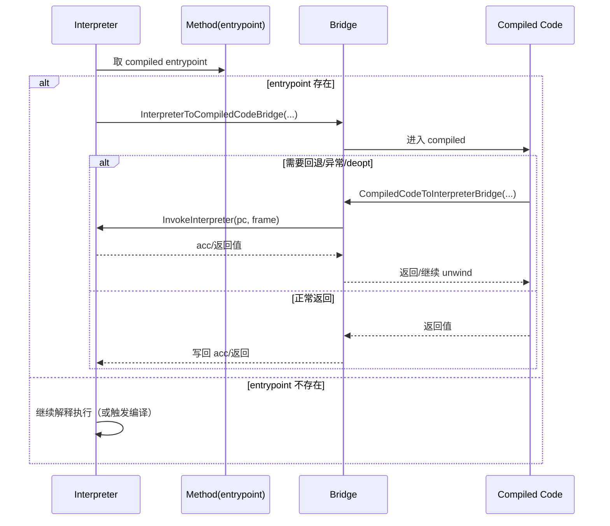
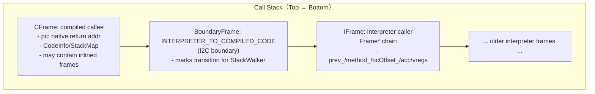
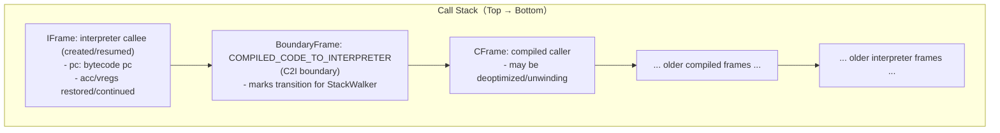
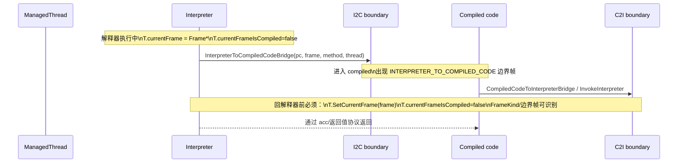

# Flow：Bridge（I2C/C2I）——解释器 ↔ 编译代码互调

## 0) 在端到端主线图中的位置

- 总入口：[ExecutionEngine_EndToEnd](ExecutionEngine_EndToEnd.md)（“调用/桥接（解释器 ↔ compiled）”框）

## 1) 这条 flow 解决什么问题

桥接问题通常表现为“跳到 compiled 就崩/返回值错/栈不对”。  
这条 flow 把关键边界点标出来，让你能快速定位：
- I2C：解释器如何调用 compiled entrypoint
- C2I：compiled 何时/如何回解释器（InvokeInterpreter）
- 返回值与 acc 的写回语义
- FrameKind 切换点（StackWalker/deopt 依赖）

## 2) Mermaid：双向桥接主线（概念）

## 2.1 Mermaid：i2c/c2i 的“逻辑栈形态”（你调试/栈回溯时看到的那种）

> 说明：这是 **逻辑形态**，真实机器栈还包含 arch/ABI 保存区与若干过渡帧。  
> 你定位缺帧/错帧时，先用这张图对齐 **FrameKind + boundary frame**，再去看 `runtime/bridge/arch/*` 细节。

### A) Interpreter → Compiled（I2C）之后的典型栈

### B) Compiled → Interpreter（C2I / InvokeInterpreter）之后的典型栈

> 关键点：StackWalker 依赖 boundary frame 与 thread 的 “currentFrameIsCompiled” 状态，才能在 IFrame/CFrame 两套解码规则之间正确切换。

## 2.2 Mermaid：Thread/FrameKind 切换点清单（排障用）

## 3) 排障抓手（你该看哪些点）

- **InvokeInterpreter 的骨架**：frame kind 切换、`thread->SetCurrentFrame(frame)`、acc 写回、FreeFrame
- **arch 相关**：真正的寄存器保存/ABI 在 `runtime/bridge/arch/*`（本章已在 **4.1 arch 汇编证据链** 提供 aarch64/amd64 的一键下潜入口；需要“物理栈帧/寄存器保存/TLS 更新点”时以汇编为准）

## 4) 证据链（本章内）

- `runtime/bridge/bridge.h`、`runtime/bridge/bridge.cpp`
- [Bridge_ABI_and_FrameKind（DataStructure）](../DataStructures/Bridge_ABI_and_FrameKind.md)
- 交界面：`runtime/deoptimization.*`、`runtime/include/stack_walker.h`
  - 特别关注：`StackWalker` 的 boundary frame 判定、以及 `ConvertToIFrame`（deopt 时重建解释器帧）

## 5) 下一步（新人推荐）

- 你想看“compiled 调 runtime 慢路径” → [Entrypoints_and_RuntimeInterface](Entrypoints_and_RuntimeInterface.md)
- 你遇到“deopt-after/OSR/回退解释器” → [Deopt_and_OSR](Deopt_and_OSR.md)
- 你遇到“异常缺帧/栈回溯不一致” → [StackWalking](StackWalking.md)

### 4.1 arch 汇编证据链（建议收藏：从“概念”一键下潜到“栈/ABI”）

> 说明：这组汇编是 “I2C/C2I/deopt/proxy 的最终真相层”。  
> 新人不需要逐行背，但当你遇到 **缺帧/错帧/异常无法跨边界/返回值错/GC safepoint 崩**，这里是最快的定位入口。

- **aarch64 / I2C（静态 shorty）**：
  - 源码：`runtime/bridge/arch/aarch64/interpreter_to_compiled_code_bridge_aarch64.S`
  - 逐行笔记：[FileNotes/runtime_bridge_arch_aarch64_interpreter_to_compiled_code_bridge_aarch64.S.md](../FileNotes/runtime_bridge_arch_aarch64_interpreter_to_compiled_code_bridge_aarch64.S.md)
- **aarch64 / I2C（dyn）**：
  - 源码：`runtime/bridge/arch/aarch64/interpreter_to_compiled_code_bridge_dyn_aarch64.S`
  - 逐行笔记：[FileNotes/runtime_bridge_arch_aarch64_interpreter_to_compiled_code_bridge_dyn_aarch64.S.md](../FileNotes/runtime_bridge_arch_aarch64_interpreter_to_compiled_code_bridge_dyn_aarch64.S.md)
- **aarch64 / C2I（静态 shorty）**：
  - 源码：`runtime/bridge/arch/aarch64/compiled_code_to_interpreter_bridge_aarch64.S`
  - 逐行笔记：[FileNotes/runtime_bridge_arch_aarch64_compiled_code_to_interpreter_bridge_aarch64.S.md](../FileNotes/runtime_bridge_arch_aarch64_compiled_code_to_interpreter_bridge_aarch64.S.md)
- **aarch64 / C2I（dyn）**：
  - 源码：`runtime/bridge/arch/aarch64/compiled_code_to_interpreter_bridge_dyn_aarch64.S`
  - 逐行笔记：[FileNotes/runtime_bridge_arch_aarch64_compiled_code_to_interpreter_bridge_dyn_aarch64.S.md](../FileNotes/runtime_bridge_arch_aarch64_compiled_code_to_interpreter_bridge_dyn_aarch64.S.md)
- **aarch64 / proxy entrypoint（异常桥）**：
  - 源码：`runtime/bridge/arch/aarch64/proxy_entrypoint_aarch64.S`
  - 逐行笔记：[FileNotes/runtime_bridge_arch_aarch64_proxy_entrypoint_aarch64.S.md](../FileNotes/runtime_bridge_arch_aarch64_proxy_entrypoint_aarch64.S.md)
- **aarch64 / deopt-after（CFrame→C2I 变形）**：
  - 源码：`runtime/bridge/arch/aarch64/deoptimization_aarch64.S`
  - 逐行笔记：[FileNotes/runtime_bridge_arch_aarch64_deoptimization_aarch64.S.md](../FileNotes/runtime_bridge_arch_aarch64_deoptimization_aarch64.S.md)

- **amd64 / I2C（静态 shorty）**：
  - 源码：`runtime/bridge/arch/amd64/interpreter_to_compiled_code_bridge_amd64.S`
  - 逐行笔记：[FileNotes/runtime_bridge_arch_amd64_interpreter_to_compiled_code_bridge_amd64.S.md](../FileNotes/runtime_bridge_arch_amd64_interpreter_to_compiled_code_bridge_amd64.S.md)
- **amd64 / I2C（dyn）**：
  - 源码：`runtime/bridge/arch/amd64/interpreter_to_compiled_code_bridge_dyn_amd64.S`
  - 逐行笔记：[FileNotes/runtime_bridge_arch_amd64_interpreter_to_compiled_code_bridge_dyn_amd64.S.md](../FileNotes/runtime_bridge_arch_amd64_interpreter_to_compiled_code_bridge_dyn_amd64.S.md)
- **amd64 / C2I（静态 shorty）**：
  - 源码：`runtime/bridge/arch/amd64/compiled_code_to_interpreter_bridge_amd64.S`
  - 逐行笔记：[FileNotes/runtime_bridge_arch_amd64_compiled_code_to_interpreter_bridge_amd64.S.md](../FileNotes/runtime_bridge_arch_amd64_compiled_code_to_interpreter_bridge_amd64.S.md)
- **amd64 / C2I（dyn）**：
  - 源码：`runtime/bridge/arch/amd64/compiled_code_to_interpreter_bridge_dyn_amd64.S`
  - 逐行笔记：[FileNotes/runtime_bridge_arch_amd64_compiled_code_to_interpreter_bridge_dyn_amd64.S.md](../FileNotes/runtime_bridge_arch_amd64_compiled_code_to_interpreter_bridge_dyn_amd64.S.md)
- **amd64 / proxy entrypoint（异常桥）**：
  - 源码：`runtime/bridge/arch/amd64/proxy_entrypoint_amd64.S`
  - 逐行笔记：[FileNotes/runtime_bridge_arch_amd64_proxy_entrypoint_amd64.S.md](../FileNotes/runtime_bridge_arch_amd64_proxy_entrypoint_amd64.S.md)
- **amd64 / deopt-after（CFrame→C2I 变形）**：
  - 源码：`runtime/bridge/arch/amd64/deoptimization_amd64.S`
  - 逐行笔记：[FileNotes/runtime_bridge_arch_amd64_deoptimization_amd64.S.md](../FileNotes/runtime_bridge_arch_amd64_deoptimization_amd64.S.md)

