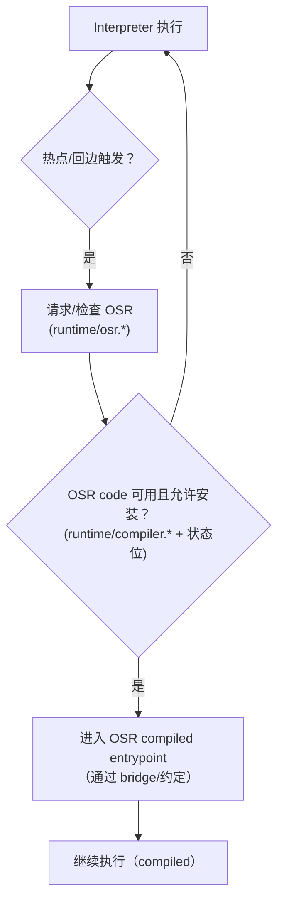
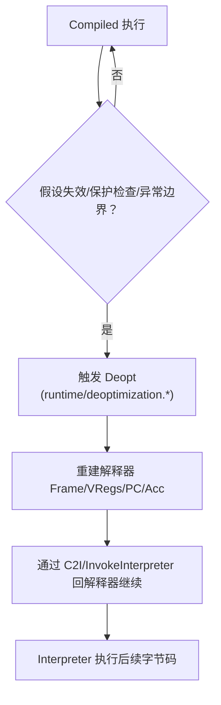

# Flow：Deopt 与 OSR（回退与中途切换）

## 0) 在端到端主线图中的位置

- 总入口：[ExecutionEngine_EndToEnd](ExecutionEngine_EndToEnd.md)（“JIT/OSR（热点触发）”与“Deopt（compiled→解释器恢复）”框）

## 1) 这条 flow 解决什么问题

当你遇到：
- “运行一段时间后突然回退解释器/性能掉崖”
- “OSR 明明应该触发但没触发”
- “deopt 后语义不对/返回值错/pc 错”

你需要一张“端到端主线图”来定位：触发点在哪里、状态如何恢复/切换、与桥接/栈遍历如何耦合。

## 2) Mermaid：OSR（解释器→OSR compiled）

## 3) Mermaid：Deopt（compiled→解释器恢复）

## 4) 与 StackWalker/Bridge 的交界点（你该记住的）

- **StackWalker**：deopt/异常/调试常需要先“走栈找边界”，所以 stack walking 往往与 deopt 同时出现
- **Bridge（C2I）**：deopt 后一般通过 C2I/InvokeInterpreter 把控制权交回解释器

## 4.1 OSR 触发点（补充：解释器回边）

在解释器执行中，OSR 往往不是“随便某条指令触发”，而是在 **回边/分支插桩** 处发生：

- **仅回边（back-edge）触发**：`InstrumentBranches(int32_t offset)` 里明确：`offset > 0` 直接返回（不是回边）；`offset <= 0` 才进入 safepoint/OSR 逻辑。
- **回边会做 safepoint 检查**：`TestAllFlags()` 为真时会把 acc 写回 frame、执行 `Safepoint()`，再恢复 acc。
- **回边会递减 hotness，并可能触发 OSR 编译/进入**：
  - gating：`frame->IsDeoptimized()` 或 `!Runtime::GetOptions().IsCompilerEnableOsr()` 时，**不会尝试 OSR**，只做普通 hotness 递减
  - 尝试 OSR 时会调用：`method->DecrementHotnessCounter<false>(bytecodeOffset+offset, &acc, /*osr=*/true)`
- **触发成功后的“fake-return”机制**：如果 OSR 发生，解释器会把当前 inst 替换为一条伪造的 `RETURN_VOID`（写入 fake buffer 并 `SetInst(...)`），用于把控制流从解释器主循环安全地交给 OSR 入口路径（见 `InstrumentBranches` 的 `GetFakeInstBuf/RETURN_VOID` 分支）。

证据链：
- `runtime/interpreter/instruction_handler_base.h::InstrumentBranches/UpdateHotnessOSR`
- `runtime/osr.*`
- `runtime/options.yaml`：`compiler-enable-osr`（默认 true）
- `runtime/interpreter/frame.h`：`IS_DEOPTIMIZED` 标志的注释说明（用于避免 deopt 后 OSR 导致栈空间不可回收而溢出）

### 4.2 fast interpreter（IRTOC/LLVM）如何触发 OSR（entrypoint 证据）

在 fast interpreter 里，OSR 热度递减通常通过 runtime entrypoint 完成：

- `runtime/entrypoints/entrypoints.cpp::CallCompilerSlowPathOSR(thread, method, frame, acc, accTag, insOffset, offset)`
  - 入口会把 `(acc, accTag)` 写回到 `frame->acc`，然后调用 `method->DecrementHotnessCounter<false>(insOffset + offset, &frame->GetAcc(), true)`
  - 同样受 `frame->IsDeoptimized()` 与 `compiler-enable-osr` gating

### 4.3 架构约束：OSR 的“最后一层”并非全平台都有（非常关键）

这一点在排障/新人实验时经常被忽略：**OSR 的最终进入点是架构相关汇编**，而当前源码对不同架构的支持并不对称。

- **arm64（PANDA_TARGET_ARM64）**：有真实实现，OSR 入口在：
  - `runtime/arch/aarch64/osr_aarch64.S`：实现 `OsrEntryAfterIFrame/OsrEntryAfterCFrame/OsrEntryTopFrame`，会调用 `PrepareOsrEntry`、恢复寄存器、跳入 OSR code，并在需要时 `SetOsrResult` 写回解释器 accumulator。
- **非 arm64**：OSR 入口在运行时被定义为 **UNREACHABLE**（不是“慢一点/降级”）：
  - `runtime/arch/asm_support.cpp`：在 `#if !defined(PANDA_TARGET_ARM64)` 下提供 `OsrEntryAfter*` 的 stub，函数体直接 `UNREACHABLE()`。
  - 额外证据：`runtime/arch/x86/osr_x86.S` 的 `OsrEntry` 仍是占位实现（直接返回 0）；`runtime/arch/amd64/osr_amd64.S`/`runtime/arch/arm/osr_arm.S` 当前仅有文件头（无实际逻辑）。

> 实战含义：在非 arm64 环境上，“把 OSR 路径跑出来”的实验/排障应优先验证 **是否具备架构实现**，否则你看到的现象往往只是 stub 行为（甚至直接崩到 UNREACHABLE）。

## 5) 证据链（本章内）

- `runtime/osr.h/.cpp`
- `runtime/deoptimization.h/.cpp`
- `runtime/bridge/bridge.cpp`
- `runtime/include/stack_walker.h`、`runtime/stack_walker.cpp`
- `runtime/compiler.h/.cpp`（OSR code 安装条件/写回）
- （OSR 最终落地/架构限制）
  - `runtime/arch/aarch64/osr_aarch64.S`
  - `runtime/arch/asm_support.cpp`
  - FileNotes：
    - [runtime_arch_aarch64_osr_aarch64.S](../FileNotes/runtime_arch_aarch64_osr_aarch64.S.md)
    - [runtime_arch_asm_support.cpp](../FileNotes/runtime_arch_asm_support.cpp.md)
    - [runtime_arch_x86_osr_x86.S](../FileNotes/runtime_arch_x86_osr_x86.S.md) / [runtime_arch_arm_osr_arm.S](../FileNotes/runtime_arch_arm_osr_arm.S.md) / [runtime_arch_amd64_osr_amd64.S](../FileNotes/runtime_arch_amd64_osr_amd64.S.md)（stub/空实现现状说明）

## 6) 下一步（新人推荐）

- 你需要确认“解释器回边/OSR 触发点” → [Interpreter_Execute](Interpreter_Execute.md)
- 你需要确认“跨边界回解释器/缺帧/ABI” → [Bridge_I2C_C2I](Bridge_I2C_C2I.md)
- 你需要确认“异常两段式 + StackWalker” → [StackWalking](StackWalking.md)

