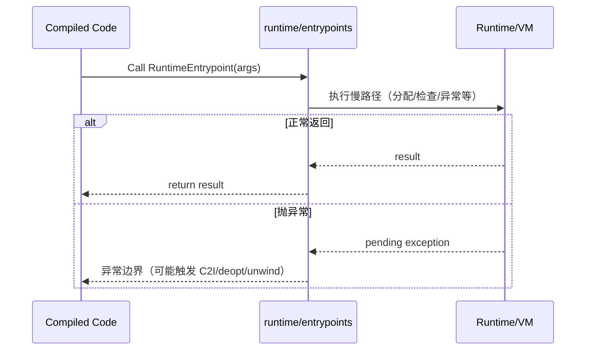
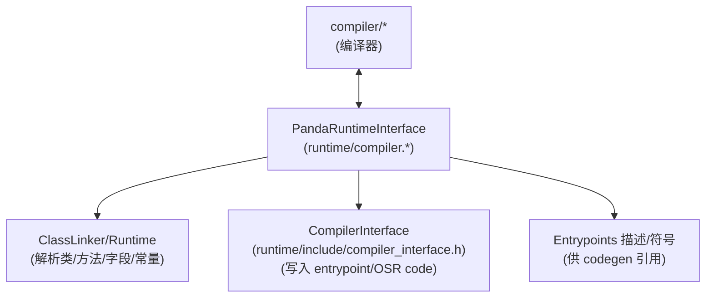

# Flow：Entrypoints 与 RuntimeInterface（compiled code 的慢路径）

## 0) 在端到端主线图中的位置

- 总入口：`ExecutionEngine_EndToEnd.md`（“Entrypoints（runtime slow paths）”与“RuntimeInterface/写回编译产物”框）

## 1) 这条 flow 解决什么问题

当你看到：
- “编译代码调用 runtime helper 崩了/抛异常了”
- “JIT 编译阶段需要解析类/方法/常量池”
- “OSR code 安装失败/compiled entrypoint 没写进去”

你需要把两条线串起来：
- **Entrypoints**：compiled code 在运行时需要慢路径时调用哪里
- **PandaRuntimeInterface**：compiler 在编译时需要从 runtime 查询哪些信息、以及如何写回编译产物

## 2) Mermaid：运行期（compiled code → entrypoints）

## 3) Mermaid：编译期（compiler ↔ PandaRuntimeInterface ↔ ClassLinker/Runtime）

## 4) 排障抓手（你该看哪里）

- **entrypoints 的定义与分类**：先从 `runtime/entrypoints/entrypoints.h/.cpp` 看“有哪些入口、参数是什么、哪些会抛异常”
- **compiled entrypoint / OSR code 写回**：看 `runtime/compiler.h/.cpp`（例如 `SetCompiledEntryPoint`、`TrySetOsrCode`）
- **写回的底层接口**：看 `runtime/include/compiler_interface.h`

## 5) 证据链（本章内）

- `runtime/entrypoints/entrypoints.h`、`runtime/entrypoints/entrypoints.cpp`
- `runtime/compiler.h`、`runtime/compiler.cpp`
- `runtime/include/compiler_interface.h`

## 6) 下一步（新人推荐）

- 你关心“解释器↔compiled 边界与返回值” → `Bridge_I2C_C2I.md`
- 你关心“OSR/deopt 触发与安装条件” → `Deopt_and_OSR.md`

