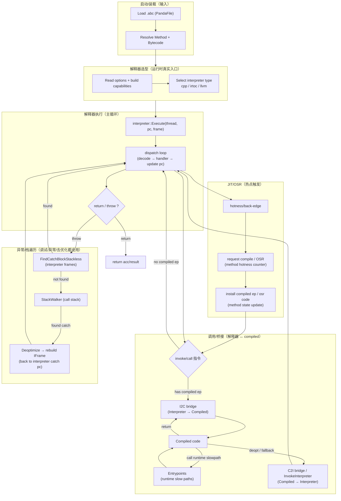

# Flow：执行引擎端到端主线（新人“脊柱图”）

> 目标：给新同学一条**唯一主线**——先用一张图把“代码怎么跑起来”串起来，然后每个框都能**一键下潜**到对应 Flow / DataStructures / FileNotes。

## 0) 你该怎么用这份文档（新人推荐顺序）

建议打开 3 个页签：

- 术语速查：[FileNotes/_Glossary](../FileNotes/_Glossary.md)
- 新人快速自检：[Newbie_MinDebug_Playbook](../Newbie_MinDebug_Playbook.md)
- 本文（端到端主线图）

然后按“由粗到细”阅读：

1. **先看 2) 总图**：建立执行引擎整体 mental model
2. **再按你关心的框下潜**：每个框下都有“进一步阅读”入口，进入对应的 Flow 图
3. **最后才读逐行证据**：Flow → FileNotes（逐行）是最稳定的证据链

## 1) 先记住三条现实规则（新人最常误判）

- **默认值 vs 最终选型**：`runtime/options.yaml` 默认 `interpreter-type=llvm`，但最终选型由 `frame->IsDynamic()`、是否显式设置、构建宏能力（LLVM/IRTOC）、debug-mode/GC 等硬限制共同决定（入口：`runtime/interpreter/interpreter_impl.cpp`）。
- **build/ 产物平台差异**：本机 linux/amd64 的 `build/` 产物不能直接推断手机 android/arm64 的运行情况；要验证 fast interpreter/dispatch table，请以**对应目标平台构建产物**为准。
- **OSR 的平台现实**：OSR 的最终进入点是 arch 汇编入口；当前源码对非 arm64 平台可能是 stub/UNREACHABLE（见 [Deopt_and_OSR](Deopt_and_OSR.md) 的架构约束）。
  - 进一步阅读：[Deopt_and_OSR](Deopt_and_OSR.md)

## 2) Mermaid：执行引擎端到端总图（主线）

## 3) “按框下潜”导航（每个框都能继续看细节图）

### 3.1 解释器选型（cpp/irtoc/llvm）

- **看细节 Flow 图**：[IRTOC_FastInterpreter](IRTOC_FastInterpreter.md)（含选型精确规则 + build 生成链）
- **看代码证据**：[runtime_interpreter_interpreter_impl.cpp](../FileNotes/runtime_interpreter_interpreter_impl.cpp.md)

### 3.2 解释器主循环（dispatch/handler/EXCEPTION_HANDLER）

- **看细节 Flow 图**：[Interpreter_Execute](Interpreter_Execute.md)
- **结构卡片**：[Frame_VReg_Acc](../DataStructures/Frame_VReg_Acc.md)
- **生成模板与证据入口**：[runtime_interpreter_templates_interpreter-inl_gen.h.erb](../FileNotes/runtime_interpreter_templates_interpreter-inl_gen.h.erb.md)（`ExecuteImpl/dispatch/EXCEPTION_HANDLER` 的“真实来源层”）

### 3.3 invoke/call 与桥接（I2C/C2I）

- **看细节 Flow 图**：[Bridge_I2C_C2I](Bridge_I2C_C2I.md)（含 arch 汇编证据链入口）
- **结构卡片**：[Bridge_ABI_and_FrameKind](../DataStructures/Bridge_ABI_and_FrameKind.md)
- **C++ 骨架证据**：[runtime_bridge_bridge.cpp](../FileNotes/runtime_bridge_bridge.cpp.md)

### 3.4 entrypoints（compiled code 的慢路径）

- **看细节 Flow 图**：[Entrypoints_and_RuntimeInterface](Entrypoints_and_RuntimeInterface.md)
- **结构卡片**：[Entrypoints](../DataStructures/Entrypoints.md)
- **逐行证据**：[runtime_entrypoints_entrypoints.cpp](../FileNotes/runtime_entrypoints_entrypoints.cpp.md)

### 3.5 JIT/OSR 的触发、安装与进入

- **看细节 Flow 图**：[Deopt_and_OSR](Deopt_and_OSR.md)
- **结构卡片**：[Deopt_and_OSR（DataStructure）](../DataStructures/Deopt_and_OSR.md)
- **逐行证据**：[runtime_osr.cpp](../FileNotes/runtime_osr.cpp.md)、[runtime_compiler.cpp](../FileNotes/runtime_compiler.cpp.md)

### 3.6 异常与 StackWalker（两段式 + deopt 回 catch）

- **看细节 Flow 图**：[StackWalking](StackWalking.md)（异常“两段式”路径图）
- **结构卡片**：[StackWalker（DataStructure）](../DataStructures/StackWalker.md)
- **逐行证据**：[runtime_exceptions.cpp](../FileNotes/runtime_exceptions.cpp.md)、[runtime_stack_walker.cpp](../FileNotes/runtime_stack_walker.cpp.md)

