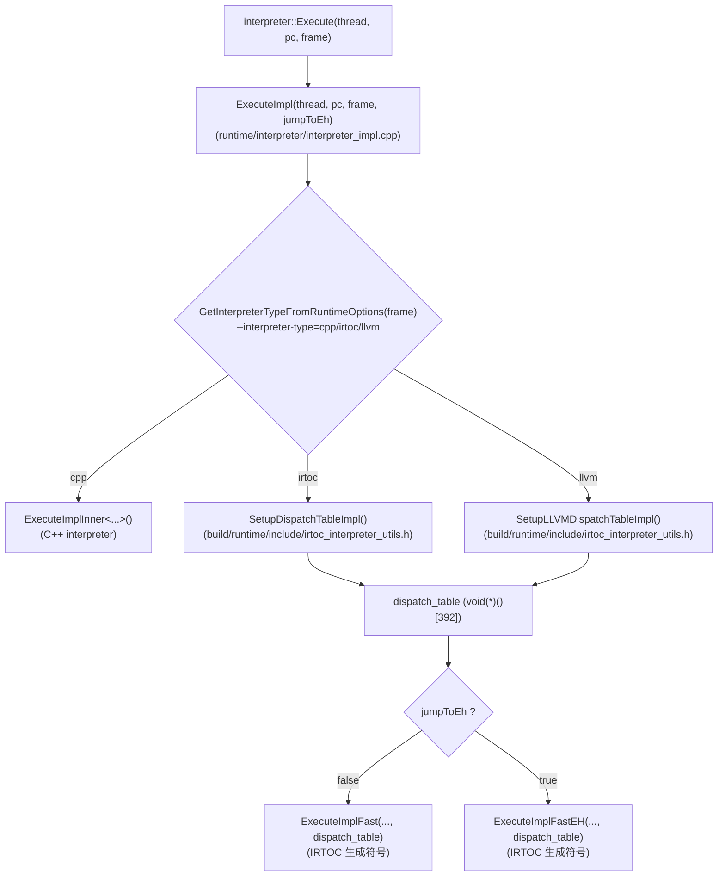
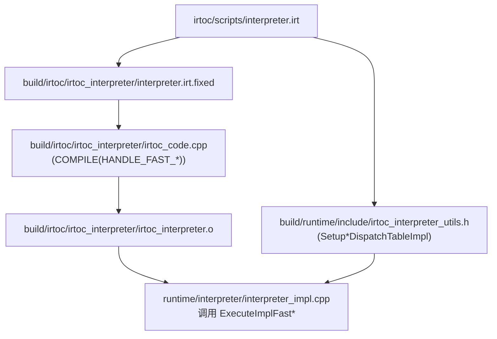

# Flow：IRTOC/LLVM Fast Interpreter（ExecuteImpl → SetupDispatchTable → ExecuteImplFast）

## 0) 在端到端主线图中的位置

- 总入口：`ExecutionEngine_EndToEnd.md`（“解释器选型（运行时真实入口）”与“解释器执行（主循环）”框：本 flow 解释 fast interpreter 的真实执行路径与 build 生成链）

## 1) 这条 flow 解决什么问题

当你发现：

- “生产环境默认走 llvm interpreter，我看 C++ handler 怎么对不上？”
- “`--interpreter-type` 切换后，代码路径完全变了”
- “dispatch table 从哪里来？`ExecuteImplFast` 是谁实现的？”

这条 flow 把 **运行时选型 → dispatch table → fast interpreter entry** 串起来，并把 build 生成物指给你看。

## 2) Mermaid：运行时调用链（真实执行路径）

## 3) Mermaid：build 生成链（脚本 → 机器码）

## 4) 排障抓手（你应该先看哪里）

- **解释器选型是否符合预期**：`runtime/interpreter/interpreter_impl.cpp`
  - 动态语言默认 cpp（除非显式设置）
  - debug-mode 只能 cpp
  - 部分 GC/编译开关会导致降级
- **dispatch table 是否为你期望的后端**：`SetupDispatchTableImpl` vs `SetupLLVMDispatchTableImpl`
- **handler 符号是否存在**：`HANDLE_FAST_*` / `HANDLE_FAST_*_LLVM`（`irtoc_interpreter_utils.h` 里是声明 + table）

## 4.1 解释器选型“精确规则”（按源码可复核，不靠猜）

> 核心入口：`runtime/interpreter/interpreter_impl.cpp::GetInterpreterTypeFromRuntimeOptions/ExecuteImpl`

### A) 默认值与“动态语言默认 cpp”

- **options 默认值**：`--interpreter-type` 默认是 `llvm`（`runtime/options.yaml:886-890`）。
- **但动态语言有特例**：源码直接写明：`Dynamic languages default is always cpp interpreter (unless option was set)`。  
  即：**frame 是 dynamic 且你没有显式设置 `--interpreter-type` 时，会强制走 cpp**（即使 options 默认是 llvm）。

### B) 构建开关导致的“自动降级”（只在你没有显式设置 interpreter-type 时发生）

当 `--interpreter-type` **未显式设置**（`wasSet == false`）时：

- **没编进 LLVM interpreter**（未定义 `PANDA_LLVM_INTERPRETER`）：`llvm → irtoc`
- **没编进 IRTOC**（未定义 `PANDA_WITH_IRTOC`）：`irtoc → cpp`
- **ARK_HYBRID 特例**：若默认选择到 `llvm`，会打印 INFO 并 **降级到 irtoc**（注释写明 CMC GC 的 LLVM 支持仍在补齐）

> 重要：如果你 **显式设置** 了 `--interpreter-type=llvm/irtoc`，而当前构建不支持，对应路径会 `LOG(FATAL)`，不会降级。

### C) 运行时硬约束（不满足直接 FATAL，不是“降级”）

当最终 interpreter-type > cpp（即 irtoc/llvm）时，`ExecuteImpl` 还会做一组硬检查：

- **debug-mode 限制**：`--debug-mode=true` **只能** 配 `--interpreter-type=cpp`（否则 FATAL）
- **Arm32 限制**：`PANDA_TARGET_ARM32` 下 irtoc 不可用，整个文件把选型包在 `#if !defined(PANDA_TARGET_ARM32)` 内（等价于 **arm32 永远 cpp**）
- **GC 限制（非 ARK_HYBRID）**：
  - 对 **动态语言**：若你显式要求 irtoc/llvm，则 GC 必须是 `G1_GC`，否则 FATAL（提示 dynamic languages 的 gc-type 仅 cpp 支持）
- **ARK_HYBRID 的组合限制**：
  - 只要 interpreter-type > cpp，GC 必须是 `CMC_GC`，否则 FATAL
  - 并且 `interpreter-type == llvm` 会直接 FATAL（信息：CMC GC 只支持 cpp 或 irtoc）

## 4.2 dispatch table 的 392 是怎么来的（从模板可算出来）

你在 `build/runtime/include/irtoc_interpreter_utils.h` 看到的 `std::array<void (*)(), 392>` 不是随手写的常量，它来自模板展开后的“handler 名单长度”：

- **IRTOC/LLVM fast interpreter 的 table**：生成模板 `runtime/interpreter/templates/irtoc_interpreter_utils.h.erb` 里直接用：
  - `std::array<void (*)(), Panda::dispatch_table.handler_names.size() + 1>`
  - 最后 `+1` 是补上 `HANDLE_FAST_EXCEPTION(_LLVM)` 这个异常槽位

- **C++ interpreter 的 label dispatch table（同长度、同一套 ISA 空间）**：生成模板 `runtime/interpreter/templates/interpreter-inl_gen.h.erb` 里有：
  - `DISPATCH_TABLE_LEN = 256 + NUM_PREFIXED + 1`
  - `256`：一级表覆盖 0..255 的 primary opcode
  - `NUM_PREFIXED`：prefix 扩展出的额外 opcode 数（来自 ISA）
  - `+1`：为 `EXCEPTION_HANDLER` 预留的槽位（见 `isa_constants_gen.h.erb` 注释）

因此：在本仓库当前 ISA 下，`392` 同时满足：

- `392 = Panda::dispatch_table.handler_names.size() + 1`（fast interpreter table 的真实生成规则）
- `392 = 256 + NUM_PREFIXED + 1`（同一套 ISA 空间下，C++ interpreter 的 label table 长度）

## 5) 证据链（本章）

- 运行时：`runtime/interpreter/interpreter_impl.cpp`
- build header：`build/runtime/include/irtoc_interpreter_utils.h`
- IRTOC 脚本：`irtoc/scripts/interpreter.irt`
- IRTOC 编译产物：`build/irtoc/irtoc_interpreter/irtoc_code.cpp`

## 6) VM 架构师视角：新人如何“真正学会改 IRTOC”（从现象到落地）

> 这是新人最缺的一段：知道 fast interpreter 存在 ≠ 能改得动。  
> 建议把它当作你做任何 IRTOC 相关改动前的固定 checklist。

### 6.1 一句话工作流（最短闭环）

**确认你跑的是 fast interpreter → 定位 `.irt` 的锚点（dispatch/decode/call/OSR/exception）→ 修改 `irtoc/scripts/interpreter.irt` → 用 build 产物做三段式验证（.irt.fixed → irtoc_code.cpp → disasm.txt）**。

更详细的“怎么读/怎么改/怎么验证”见：
- `IRTOC_DSL_Primer.md`（新人工具书：最小语法集 + 常见改动落点表 + 验证闭环）
- 逐行证据：`../FileNotes/irtoc_scripts_interpreter.irt.md`、`../FileNotes/irtoc_scripts_common.irt.md`
- 更系统的 DSL 参考：`IRTOC_DSL_Reference.md`（查手册式：语法/语义/常见坑）

### 6.2 从现象到 `.irt`：第一落点速查表（新人最实用）

| 你看到的现象 | 先确认 | `.irt` 第一落点（关键词） | 下一跳 |
|---|---|---|---|
| 改了 C++ handler 没生效 | 是否跑的是 `--interpreter-type=llvm/irtoc` | `Panda.instructions.each` / `handle_xxx` | `IRTOC_DSL_Primer.md`（2/3/4 节） |
| dispatch/异常入口不对 | dispatch table 末尾是否是 exception slot | `macro(:dispatch)` / `move_to_exception` | `../FileNotes/build_runtime_include_irtoc_interpreter_utils.h.md` |
| OSR 不触发/回退奇怪 | 是否是回边触发、是否 fake-return | `instrument_branches` / `handle_fake_return` | `../FileNotes/irtoc_scripts_interpreter.irt.md`（OSR 段） |
| call/return 行为异常 | 是否走 I2C 或 stackless | `generic_call` / `generic_return` | `../Flows/Bridge_I2C_C2I.md` |
| GC/safepoint 崩或偶现错 | acc 是否在边界前写回 | `save_acc` / `restore_acc` / `safepoint` | `../DataStructures/Frame_VReg_Acc.md` |

### 6.3 “验证你改动真的生效”的证据链（必须做）

不要只靠“运行起来没崩”。至少做一次三段式对齐：

- **脚本层**：`build/irtoc/irtoc_interpreter/interpreter.irt.fixed`（确认你的改动确实被规范化产物吸收）
- **IR 层**：`build/irtoc/irtoc_interpreter/irtoc_code.cpp`（确认对应 `Loc(..., line)` 的 IR 节点发生变化）
- **机器码层**：`build/irtoc/irtoc_interpreter/disasm.txt`（确认对应 `# [inst] id` 的汇编发生变化）

参考笔记：`../FileNotes/build_irtoc_irtoc_interpreter_disasm.txt.md`

