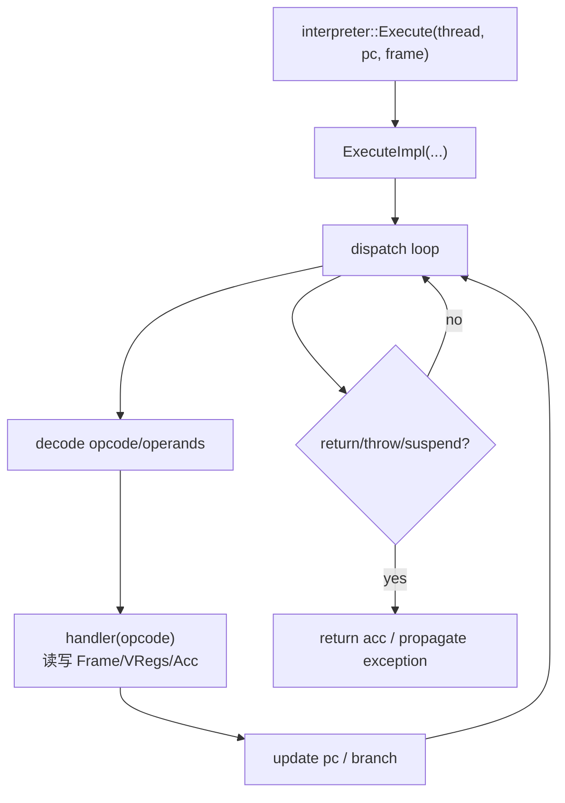

# Flow：解释器执行（Execute → 主循环 → 返回/异常）

## 0) 在端到端主线图中的位置

- 总入口：`ExecutionEngine_EndToEnd.md`（“解释器执行（主循环）”框）

## 1) 这条 flow 解决什么问题

当你在排障“解释器执行异常/语义不对/某 opcode 行为怪异”时，你需要迅速回答：
- 解释器入口在哪里（谁调用它）
- 主循环的基本结构（取指/分派/更新 PC）
- acc/vreg 的读写点在哪里

## 2) Mermaid：解释器最小主线（概念）

## 3) 常见分支点（高价值）

- **invoke 类指令**：可能走 I2C（已编译）或继续解释执行
- **异常路径**：可能触发栈遍历（StackWalker）或回退（C2I/deopt）
- **回边/热度**：可能触发 OSR

## 4) 证据链（本章内）

- `runtime/interpreter/interpreter.h/.cpp`（Execute 入口）
- `runtime/interpreter/interpreter_impl.h/.cpp`（ExecuteImpl 与状态管理）
- `runtime/interpreter/templates/interpreter-inl_gen.h.erb`（主循环/dispatch table/EXCEPTION_HANDLER 的生成模板）
- `runtime/interpreter/interpreter-inl.h`（大量 opcode handler：`InstructionHandler::HandleXxx`，以及 stackless 调用/返回/找 catch 等 helper）
- 辅助底座：`runtime/interpreter/instruction_handler_base.h`、`runtime/interpreter/instruction_handler_state.h`
- 数据结构：`DataStructures/Frame_VReg_Acc.md`

## 5) 下一步（新人推荐）

- 你关心“call/返回怎么跨边界” → `Bridge_I2C_C2I.md`
- 你关心“compiled code 怎么走慢路径” → `Entrypoints_and_RuntimeInterface.md`
- 你关心“deopt/OSR 为什么触发、怎么回退/进入” → `Deopt_and_OSR.md`
- 你关心“异常/缺帧/栈回溯为什么不一致” → `StackWalking.md`

