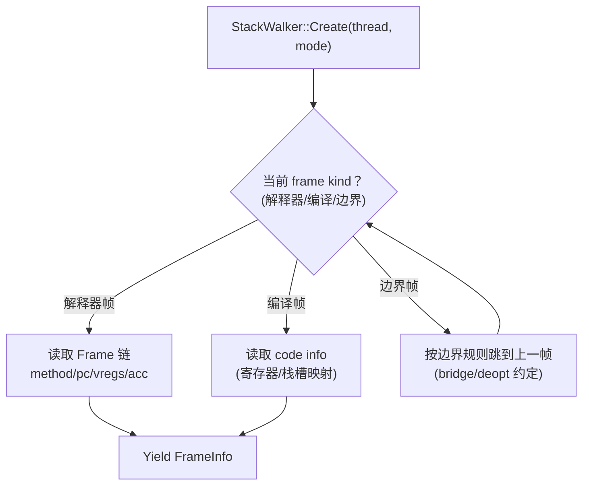

# Flow：StackWalking（StackWalker 如何遍历解释器/编译帧）

## 0) 在端到端主线图中的位置

- 总入口：[ExecutionEngine_EndToEnd](ExecutionEngine_EndToEnd.md)（“异常/栈遍历（调试/异常/去优化都会用）”框）

## 1) 这条 flow 解决什么问题

当你看到：
- 崩溃 dump/异常栈缺帧
- profiler/调试看到的栈不一致
- deopt/unwind 过程中访问了错误的 frame

这条 flow 给你一个“遍历策略视图”：StackWalker 依据什么判断帧类型、如何跨越边界帧、如何产出统一的 FrameInfo。

## 2) Mermaid：StackWalker 的遍历主线（概念）

## 3) 排障抓手（你该看哪里）

- **FrameKind 的来源**：通常在 bridge/deopt 交界处切换或标记
- **缺帧/错帧**：优先检查“边界帧识别”与“上一帧跳转”逻辑
- **inlined methods**：一个 CFrame 里可能展开多个 method；先确认你看到的是“逻辑帧”还是“物理帧”
- **异常两段式**：stackless IFrames →（必要时）CFrames 搜索并 deopt 回解释器；缺帧问题经常出现在两段交界  
  - **第一段（解释器 stackless）**：`EXCEPTION_HANDLER` 调 `handler.FindCatchBlockStackless()`  
    - 证据：`runtime/interpreter/templates/interpreter-inl_gen.h.erb` 的 `EXCEPTION_HANDLER` 逻辑
  - **第二段（进入编译帧/跨边界）**：若第一段没找到，则调用 `FindCatchBlockInCallStack(thread)`  
    - 证据：`runtime/exceptions.cpp::FindCatchBlockInCallStack/FindCatchBlockInCFrames`  
    - 命中 catch 后会 `Deoptimize(stack, method->GetInstructions() + pcOffset)`，直接把控制流拉回解释器 catch pc

## 4) 证据链（本章内）

- `runtime/include/stack_walker.h`
- `runtime/stack_walker.cpp`
- 交界面：`runtime/bridge/bridge.cpp`、`runtime/deoptimization.*`
- 异常跨帧：
  - `runtime/interpreter/templates/interpreter-inl_gen.h.erb`（`EXCEPTION_HANDLER`：stackless catch 搜索 + 进入第二段）
  - `runtime/exceptions.cpp`（`FindCatchBlockInCallStack/FindCatchBlockInCFrames`：CFrames 搜索 + Deoptimize）

## 5) 下一步（新人推荐）

- 你遇到“边界帧/ABI 导致缺帧” → [Bridge_I2C_C2I](Bridge_I2C_C2I.md)
- 你遇到“deopt-after/回退解释器导致栈不一致” → [Deopt_and_OSR](Deopt_and_OSR.md)

