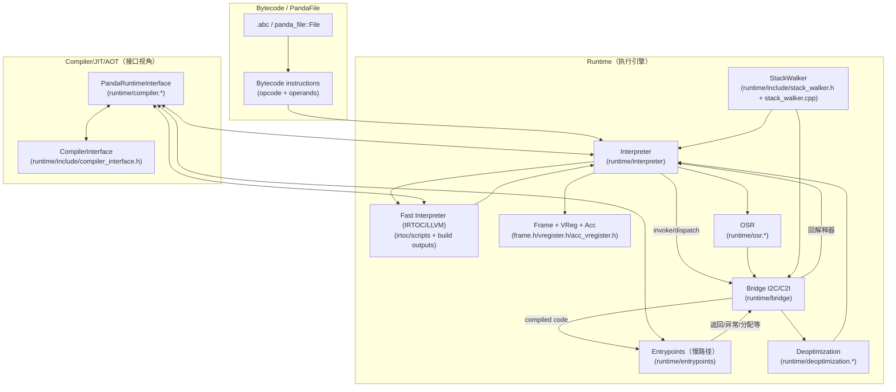
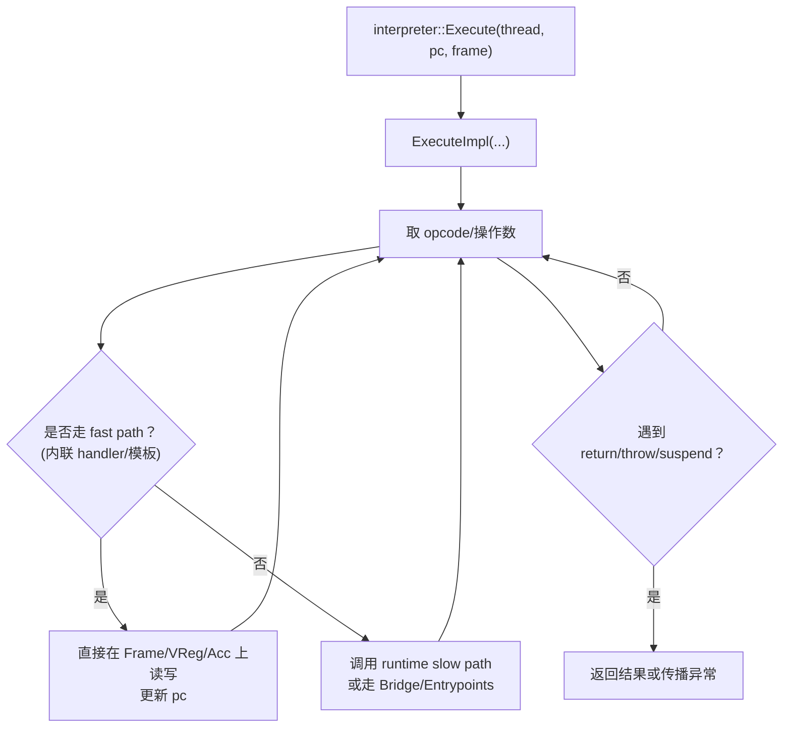
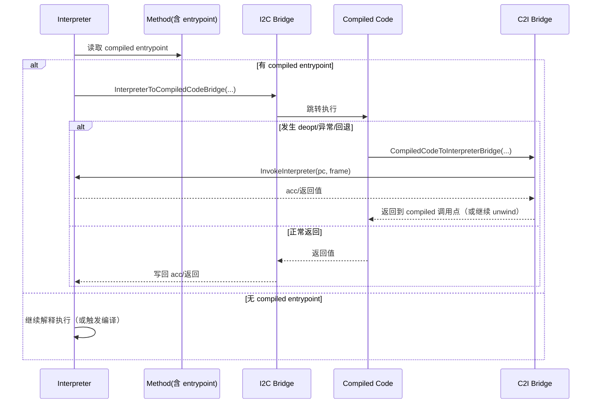
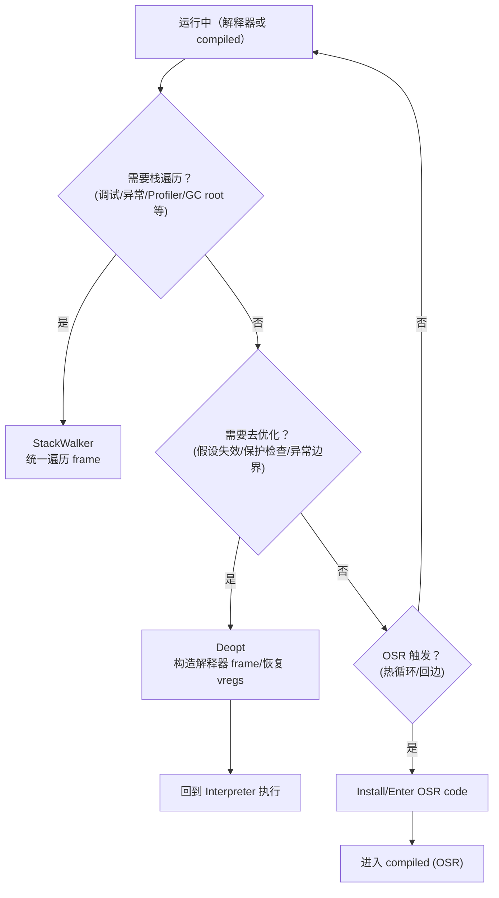
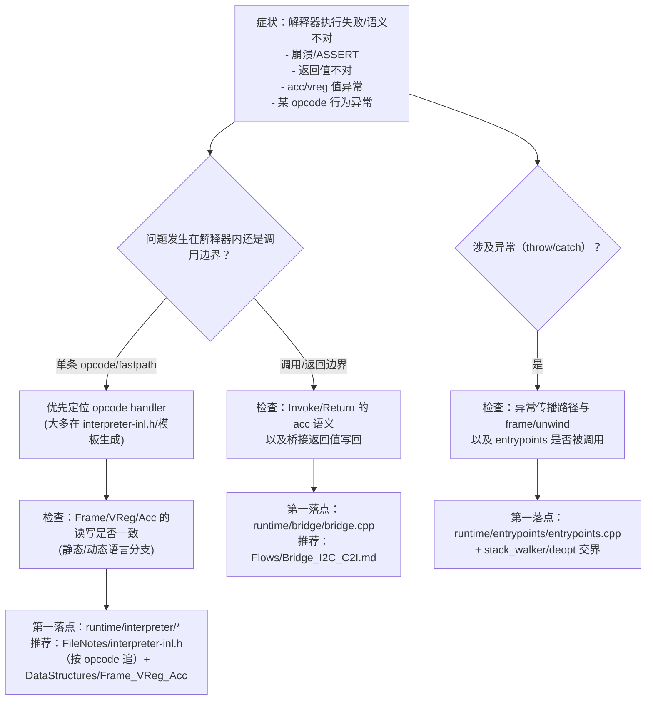
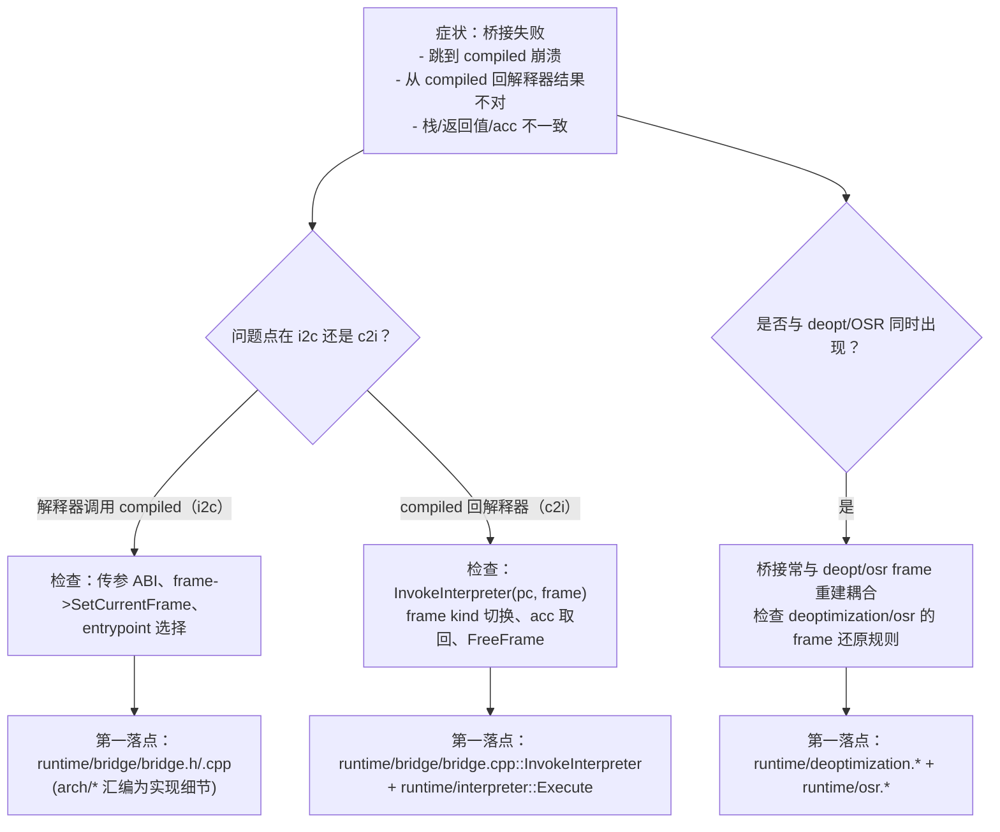
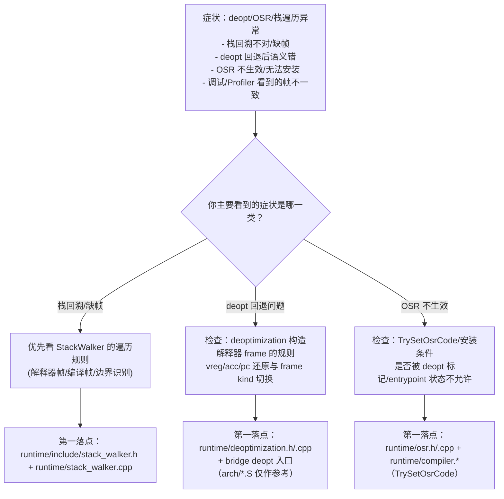

# 04_ExecutionEngine（Stage2）

> 阶段二：逐行精读与 wiki 沉淀（目标：**新同学不读 FileNotes 也能建立“执行引擎怎么跑”的整体模型**，需要时再下潜逐行证据）。

## 你读完应该能回答什么（面向新同学）

- **一段字节码是怎么被执行的**：解释器入口在哪里？PC/Frame/VReg/Acc 是什么关系？
- **为什么能从解释器跳到编译代码，又能从编译代码回到解释器**：I2C/C2I bridge 的边界与返回值语义是什么？
- **为什么会去优化（deopt）/为什么要 OSR**：OSR code 的安装条件是什么？StackWalker 在调试/栈回溯/去优化中扮演什么角色？
- **JIT/AOT/entrypoints 的位置**：编译器如何通过 RuntimeInterface 查询信息？编译代码调用运行时慢路径走哪里？

## 前置知识（与 Chapter 3 的交界）

执行引擎并不“凭空执行”——它执行的是 **Chapter 3 已经加载/链接好的 `Class/Method/Field` 元数据**：

- 03 章 Stage2 入口：`../03_ClassLoading/README.md`
- 03 章端到端主线图：`../03_ClassLoading/Flows/ClassLoading_EndToEnd.md`

## 快速上手（不读 FileNotes 也能看懂大概）

### 0) 先看“端到端脊柱图”（新人最推荐的第一入口）

- `Flows/ExecutionEngine_EndToEnd.md`：一张图把“选型→执行→桥接→entrypoints→JIT/OSR→deopt→异常/栈遍历”串起来；每个框都能一键下潜到对应 Flow/数据结构/逐行证据。

### 1) 一句话主线（本章故事线）

**执行引擎 = “解释器用 Frame+VReg 执行 bytecode” + “热点时跳到 compiled entrypoint” + “必要时 deopt/OSR/回解释器” + “compiled code 通过 entrypoints 走慢路径”**。

### 2) 三个最常见场景（每个场景都有排障决策树）

- **场景 A：解释器执行异常/语义不对**（崩溃、抛错、返回值不对、acc/vreg 错）
- **场景 B：I2C/C2I 桥接相关问题**（跳转到 compiled code 后崩溃；从 compiled 回解释器结果不对）
- **场景 C：deopt/OSR/stack walking 问题**（调试栈不对、去优化回退异常、OSR 不生效/卡住）

### 3) 术语速查（建议侧边打开）

- `FileNotes/_Glossary.md`：本章术语解释（Frame/VReg/Acc、FrameKind、entrypoint、I2C/C2I、OSR、deopt、StackWalker…）

### 4) 最小调试手册（独立文档）

- `Newbie_MinDebug_Playbook.md`：新人 5 分钟确认 **interpreter-type / fast interpreter / dispatch table / bridge boundary / OSR / 异常两段式** 的最短路径

### 5) IRTOC（最核心也最难的新人成长点）

如果你需要在实际工作中修改 fast interpreter（`.irt` / handler / dispatch / OSR / 异常等），建议按“由浅入深”：

- `Flows/IRTOC_FastInterpreter.md`：运行时选型→dispatch table→`ExecuteImplFast*` 的执行链与 build 生成链
- `Flows/IRTOC_DSL_Primer.md`：`.irt → Graph → 机器码` 的全链路分工 + 新人可落地的“怎么读/怎么改/怎么验证”
- `Flows/IRTOC_DSL_Reference.md`：更“教科书式”的 DSL 参考（语法/语义/常见坑/查手册）

## 本章产物导航（先看“总览型”）

- **学习路线图**：`Index.md`（30min/2h/1d）
- **沉淀文档**：
  - `DataStructures/Index.md`：关键结构卡片（Frame/VReg/Acc/entrypoints/bridges/OSR/Deopt/StackWalker）
  - `Flows/ExecutionEngine_EndToEnd.md`：端到端主线（新人“脊柱图”入口）
  - `Flows/Index.md`：主调用链（解释器执行、调用、桥接、异常、deopt/OSR）
- **opcode 入门（新人强烈建议从这里开始）**：
  - `DataStructures/ISA_and_OpcodeModel.md`：ISA（core + ETS）如何定义 opcode，以及如何驱动 IRTOC 生成 handler
  - `Flows/Opcode_DeepDives_IRTOC.md`：挑选常用 opcode 深入分析（call/return/jmp+OSR/throw/ETS name-based 指令）
- **逐行证据链**：`FileNotes/`（需要“为什么一定是这样”时再下潜）
- **逐行清单**：`Manifests/files.yaml`（本章语义归属文件）
- **阶段一校正**：`Errata_to_Stage1.md`
- **章节完工审查（交付验收）**：`Completion_Review.md`（逐文档正确性核验 + 证据点 + 可执行优化项）

## 执行引擎总览：组件边界与数据流（你先把这张图记住）

## 解释器实现不止 C++：真实默认是 IRTOC/LLVM fast interpreter

你在 `runtime/interpreter/*` 里读到的很多 C++ handler，更多是 **语义对照/调试入口**；但真实运行时默认会选择 fast interpreter：

- 运行时 option：`--interpreter-type`，默认 **`llvm`**（`runtime/options.yaml`）
- 运行时选择入口：`runtime/interpreter/interpreter_impl.cpp`
- fast interpreter 语义脚本：`irtoc/scripts/interpreter.irt`
- build 生成产物（本机证据）：
  - `build/runtime/include/irtoc_interpreter_utils.h`：392 项 dispatch table（含 IRTOC 与 LLVM 两套）
  - `build/irtoc/irtoc_interpreter/*`：`interpreter.irt.fixed`、`irtoc_code.cpp`、`irtoc_interpreter.o`

> 关键现实差异（新人必读）：
> - **默认值 vs 实际选型**：`runtime/options.yaml` 里 `interpreter-type` 的 **默认值是 `llvm`**，但运行时会在 `runtime/interpreter/interpreter_impl.cpp` 里基于 **frame 是否 dynamic / 是否显式设置 / 编译宏能力 / 运行时硬限制** 做最终选型。
> - **静态语言（非 dynamic frame）**：如果你没有显式设置 `--interpreter-type`，则会使用默认值 `llvm`；当该构建开启 `PANDA_LLVM_INTERPRETER` 时，确实会默认走 LLVM fast interpreter，否则会按源码自动降级（LLVM→IRTOC→CPP）。
> - **动态语言（dynamic frame）**：如果你没有显式设置 `--interpreter-type`，源码会强制 **默认走 cpp**（这是 `frame->IsDynamic()` 的特例；显式设置时才会尝试 irtoc/llvm）。
> - **debug-mode**：`--debug-mode=true` 只能配 `--interpreter-type=cpp`（否则直接 FATAL）。
> - **arm32**：构建上 irtoc 不可用，等价于 **arm32 永远走 cpp**。
> - **GC 组合约束（非 ARK_HYBRID）**：仅对 **动态语言 + 选择 fast interpreter（irtoc/llvm）** 生效：若 `--gc-type` 不是 `g1-gc` 会 FATAL（静态语言不受该限制）。
> - **ARK_HYBRID 组合约束（仅当编译宏 `ARK_HYBRID` 打开时）**：
>   - 只要 interpreter-type > cpp，就要求 GC 必须是 `cmc-gc`（否则 FATAL）
>   - 且 **`--interpreter-type=llvm` 会直接 FATAL**（只允许 cpp/irtoc）
>   - “自动降级”只对 **未显式设置** `--interpreter-type` 的场景生效；显式指定不支持的后端会直接 FATAL
> - **关于 build/ 目录的提醒**：本仓库的 `build/` 产物是“当前这次编译”的输出；你本机 linux/amd64 的 `build/` 不能直接推断手机 android/arm64 的运行情况，验证 fast interpreter/dispatch table 时请以 **对应目标平台的构建产物**为准。

如果你要“从现实角度理解解释器”，建议先读：

- `Flows/IRTOC_FastInterpreter.md`
- `DataStructures/IRTOC_FastInterpreter.md`

## 关键主流程（先看图建立直觉）

### 1) 解释器执行主循环（概念图）

### 1.1 新人最容易误解的点：主循环代码到底在哪？

在源码树里你会同时看到：

- `runtime/interpreter/interpreter-inl.h`：**大量 opcode 的 `InstructionHandler::HandleXxx` 语义实现**（以及 stackless 调用/返回/找 catch 等 helper）
- `runtime/interpreter/interpreter_impl.cpp`：解释器类型选择（CPP/IRTOC/LLVM）与执行入口

但 **真正的“dispatch loop（computed-goto 跳表）+ EXCEPTION_HANDLER label”是在构建期生成的头里**：

- 生成头：`interpreter-inl_gen.h`（由 `runtime/interpreter/templates/interpreter-inl_gen.h.erb` 生成）
- dispatch 原语：`runtime/interpreter/arch/macros.h` 的 `DISPATCH(table, opcode)`

> 你如果想“最快理解解释器循环结构”，直接先读模板 `interpreter-inl_gen.h.erb`，再回头读 `interpreter-inl.h` 的具体 handler。

### 2) I2C/C2I 桥接（解释器↔编译代码的双向跳转）

### 3) deopt/OSR/stack walking 三者关系（概念图）

## 三个场景的排障决策树（从日志/症状到定位点）

### 场景 A：解释器执行异常/语义不对（决策树）

## 额外赠送：执行引擎“4 个不变量”（新人排障最省时间）

- **acc 必须可被 GC 看见**：在调用 runtime/通知/safepoint 前，很多路径会先把 acc 写回 frame（否则 hook/GC 可能把 acc 当作丢失 root）。
- **FrameKind/边界帧必须一致**：桥接/StackWalker/deopt/异常都依赖它，错了就是“缺帧/崩溃/返回值错”的大概率根因。
- **stackless frame 会在解释器内自己弹栈**：`HandleReturnStackless/FindCatchBlockStackless` 会 `FreeFrame` 并把 state 更新回 caller。
- **异常是“两段式”**：先在 stackless IFrames 里找 catch，找不到再进入 CFrames 搜索并 deopt 回解释器 catch pc。

### 场景 B：I2C/C2I 桥接相关问题（决策树）

> 需要对照“真实栈/ABI/寄存器保存/TLS 更新点”时，直接跳：`Flows/Bridge_I2C_C2I.md` → **4.1 arch 汇编证据链**（aarch64/amd64，含 dyn）。

### 场景 C：deopt/OSR/stack walking 问题（决策树）

> 遇到 “deopt-after/缺帧/边界帧不见了” 时，优先把 `thread.currentFrame* / currentFrameIsCompiled / boundary marker` 对齐，再看 `runtime/bridge/arch/*/deoptimization_*.S`（对应 FileNotes 已挂在 `Flows/Bridge_I2C_C2I.md`）。

## 本章的“最小闭环文件集”（对应 Stage2 逐行）

> 这些文件读完，你就能把解释器/桥接/entrypoints/deopt-osr/stackwalker/JIT 接口串成闭环：
- 解释器：`runtime/interpreter/{interpreter.*,interpreter_impl.*,interpreter-inl.h,frame.h,vregister.h,acc_vregister.*}`
- 桥接：`runtime/bridge/{bridge.h,bridge.cpp}`
- 运行时入口：`runtime/entrypoints/{entrypoints.h,entrypoints.cpp}`
- JIT 接口（运行时侧）：`runtime/{compiler.h,compiler.cpp}` + `runtime/include/compiler_interface.h`
- 去优化/OSR：`runtime/{deoptimization.h,deoptimization.cpp,osr.h,osr.cpp}`
- 栈遍历：`runtime/include/stack_walker.h` + `runtime/stack_walker.cpp`
