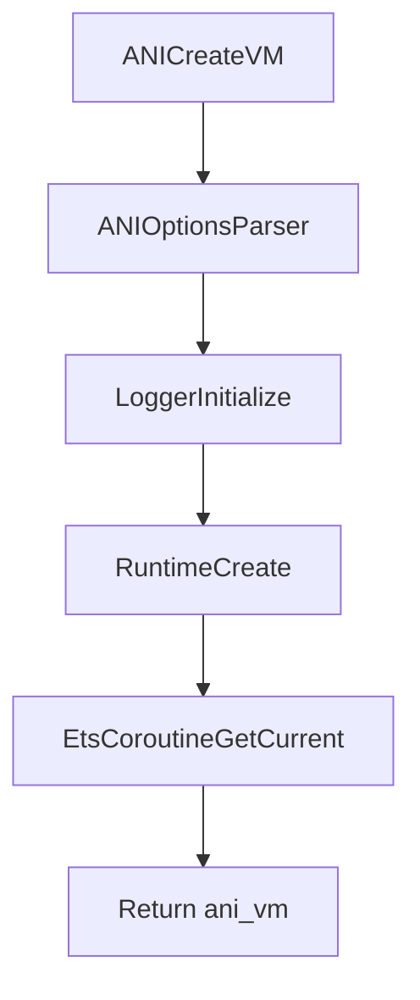
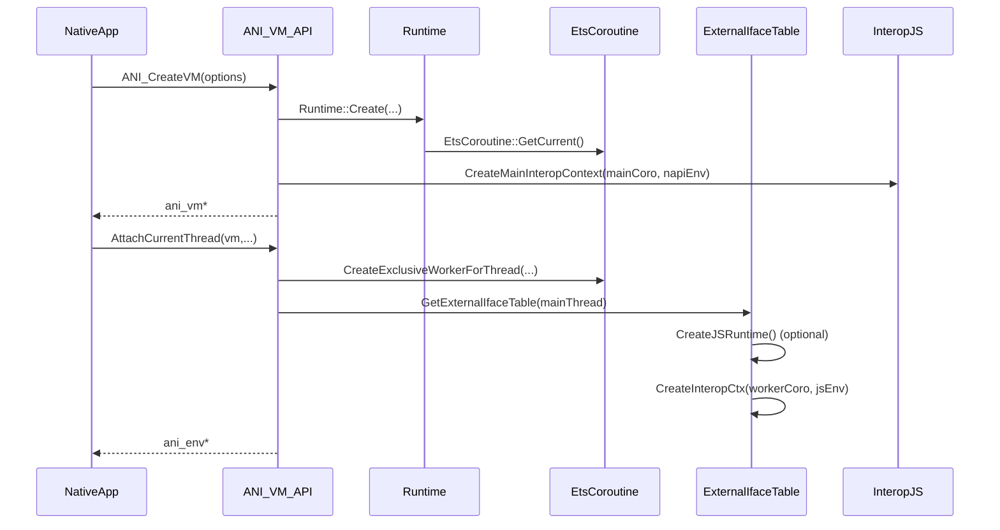

# Chapter 5：Native 桥（ANI / ETS Native Library / JS Interop）

> 本章把“外部世界如何进入 VM”拆成三块：**ANI（类 JNI 的 native API）**、**ETS Native Library 加载与符号解析**、以及 **可选的 JS 互操作（Interop JS）**。这些路径共同决定：线程如何 attach、GC 何时允许发生、以及跨语言对象如何被引用/管理。

---

### 1. 入口地图（目录 → 职责）

| 子系统 | 目录 | 关键锚点 | 说明 |
|---|---|---|---|
| ANI VM API（创建 VM / 线程 attach） | `plugins/ets/runtime/ani/` | `ani_vm_api.cpp` | `ANI_CreateVM`、`AttachCurrentThread`、`DetachCurrentThread`、`GetEnv` |
| ANI Interaction API（大量 C API 实现） | `plugins/ets/runtime/ani/` | `ani_interaction_api.cpp` | 方法调用、参数转换、类初始化、异常/校验等（文件很大） |
| ETS N-API env（ani_env 实例） | `plugins/ets/runtime/` | `ets_napi_env.h/.cpp` | `PandaEtsNapiEnv`，保存 coroutine、reference storage、可选 verifier hook |
| ETS Native Library 加载 | `plugins/ets/runtime/` | `ets_native_library_provider.h/.cpp`、`ets_native_library.h/.cpp` | 按路径/namespace 加载 so，查找 `ANI_Constructor`，做权限校验（OHOS） |
| Interop JS（可选） | `plugins/ets/runtime/interop_js/` | `interop_context_api.h`、`interop_context.cpp` | `CreateMainInteropContext`，对外隐藏 napi_env（用 void*） |
| ExternalIfaceTable（跨运行时接口表） | `plugins/ets/runtime/` | `external_iface_table.h` | JS runtime 创建/销毁、job queue、interop ctx 创建等回调集合 |

---

### 2. ANI：创建 VM 与线程模型（attach/detach）

#### 2.1 创建 VM：`ANI_CreateVM`

`plugins/ets/runtime/ani/ani_vm_api.cpp` 的 `ANI_CreateVM()` 做了三件关键事：

1. **解析 ANI options**（`OptionsParser`）
2. **初始化 logger**（支持 callback）
3. **创建 Runtime**：`ark::Runtime::Create(runtimeOptions)`

成功后通过当前 `EtsCoroutine` 拿到 `PandaVM` 并返回给调用方。

#### 2.2 获取 env：`GetEnv`

`ANI_GetEnv`（实现为 `GetEnv`）关键约束：
- 当前线程必须已经 attach 到 VM（`Thread::GetCurrent() != nullptr`）
- 必须存在当前 coroutine（`EtsCoroutine::GetCurrent()`）
- 每个 coroutine 都应有一个有效的 `ani_env`（通过 `coro->GetEtsNapiEnv()` 获得）

#### 2.3 线程附着：`AttachCurrentThread` / `DetachCurrentThread`

`AttachCurrentThread()` 的核心逻辑：
- 若线程已 attach 则报错
- 通过 `PandaEtsVM -> CoroutineManager` 创建该线程专用的 “exclusive worker coroutine”
- 返回 `PandaEtsNapiEnv::GetCurrent()` 作为 `ani_env*`
- 若启用 interop，可能创建/绑定 JS env，并建立 interop ctx（见 5）

`DetachCurrentThread()` 的核心逻辑：
- 销毁该 worker coroutine
- 若存在 JS env，则走 `ExternalIfaceTable->CleanUpJSEnv(jsEnv)` 清理

> 读代码提示：ANI 把 “线程 attach” 显式建模为 “为线程创建 coroutine worker”。这意味着很多生命周期（异常、reference storage、handle scope、interop ctx）都天然挂在 coroutine 上，而不是纯 thread-local。

---

### 3. ani_env：PandaEtsNapiEnv 与引用/异常/校验

`plugins/ets/runtime/ets_napi_env.h/.cpp` 定义 `PandaEtsNapiEnv : public ani_env`：

- **绑定 coroutine**：`GetEtsCoroutine()` / `GetEtsVM()`
- **引用管理**：持有 `EtsReferenceStorage`（`mem::InternalAllocator` 分配），用于管理跨 native 边界的引用生命周期
- **异常桥接**：`SetException/GetThrowable/HasPendingException/ClearException` 转发给 coroutine
- **可选的 ANI 校验器**：
  - 构造时若 `coroutine->GetPandaVM()->IsVerifyANI()`，将 `c_api` 替换为 verify 版本的 interaction API

这给出一个很重要的“扩展点”：ANI 的 C API 表（`c_api`）是可替换的——可以注入 verifier/统计等横切逻辑。

---

### 4. ANI Interaction API：native 调用如何进入 managed 世界

`plugins/ets/runtime/ani/ani_interaction_api.cpp` 很大，但从局部结构可以抓住主线：

- **类初始化**：在调用静态方法/函数时，先 `InitializeClass(...)`，并正确处理 pending exception
- **参数转换**：把 `ani_value` / varargs 按 method shorty 转成 VM 内部 `Value` 列表
- **线程/GC 约束**：使用 `ScopedCoroutineNativeCall`（在 method call 周期内切换/标记 coroutine 状态）

> 这部分相当于“JNI CallStatic* / Call*Method”族的实现中心；建议后续按功能把该文件拆成：参数转换、method resolve、invoke、异常、verify 这几类索引。

---

### 5. ETS Native Library：加载、权限与 ANI_Constructor

#### 5.1 NativeLibraryProvider：统一装载入口

`plugins/ets/runtime/ets_native_library_provider.h/.cpp` 提供：
- `LoadLibrary(env, name, shouldVerifyPermission, fileName)`
- `ResolveSymbol(name)`
- libraryPath 的读写（线程安全 RWLock）

#### 5.2 装载策略：path → system → namespace（应用）

`ets_native_library_provider.cpp` 的策略可以概括为：

- **优先按 libraryPath 搜索**（name 不含 `/` 时，会在每个 path 下拼接 `path/name` 逐个尝试）
- 若 `shouldVerifyPermission == false`（例如 system library load 失败场景），会尝试从 **应用 namespace** 加载：
  - 通过 `StackWalker` 找到首个非 boot context 的方法帧，拿到应用 abc 路径（`GetFullFileName()`）
  - 交给 `EtsNamespaceManagerImpl::LoadNativeLibraryFromNs(abcPath, name)` 做 namespace 级加载

这意味着同名 so 可能来自“系统路径”或“应用命名空间”，并且加载决策与当前执行栈/类加载上下文有关。

#### 5.3 ANI_Constructor 约定

`NativeLibraryProvider::CallAniCtor()` 会：
- 查找导出符号 `ANI_Constructor`
- 按约定签名调用：`ani_status (*)(ani_vm*, uint32_t*)`
- 返回的 `version` 必须通过 `ani::IsVersionSupported(version)` 校验

> 这与 JNI_OnLoad 类似：native 库可在加载时进行版本协商与初始化，但这里统一用 `ANI_Constructor` 命名。

#### 5.4 权限校验（OHOS）

在 `PANDA_TARGET_OHOS` 下，`CheckLibraryPermission` 会：
- 从调用栈推导 caller class（要求在 boot context）
- 通过 `EtsNamespaceManagerImpl` 注册的回调 `ExtensionApiCheckCallback` 校验 className 是否被允许加载该 native 库文件

---

### 6. Interop JS：CreateMainInteropContext 与 ExternalIfaceTable

#### 6.1 为什么 interop API 要用 `void*`？

`plugins/ets/runtime/interop_js/interop_context_api.h` 里的注释给了动机：
- 对外模块（例如 ANI）应与 interop 细节隔离
- 因此对外接口使用 `void* napiEnv`，避免直接依赖 `napi_env` 类型与 interop 内部实现

对外入口：
- `interop::js::CreateMainInteropContext(EtsCoroutine *mainCoro, void *napiEnv)`

#### 6.2 ExternalIfaceTable：跨运行时的回调表

`plugins/ets/runtime/external_iface_table.h` 定义 `ExternalIfaceTable`，核心是“把 interop 依赖注入到 ETS runtime 侧”：

- `CreateJSRuntime()` / `CleanUpJSEnv()` / `GetJSEnv()`：JS env 生命周期
- `CreateInteropCtx(Coroutine*, JSEnv)`：把某个 coroutine 绑定到 interop context
- `JobQueue`：JS microtask/job queue 挂载点
- `ClearInteropHandleScopesFunction`：用于清理 interop 句柄作用域（避免跨语言引用泄漏/悬挂）

#### 6.3 ANI 与 interop 的结合点

在 `ani_vm_api.cpp` 中能看到两个关键结合点：

- **创建 VM 时（main coroutine）**：若 `aniOptions.IsInteropMode()`，调用 `CreateMainInteropContext(coroutine, aniOptions.GetInteropEnv())`
- **线程 attach 时（worker coroutine）**：通过 main thread 的 `ExternalIfaceTable`：
  - 若没有 jsEnv，先 `CreateJSRuntime()`
  - 再 `CreateInteropCtx(exclusiveCoro, jsEnv)` 把 worker coroutine 绑定到 interop ctx

---

### 7. 阶段 2（后续扩展建议）

- 把 `ani_interaction_api.cpp` 按“API 族”拆索引：对象/类/字段/方法调用、数组、字符串、异常、verify，并为每族建立“从 ani_* 到 Ets* / coretypes”的映射表
- 把 `EtsReferenceStorage` 的引用语义写清楚：local/global/weak 的生命周期与 GC 交互（对应 `plugins/ets/runtime/mem/ets_reference*`）
- 深入 interop_js：把 `interop_context.cpp` 的初始化模块列表、job queue 与 XGC（跨 VM 引用 GC）串成一张图

