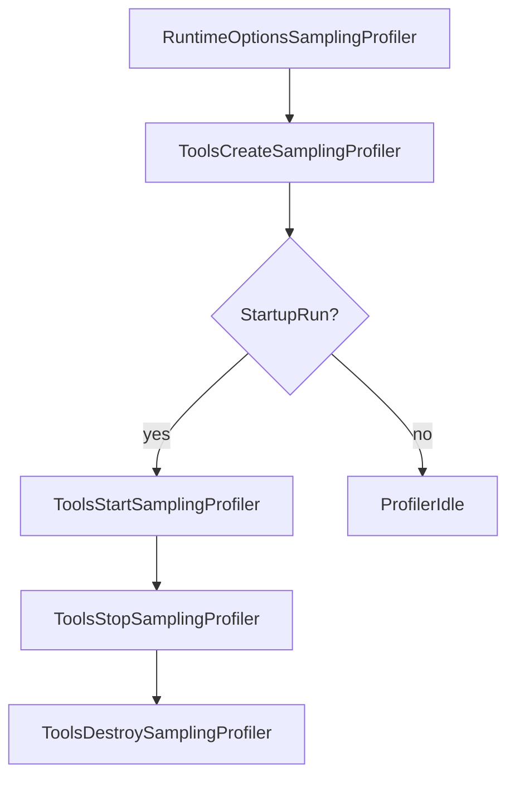

# Chapter 6：工具链与可观测性（Tooling / Profiling / Verification）

> 本章回答“如何观测与控制 VM”：调试器/Inspector 如何挂接运行时事件，采样 profiler 与 PGO profile saver 如何工作，以及 verification（字节码验证）如何在 runtime 中创建 service 并执行。

---

### 1. 总览：三类能力与它们挂在哪

| 能力 | 目录 | 关键锚点 | 在生命周期中的位置 |
|---|---|---|---|
| Debugger / Inspector | `runtime/tooling/` | `runtime/tooling/debugger.{h,cpp}`、`runtime/tooling/inspector/*` | runtime 初始化后（VmStart/VmInitialization/ThreadStart 等事件）持续工作；Destroy 时先卸载 |
| Sampling Profiler | `runtime/tooling/` | `runtime/tooling/tools.{h,cpp}`、`runtime/tooling/sampler/*` | `Runtime::Create()` 时可创建并在 startup 自动启动；Destroy 时停止并销毁 |
| PGO/Profile Saver（JIT/AOT profiling） | `runtime/jit/` | `runtime/jit/profile_saver_worker.h`、`runtime/jit/profiling_saver.*` | runtime Destroy 时会把 profiled methods 写入 profile 文件（与 AotManager 关联） |
| Verifier | `verification/` + `runtime/` | `verification/public.h`、`verification/verifier/verifier.cpp`、`runtime/runtime.cpp` | runtime 初始化时可创建 verifier service；也可用独立 verifier 可执行进行 AOT 验证 |

---

### 2. Debugger：基于 RuntimeNotification + PtHooks 的调试框架

#### 2.1 Debugger 的挂接方式

`runtime/tooling/debugger.h` 显示：
- `class Debugger : public DebugInterface, RuntimeListener`
- 构造时通过 `runtime_->GetNotificationManager()->AddListener(this, DEBUG_EVENT_MASK)` 注册监听
- 析构时 RemoveListener，保证 runtime 退出时不留悬挂 listener

这意味着 Debugger 与 runtime 的耦合点主要是：
- **RuntimeNotificationManager**：提供 VM start/death、thread start/end、bytecode pc change、GC start/finish 等事件
- **PtHooks**：把这些事件转发给更上层的 inspector/调试协议实现（见 2.2）

#### 2.2 Inspector：调试协议服务端 + PtHooks 实现

`runtime/tooling/inspector/inspector.h` 显示：
- `Inspector : public PtHooks`
- 通过 `InspectorServer` 在独立线程提供调试服务
- 维护 `DebuggableThread`、`BreakpointStorage`、`DebugInfoCache` 等调试状态

Inspector 的关键行为：
- 处理 `Exception/MethodEntry/SingleStep/FramePop/...` 等 hook
- 维护断点（源文件、行号、条件等），并在 bytecode 执行时触发暂停
- 可集成 CPU profiler（见 3.2 的 sampling profiler 与 inspector 的互调）

---

### 3. Profiling：两条路径（采样 vs PGO/方法级 profile）

#### 3.1 Sampling Profiler：Tools + sampler 模块

`runtime/tooling/tools.h` 定义 `tooling::Tools`：
- `CreateSamplingProfiler()`
- `StartSamplingProfiler(StreamWriter, interval)`
- `StopSamplingProfiler()`
- `DestroySamplingProfiler()`

`runtime/tooling/tools.cpp` 还导出 C API：
- `StartSamplingProfiler(const char* asptFilename, int interval)`
- `StopSamplingProfiler()`

并且 runtime 生命周期中有明确挂接点（`runtime/runtime.cpp`）：
- Create 时：若 `options_.IsSamplingProfilerCreate()`，创建 profiler；若 `IsSamplingProfilerStartupRun()` 则自动启动
- Destroy 时：若开启过，则 stop + destroy

> 读代码提示：采样 profiler 通常会依赖信号/handler（见 `runtime/tooling/sampler/sampling_profiler.cpp` 以及 runtime 初始化里注册 `SamplingProfilerHandler` 的逻辑）。

#### 3.2 PGO / 方法级 profile：ProfilingSaver + ProfileSaverWorker

这一条路径服务于 AOT/JIT 的 profile-guided 优化（而非纯采样）。

- `runtime/jit/profiling_saver.h/.cpp`：`ProfilingSaver::SaveProfile(...)`
  - 读取旧 profile（若存在）并 merge
  - 把 runtime 收集到的 inline cache / branch / throw 数据写入 PGO 文件
- `runtime/jit/profile_saver_worker.h`：`ProfileSaverWorker`
  - 基于 `taskmanager::TaskManager` 提交后台保存任务
  - 支持 zygote fork：`PreZygoteFork()` 会 finalize，`PostZygoteFork()` 会重建 worker

此外 `runtime/runtime.cpp` 的 Destroy 路径会在条件满足时写 profile：
- `SaveProfileInfo()` 且 `AotManager->HasProfiledMethods()` 时触发 `ProfilingSaver::SaveProfile(...)`
- class context 字符串由 `BootClassContext + ":" + AppClassContext` 组成（用于关联 profile 与 classpath）

---

### 4. Verification：字节码验证在 runtime 中如何挂接

#### 4.1 公共 API（runtime 侧只依赖 public.h）

`verification/public.h` 给出最小公开接口：
- `VerificationMode`（DISABLED/ON_THE_FLY/AHEAD_OF_TIME/DEBUG）
- `CreateService(config, allocator, ClassLinker*, cacheFile)`
- `Verify(service, Method*, mode)`

#### 4.2 runtime 初始化 verifier service

`runtime/runtime.cpp` 中：
- `Runtime::InitializeVerifierRuntime()` 会在 verification mode enabled 时创建 `verifierService_`
- Destroy 时若 verifier enabled，会 `verifier::DestroyService(verifierService_, updateCache)`

这说明 verifier 作为一个“可选子系统”，其生命周期与 runtime 严格绑定，并且依赖：
- 内部分配器（internal allocator）
- `ClassLinker`（用于枚举/解析 Method/Class）
- cache 文件（可选，退出时可更新）

#### 4.3 独立 verifier 可执行的实现样例

`verification/verifier/verifier.cpp` 展示了 AOT 验证的典型实现方式：
- 枚举 panda files 与 classes，将 methods 入队
- 多线程 worker（最多 `MAX_THREADS`），按 method SourceLang 创建对应语言的 ManagedThread（通过 language plugin）
- 对每个 method 调用 `ark::verifier::Verify(service, method, mode)`

> 这也提示：verification 本质上是 “按语言插件创建线程 → 逐 method 验证”，并不强制与解释器/JIT 强耦合。

---

### 5. 阶段 2（后续扩展建议）

- 画出 `RuntimeNotificationManager` 的事件流与监听者（Debugger/Inspector/其他工具）的订阅关系图
- 给 sampling profiler 做“信号→采样→写 aspt”完整链路图，并指出可配置项（环境变量、options）
- 将 PGO profile 文件格式、class context 字符串、AotManager 的 `profiledMethods` 生命周期写成一篇可落地的调优指南
- 把 verifier 的错误模型（messages.yaml/Status）与实际报错示例整理成“常见验证失败 cookbook”

